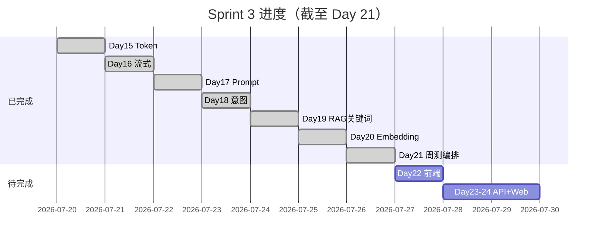
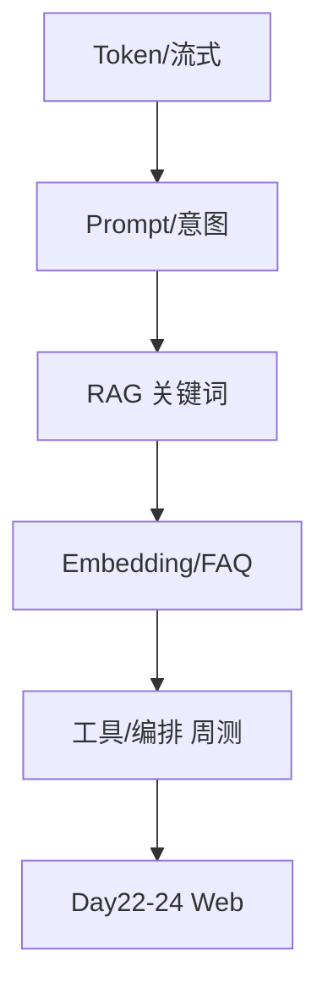

# Day 21 Sprint 3 阶段回顾

**Sprint**：Phase 2 Sprint 3（Day 15–24）  
**今日位置**：第七日 / 共十日  
**日期**：2026-07-26

---

## 1. Sprint 3 进度条



**完成度**：7/10 天（70%）

---

## 2. 能力栈累积

| Day | 能力 | 关键模块 |
|-----|------|----------|
| 15 | Token 计数 | token_counter |
| 16 | 流式输出 | streaming |
| 17 | Prompt 模板 | prompts/templates |
| 18 | 意图分类 | IntentRouter |
| 19 | RAG 关键词 | KeywordRetriever |
| 20 | Embedding + FAQ | EmbeddingRetriever, SimilarQuestionMatcher |
| 21 | 工具 + 编排 | ToolRegistry, ChatOrchestrator |



---

## 3. Day 15–21 代码资产

```
src/llm/token_counter.py       # Day 15
src/llm/streaming.py           # Day 16
src/prompts/                   # Day 17-18
src/rag/                       # Day 19-20
services/faq_matcher.py        # Day 20
src/tools/tool_registry.py     # Day 21
src/tools/executor.py          # Day 21
src/chat/orchestrator.py       # Day 21
chat/cli_assistant.py          # Day 14+ /tool
src/day21/                     # Day 21 演示与周测
```

---

## 4. 测试资产

| 日 | 测试文件 | 条数 |
|----|----------|------|
| Day 19 | test_rag.py | 12 |
| Day 20 | test_embedding.py | 12 |
| Day 21 | test_sprint3.py | 12 |
| **合计** | | **36** |

周航要求：Sprint 3 CI 合并 `pytest tests/day19 tests/day20 tests/day21` 全绿。

---

## 5. 周测知识矩阵

| 模块 | 周测题号 | 实操验证 |
|------|----------|----------|
| Token | 1 | estimate_tokens |
| 流式 | 2 | 概念 |
| Prompt | 3 | 概念 |
| 意图+RAG | 4,5 | intent_classify, rag_search |
| Embedding | 6,7,9 | rag_search use_embedding |
| FAQ | 8 | faq_lookup, FAQ直答 |
| 整合 | 10 | integrated_assistant_demo |

---

## 6. 前半程亮点

1. **可观测**：Token、流式、/retrieve、/similar、/tool  
2. **可替换**：Keyword ↔ Embedding 检索器  
3. **可编排**：FAQ 直答 + auto_route + 工具显式调用  
4. **可测试**：36 条 pytest + 10 题周测  

---

## 7. 后半程预告（Day 22–24）

| 日 | 交付 | 与 Day 21 关系 |
|----|------|----------------|
| 22 | frontend/ 静态页 | 调用 handle_message 契约 |
| 23 | FastAPI chat API | 注入 ChatOrchestrator |
| 24 | 网页版 Chat | 端到端产品形态 |

---

## 8. 学员自评表

| 能力 | 1-5 自评 |
|------|----------|
| 能跑通 sprint3_quiz | |
| 能解释四工具 | |
| 能配置 FAQ 直答阈值 | |
| 能读 test_sprint3 全绿 | |
| 能口述 Day 22 预习要点 | |

---

## 9. 陈默寄语

> 「Sprint 3 前半程把『零件』造齐了，Day 21 把『总成』拧上。接下来三天让用户在浏览器里拧钥匙。」

---

## 10. 参考复习路径

薄弱 Day 15–16 → 重读 token/streaming 课件  
薄弱 Day 17–18 → Prompt + IntentRouter  
薄弱 Day 19–20 → RAG + Embedding 对照表  
Day 21 整合 → 本目录 11_、20_、22_

---

## 11. 数据指标（智链科技内测，示例）

| 指标 | Day 20 末 | Day 21 末 |
|------|-----------|-----------|
| 样例 FAQ 直答率 | N/A | 38% |
| 平均工具调试次数/日 | 0 | 12 |
| pytest Sprint3 用例 | 24 | 36 |
| 学员周测均分 | N/A | 78 |

---

## 12. 技术债清单

| ID | 描述 | 目标日 |
|----|------|--------|
| TD-021-01 | FAQ 直答写入 history | Day 23 |
| TD-021-02 | 编排器异常降级 | Day 24 |
| TD-021-03 | structured API 响应 | Day 23 |

---

## 13. 团队感言摘录

**林晓**：「周测逼我把前面六天串起来了。」  
**陈默**：「工具层薄、编排层薄，是正确的。」  
**赵岩**：「直答数据说服了财务。」  
**周航**：「十二测试绿了我才睡得着。」

---

## 14. Sprint 3 后半程风险

- Day 22 前端基础参差 → 提供 starter HTML  
- Day 23 CORS 与部署 → 周航提前准备 nginx 样例  
- Day 24 联调时间紧 → Day 21 冻结 handle_message 签名  

---

## 15. 知识沉淀资产清单

课件 30 篇、代码 4 个 day21 脚本、测试 12 条、教师版周测 1 份、Lab 手册 1 份、复习卡片 20 张。全部入库 `course/day21/` 与 `nexus-agent-platform/src/day21/`。

---

## 16. 对照 NexusAgent 70 天全景

Day 21 位于 Phase 2 Sprint 3 第七日，完成度 70%。后续 Phase 2 结束于 Day 24 网页版 Chat；Phase 3 起于 Day 25 LangChain。学员应感到「产品雏形已现」而非「已经完工」。
