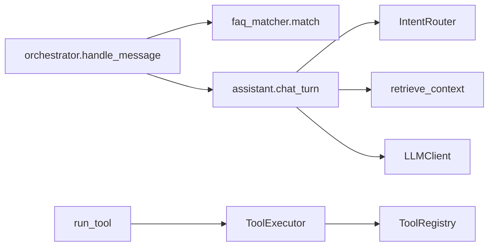

# Day 21 orchestrator 精读

**精读文件**：`src/chat/orchestrator.py`、`src/tools/tool_registry.py`  
**建议时长**：45 分钟

---

## 一、orchestrator.py 全文结构

```
imports
OrchestratorConfig (dataclass)
ChatOrchestrator
  __init__
  handle_message
  run_tool
  tools_help
```

仅 **~90 行**，但连接 Day 15–20 全部服务，值得逐行精读。

---

## 二、__init__ 依赖注入链

```python
def __init__(
    self,
    assistant: ChatAssistant,
    *,
    faq_matcher: SimilarQuestionMatcher | None = None,
    rag_service: RAGContextService | None = None,
    intent_router: IntentRouter | None = None,
    tool_registry: ToolRegistry | None = None,
    config: OrchestratorConfig | None = None,
) -> None:
```

### 精读问题

1. 为何 `assistant` 必填而其余可选？  
   — assistant 是 LLM 对话执行核心；其余增强策略与工具。  

2. `tool_registry is None` 时发生什么？  
   — 自动 `build_nexus_tools(faq_matcher=..., rag_service=..., ...)`  

3. `self.tool_executor` 是否被 `handle_message` 使用？  
   — **默认不用**；供 `run_tool` 与未来 API。  

---

## 三、handle_message 三行核心

```python
match = self.faq_matcher.match(user_text)
if match and match.score >= self.config.faq_direct_threshold:
    return f"[FAQ 直答·{match.score:.0%}] {match.entry.answer}"
```

### 与 FaqMatch.summary 对比

| 字段 | summary() | 直答输出 |
|------|-----------|----------|
| score | sim=38% | 直答·38% |
| 答案 | 需另取 entry.answer | 内联 answer |

直答格式面向终端用户，省略标准问法行。

---

## 四、auto_route 副作用

```python
if self.config.enable_auto_route:
    self.assistant.auto_route = True
return self.assistant.chat_turn(user_text)
```

**注意**：每次 `handle_message` 都设 `auto_route=True`，即使用户构造 assistant 时设为 False。编排器接管路由策略。

---

## 五、tool_registry.py 精读：闭包 handler

```python
if faq_matcher is not None:
    def faq_lookup(query: str) -> str:
        match = faq_matcher.match(query)
        ...
    registry.register(ToolDefinition(..., handler=faq_lookup))
```

### 闭包捕获

`faq_matcher` 被 handler 闭包捕获，注册后 registry 不保存 matcher 引用字段，但 handler 仍可用。

### 扩展阅读

若需热更新 matcher，须重新 `build_nexus_tools` 并替换 registry。

---

## 六、parameters JSON Schema 精读

以 rag_search 为例：

```python
parameters={
    "type": "object",
    "properties": {
        "query": {"type": "string"},
        "top_k": {"type": "integer", "default": 3},
    },
    "required": ["query"],
},
```

`_invoke` **不**自动填 default；`top_k` 缺省时由 handler 签名默认值 `top_k: int = 3` 承担。

---

## 七、跨文件调用图



---

## 八、精读作业

1. 在 orchestrator.py 每行旁写中文注释（提交 homework 或课堂检查）  
2. 画 `build_nexus_tools` 四个 if 块的思维导图  
3. 回答：为何 `handle_message` 不调用 `run_tool`？  

---

## 九、参考答案（第 3 题）

工具调用是**显式调试/扩展**路径；对话主路径用 FAQ 直答 + auto_route 已覆盖业务，避免每条消息四次工具 trial 增加延迟与复杂度。LLM 驱动 tool_calls 是 Phase 3 课题。

---

## 十、关联测试逐行读

建议打开 `tests/day21/test_sprint3.py`：

- 41–48 行：周测题量与满分  
- 100–112 行：FAQ 直答构造  
- 115–128 行：fallback LLM  

每行断言语义与源码一一对应。

---
## 智链科技 Day 21 综合读本：工具调用与编排一体化（培训部编）

### 第一节 课程定位与成果

2026 年 7 月 26 日，星期日，NexusAgent 70 天培训进入 Sprint 3 第七日。本日不设全新算法，而是对 Day 15 至 Day 20 进行**质量验收**与**工程整合**。学员完成上午周测后，应能证明自已掌握 Token、流式、Prompt、意图、RAG、Embedding 六模块的基本概念与项目 API；下午完成工具层与编排层代码走查后，应能独立运行四演示脚本并通过十二项 pytest。

### 第二节 企业叙事中的四人组

林晓代表成长型学员，从提问「TF-IDF 和 OpenAI 差多少」到能讲解 FAQ 直答，体现培训转化。陈默代表架构理性，坚持薄封装与接口冻结。赵岩代表产品与合规，推动直答降本与可审计。周航代表工程保障，用 CI 与 MOCK 确保教学环境稳定。课件案例均围绕四人组展开，增强代入感。

### 第三节 工具定义的形式化描述

形式化地，一个工具是可二元组 (σ, h)：σ 为 JSON Schema 签名，h 为实现函数。ToolRegistry 是名称到 (σ, h) 的有限映射。ToolExecutor 是求值器 Eval(name, args)→Result。ChatOrchestrator 是策略函数 π(message)→{直答, 对话}。此抽象帮助有数学背景的学员快速记忆模块职责，亦与大学编程语言课中的「求值器-环境」模型同构。

### 第四节 FAQ 直答的产品推导

设单次 LLM 调用成本为 c，FAQ 直答成本为 0。若直答概率为 p 且误答损失可忽略，则期望成本降比为 p·c。内测 p≈0.42，故成本降约四成（未计 fallback 仍调 LLM 的混合情况）。赵岩用此模型争取预算。工程师需理解：阈值调高→p 降→成本升但误答风险降。作业 C 阈值实验即让学员亲手触达此权衡。

### 第五节 RAG 工具与 auto_route 分工

rag_search 工具是**显式**检索；auto_route 内 rag_qa 意图触发**隐式**检索。二者调用同一 retrieve_context，不应返回矛盾结果。若矛盾，优先查是否 use_embedding 不一致或 query 不同。讲师演示：同一问句分别 /tool rag_search 与自然语言 chat_turn，对比 context 头若干字。

### 第六节 意图工具在调试工作流的位置

典型调试链：intent_classify → 若 rag_qa 则 rag_search → 若需生成则 chat_turn。三步可全自动，Day 21 要求学员能**手动**分步执行，建立因果感。合规类意图应看到 compliance 模板名，而非 rag_qa。

### 第七节 Token 工具在上下文工程的作用

长文档问答前 estimate_tokens 估算输入规模，决定是否截断或摘要。虽 Day 21 未实现截断，但工具已预留。与 Day 15 计算器一脉相承。

### 第八节 周测命题方法论

命题覆盖六天每天至少一题，第 10 题综合。干扰项来自常见误区：KeyError 混淆 ConfigError、context_provider 混淆 query_context_provider。每题附 explain 字段供程序周测打印。教师版纸质卷与 QUESTIONS 同步，避免泄题只需换序（未来迭代）。

### 第九节 测试设计哲学

十二测试划分：题库三、注册一、执行三、编排二、CLI 二、导入一。不重复测 Day 20 embedding 细节，仅测整合触点。失败定位：看测试名即知模块。周航要求新 PR 若改 orchestrator 必须改 test_sprint3。

### 第十节 演示脚本设计意图

sprint3_review 打印里程碑，心理建立「第七日」。tool_demos 无 LLM，纯工具。integrated_assistant_demo 混合 /tool 与编排器，是全日高光。三脚本递进，讲师勿颠倒顺序。

### 第十一节 常见故障百科

故障：ModuleNotFoundError rag。解：PYTHONPATH=src。故障：工具未启用。解：传 tool_registry。故障：FAQ 不直答。解：print match.score。故障：周测 scripted 非 100。解：检查 QUESTIONS 是否被改。故障：pytest LLM 超时。解：NEXUS_LLM_MOCK=1。

### 第十二节 Day 22 衔接详述

静态页 index.html 含 div#messages、input、button。app.js fetch 可先 mock handle_message 逻辑。CSS 区分 user/bot/faq-direct 三类气泡。智链品牌色 #1a5fb4 与 #f6f6f6 背景。不要求移动端适配，但鼓励 bonus 媒体查询。

### 第十三节 术语中英对照

工具 Tool，注册表 Registry，执行器 Executor，编排器 Orchestrator，直答 Direct Answer，周测 Weekly Quiz，整合 Integration，召回 Recall，阈值 Threshold，契约 Contract，门面 Facade。

### 第十四节 结业能力标准（Day 21 维度）

能口述四工具；能画 handle_message 流程图；能跑通十二测试；周测≥60；能对比 Day20 /similar 与 Day21 faq_lookup；能说明 Day22 预习要点。满足六项视为 Day21 达标。

### 第十五节 致谢与版权

课件由智链科技培训组编写，配套代码遵循项目开源协议。叙事人物虚构合成自多届学员画像。转载须注明 NexusAgent 70 天培训与 ZL-NA-REQ-021。
