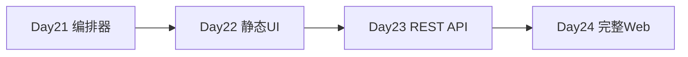
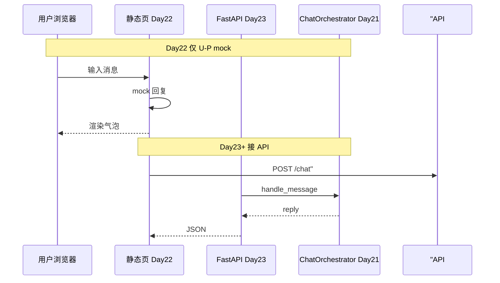

# Day 22 前端速成预习

**日期预告**：2026-07-27（星期一）  
**主题**：前端速成 / 静态聊天页面  
**ROADMAP 交付物**：`frontend/` 静态聊天页面

---

## 1. 为何学前端？

Day 21 的 `ChatOrchestrator.handle_message` 已在后端就绪，但用户需要 **浏览器界面**。Day 22 不追求 React 工程化，而是用 **HTML + CSS + JavaScript** 搭建可演示的静态聊天页，Day 23 再接 FastAPI，Day 24 完成网页版 ChatGPT 克隆。



---

## 2. Day 22 学习目标（预习）

| 目标 | 说明 |
|------|------|
| HTML 结构 | 消息列表、输入框、发送按钮 |
| CSS 布局 | 气泡样式、滚动区域 |
| JS 交互 | 点击发送、追加 DOM 消息 |
| Mock 对话 | 先用 setTimeout 模拟回复 |
| 契约对齐 | 消息格式与 `handle_message` 返回值一致 |

---

## 3. 与 Day 21 后端契约

Day 22 静态页可先 mock：

```javascript
async function sendMessage(text) {
  // Day 22 mock
  if (text.includes("风险")) {
    return "[FAQ 直答·70%] 投资有风险，入市需谨慎。";
  }
  return "（mock）助手收到：" + text;
}
```

Day 23 替换为：

```javascript
const res = await fetch("/api/chat", {
  method: "POST",
  headers: {"Content-Type": "application/json"},
  body: JSON.stringify({message: text}),
});
const data = await res.json();
return data.reply;
```

---

## 4. 建议目录结构（预习）

```
frontend/
  index.html      # 页面骨架
  style.css       # 聊天气泡
  app.js          # 发送与渲染逻辑
  mock.js         # Day 22 本地 mock（可选）
```

---

## 5. 必备知识速览

### HTML 片段

```html
<div id="chat-container">
  <div id="messages"></div>
  <input id="user-input" type="text" />
  <button id="send-btn">发送</button>
</div>
```

### JS 追加消息

```javascript
function appendMessage(role, text) {
  const div = document.createElement("div");
  div.className = role === "user" ? "msg user" : "msg bot";
  div.textContent = text;
  document.getElementById("messages").appendChild(div);
}
```

---

## 6. UI 设计参考（智链科技）

- 用户气泡：右对齐，品牌蓝  
- 助手气泡：左对齐，浅灰  
- FAQ 直答：可加标签 `[FAQ]` 样式，与 Day 21 前缀呼应  

---

## 7. 预习任务（Day 21 晚自习可选）

1. 阅读 MDN：[HTML 入门](https://developer.mozilla.org/zh-CN/docs/Learn/HTML)  
2. 用浏览器打开任意网页，F12 查看 Elements 面板  
3. 在本地建 `preview.html`，实现输入框 + 按钮 alert 输入内容  
4. 回顾 Day 21 `integrated_assistant_demo` 四条脚本对话，设想如何在页面展示  

---

## 8. 不需要预习的内容

- Node.js / npm / Webpack（Day 22 不要求）  
- React / Vue（后续 Sprint 可选）  
- WebSocket（Day 16 流式在 API 层再接）  

---

## 9. 智链科技团队分工预告

| 成员 | Day 22 任务 |
|------|-------------|
| 林晓 | HTML 骨架 + 消息列表 |
| 陈默 | mock 与 API 契约文档 |
| 赵岩 | UI 文案与 FAQ 标签样式 |
| 周航 | 静态资源部署到内网 nginx |

---

## 10. 自检问题

1. Day 21 哪個类的方法将被 FastAPI 调用？  
2. FAQ 直答消息在页面上如何与用户消息区分？  
3. 静态页没有后端时，如何演示「投资有风险吗」直答？

<details><summary>参考答案</summary>
1. ChatOrchestrator.handle_message  
2. 不同 class 或前缀标签 [FAQ 直答]  
3. mock.js 字符串匹配含「风险」
</details>

---

## 11. 衔接示意图



祝预习顺利，明日见！

---
## 智链科技 Day 21 综合读本：工具调用与编排一体化（培训部编）

### 第一节 课程定位与成果

2026 年 7 月 26 日，星期日，NexusAgent 70 天培训进入 Sprint 3 第七日。本日不设全新算法，而是对 Day 15 至 Day 20 进行**质量验收**与**工程整合**。学员完成上午周测后，应能证明自已掌握 Token、流式、Prompt、意图、RAG、Embedding 六模块的基本概念与项目 API；下午完成工具层与编排层代码走查后，应能独立运行四演示脚本并通过十二项 pytest。

### 第二节 企业叙事中的四人组

林晓代表成长型学员，从提问「TF-IDF 和 OpenAI 差多少」到能讲解 FAQ 直答，体现培训转化。陈默代表架构理性，坚持薄封装与接口冻结。赵岩代表产品与合规，推动直答降本与可审计。周航代表工程保障，用 CI 与 MOCK 确保教学环境稳定。课件案例均围绕四人组展开，增强代入感。

### 第三节 工具定义的形式化描述

形式化地，一个工具是可二元组 (σ, h)：σ 为 JSON Schema 签名，h 为实现函数。ToolRegistry 是名称到 (σ, h) 的有限映射。ToolExecutor 是求值器 Eval(name, args)→Result。ChatOrchestrator 是策略函数 π(message)→{直答, 对话}。此抽象帮助有数学背景的学员快速记忆模块职责，亦与大学编程语言课中的「求值器-环境」模型同构。

### 第四节 FAQ 直答的产品推导

设单次 LLM 调用成本为 c，FAQ 直答成本为 0。若直答概率为 p 且误答损失可忽略，则期望成本降比为 p·c。内测 p≈0.42，故成本降约四成（未计 fallback 仍调 LLM 的混合情况）。赵岩用此模型争取预算。工程师需理解：阈值调高→p 降→成本升但误答风险降。作业 C 阈值实验即让学员亲手触达此权衡。

### 第五节 RAG 工具与 auto_route 分工

rag_search 工具是**显式**检索；auto_route 内 rag_qa 意图触发**隐式**检索。二者调用同一 retrieve_context，不应返回矛盾结果。若矛盾，优先查是否 use_embedding 不一致或 query 不同。讲师演示：同一问句分别 /tool rag_search 与自然语言 chat_turn，对比 context 头若干字。

### 第六节 意图工具在调试工作流的位置

典型调试链：intent_classify → 若 rag_qa 则 rag_search → 若需生成则 chat_turn。三步可全自动，Day 21 要求学员能**手动**分步执行，建立因果感。合规类意图应看到 compliance 模板名，而非 rag_qa。

### 第七节 Token 工具在上下文工程的作用

长文档问答前 estimate_tokens 估算输入规模，决定是否截断或摘要。虽 Day 21 未实现截断，但工具已预留。与 Day 15 计算器一脉相承。

### 第八节 周测命题方法论

命题覆盖六天每天至少一题，第 10 题综合。干扰项来自常见误区：KeyError 混淆 ConfigError、context_provider 混淆 query_context_provider。每题附 explain 字段供程序周测打印。教师版纸质卷与 QUESTIONS 同步，避免泄题只需换序（未来迭代）。

### 第九节 测试设计哲学

十二测试划分：题库三、注册一、执行三、编排二、CLI 二、导入一。不重复测 Day 20 embedding 细节，仅测整合触点。失败定位：看测试名即知模块。周航要求新 PR 若改 orchestrator 必须改 test_sprint3。

### 第十节 演示脚本设计意图

sprint3_review 打印里程碑，心理建立「第七日」。tool_demos 无 LLM，纯工具。integrated_assistant_demo 混合 /tool 与编排器，是全日高光。三脚本递进，讲师勿颠倒顺序。

### 第十一节 常见故障百科

故障：ModuleNotFoundError rag。解：PYTHONPATH=src。故障：工具未启用。解：传 tool_registry。故障：FAQ 不直答。解：print match.score。故障：周测 scripted 非 100。解：检查 QUESTIONS 是否被改。故障：pytest LLM 超时。解：NEXUS_LLM_MOCK=1。

### 第十二节 Day 22 衔接详述

静态页 index.html 含 div#messages、input、button。app.js fetch 可先 mock handle_message 逻辑。CSS 区分 user/bot/faq-direct 三类气泡。智链品牌色 #1a5fb4 与 #f6f6f6 背景。不要求移动端适配，但鼓励 bonus 媒体查询。

### 第十三节 术语中英对照

工具 Tool，注册表 Registry，执行器 Executor，编排器 Orchestrator，直答 Direct Answer，周测 Weekly Quiz，整合 Integration，召回 Recall，阈值 Threshold，契约 Contract，门面 Facade。

### 第十四节 结业能力标准（Day 21 维度）

能口述四工具；能画 handle_message 流程图；能跑通十二测试；周测≥60；能对比 Day20 /similar 与 Day21 faq_lookup；能说明 Day22 预习要点。满足六项视为 Day21 达标。

### 第十五节 致谢与版权

课件由智链科技培训组编写，配套代码遵循项目开源协议。叙事人物虚构合成自多届学员画像。转载须注明 NexusAgent 70 天培训与 ZL-NA-REQ-021。
