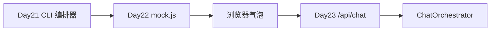

# Day 22 旁白解读：从编排器到浏览器窗口

> **前置要求**：完成 Day 21；能独立运行 `integrated_assistant_demo.py` 与 `test_sprint3.py`；理解 `ChatOrchestrator.handle_message` 两步策略

---

## 旁白

2026 年 7 月 27 日，周一。智链科技 Sprint 3 第八日，赵岩在晨会展示内测截图——终端里 `handle_message` 已能 FAQ 直答与意图路由，但产品演示仍要在黑窗口里打字：

> 「投资人、运营、合规同事不会用 CLI。Day 22 要在浏览器里看见 NexusAgent：消息气泡、发送按钮、加载动画。不要求 React，用 **HTML + CSS + JavaScript** 搭静态页，先用 `mock.js` 对齐编排器输出，Day 23 再接 FastAPI。」

林晓昨晚读完 Day 21 的预习文档，举手问：「Mock 和后端返回格式不一样怎么办？」

陈默打开 `frontend/mock.js`：

> 「契约冻结：`[FAQ 直答·72%]` 前缀表示高置信 FAQ；`[路由: rag_qa]` 表示意图模板路由。`app.js` 的 `parseReply` 解析这两种格式渲染标签。`mock_bridge_demo.py` 会并排打印后端 `handle_message` 与前端规则，供你对照。」

周航补充：

> 「`tests/day22/test_frontend.py` 十二项：五文件存在、六个元素 id、脚本引入、Mock 函数、CSS 气泡、审计通过、`/api/chat` 占位。`frontend_audit.py` 可在合并前本地跑。静态资源用 `python3 -m http.server 8080`，零 npm。」

上午十点，林晓在 `frontend/` 启动服务，浏览器打开 `http://localhost:8080`。她输入「投资有风险吗」，350ms 后出现绿色 **FAQ 直答** 标签与标准答复。赵岩点头：「这就是我们要给业务看的。」

下午陈默带全班走读 `index.html` 语义结构：`header` 品牌区、`main#chat-container` 消息列表、`footer.composer` 输入表单。林晓在 Lab 中给 `.msg--user` 微调圆角，陈默提醒：「样式可改，**元素 id 与契约字符串**不能改，否则 CI 红。」

晚自习，四人组分工：林晓改欢迎语文案，陈默核对 `sendMessageApi` 与 Day 23 `chat.py` 草案字段，赵岩审核合规示例问句，周航把 `test_frontend.py` 挂进流水线。明日 FastAPI 将把 Mock 换成真编排器——今日静态页是那座桥的桥头。

---

## 学习路径建议

| 阶段 | 文档 / 实操 | 时长 |
|------|-------------|------|
| 晨读 | 本旁白 + 01_ 企业背景 | 30 min |
| 上午 | 11_ 静态聊天页详解 + 26_ Lab 0–2 | 2 h |
| 下午 | 20_ 代码走查 + 浏览器实操 | 2 h |
| 晚间 | 08_ 作业 + 16_ 复习卡片 | 1.5 h |

---

## 关键术语（今日首次出现）

| 术语 | 含义 |
|------|------|
| 静态页 | 无服务端渲染，纯 HTML/CSS/JS 文件 |
| Mock 桥 | `mock.js` 模拟 `handle_message` 返回 |
| 契约 | 前后端约定的 `reply` 字符串前缀格式 |
| `parseReply` | `app.js` 将 reply 解析为 faq/route/bot |
| `useMock` | 切换本地 Mock 与 `fetch('/api/chat')` |

---

## 与昨日衔接

Day 21 冻结了 `handle_message(user_text) -> str`。Day 22 不修改 Python 编排器，只在浏览器侧**复现其输出形态**。学员若发现 Mock 与后端语义偏差，应更新 `FAQ_RULES` / `ROUTE_RULES` 或记录 Issue，而非改 `orchestrator.py`。

---

## 旁白尾声

智链科技内训部将 Day 22 定位为「全栈视野日」：后端学员必须亲手写 DOM 操作，前端零基础学员必须理解编排器契约。林晓在日记里写：「原来 `[FAQ 直答·72%]` 不只是日志里的字符串，它会在页面上变成绿色标签。」陈默回复：「明日它将从真实 `SimilarQuestionMatcher` 算出，而非正则。今日先学会**看见**契约。」

全文完。请继续阅读 [01_企业背景与今日任务.md](01_企业背景与今日任务.md)。

## 智链科技 NexusAgent Day 22 扩展读本（培训部）

### 关于前端速成在七十天路线图中的坐标

NexusAgent 七十天培训并非要把每位学员都培养成专业前端工程师，而是要在 Sprint 3 的关键节点上建立**浏览器视角**。当林晓在 Day 15 调试 Token 计数时，她面对的是 Python 解释器里的整数；当她在 Day 22 调试聊天气泡时，她面对的是 DOM 树里的节点。这两种视角的差异，正是全栈工程师需要跨越的鸿沟。陈默在架构评审中反复强调：Day 22 的代码量不足三百行，但其象征意义是「用户可见交付」的起点。赵岩从产品经理角度补充：内测用户并不关心你用了 ToolRegistry 还是 EmbeddingRetriever，他们只关心输入问题后三秒内能否看到清晰、可信、带来源提示的回答。周航则从工程角度指出：静态页虽然没有后端逻辑，却同样纳入 CI，这说明在智链科技，**一切用户触达面都是产品面**。

### HTML 语义与可维护性

很多初学者倾向于用 div 包裹一切。Day 22 的 index.html 刻意使用 header、main、footer，是为了让六个月后的自己在 Code Review 时一眼看出页面骨架。main 元素上的 role="main" 在语义 HTML 中通常冗余，但在部分读屏软件组合下仍能提供额外保障。form 元素包裹输入区而非散落的 input 与 button，是为了让 Enter 键提交成为浏览器默认行为的一部分，app.js 中的 requestSubmit 则是对这一行为的增强而非替代。林晓在练习中曾把 footer 改成 div，样式未变，但陈默在 Review 中要求改回，理由是「语义是文档契约，不只服务于当日样式」。

### CSS 变量与主题扩展

:root 中的 CSS 自定义属性是 Day 22 最重要的扩展点之一。品牌色、文字色、圆角、阴影均集中定义，使得智链科技未来若统一升级 VI，只需修改变量表。学员在作业 E 中修改 --brand 时，应同时检查 :focus 状态的 box-shadow 是否仍使用 rgba(26, 86, 219, 0.15) 硬编码；若是，可选地将焦点环颜色也变量化，作为加分项。深色模式在金融行业后台并不少见，但 Day 22 不要求实现；可在 13_ 深度扩展中阅读 prefers-color-scheme 方案，作为 Sprint 4 选修。

### JavaScript 异步与用户体验

mock.js 中的 await delay(350) 不是装饰。没有延迟时，loading 元素几乎无法被肉眼捕捉，用户会怀疑「是否真在处理」。产品心理学上，适度的等待暗示系统在工作；但超过一秒又会引发焦虑。350 毫秒是智链科技 UX 小组在内测中的折中值。app.js 在 finally 块中调用 inputEl.focus()，保证连续对话时键盘流不中断，这对高频客服场景尤为重要。错误处理 catch 分支将 err.message 渲染为 bot 气泡，避免静默失败；Day 23 接 API 后，网络错误与 500 错误将走同一通道，学员应思考是否要区分「网络不可用」与「服务器错误」的文案。

### Mock 规则与真实业务的差距

必须向学员坦白：mock.js 中的正则规则是**教学简化**，不能等同于 SimilarQuestionMatcher 的向量相似度。FAQ 规则用「风险|有风险」匹配，而后端可能对「有没有风险」「风险大吗」给出不同 score。mock_bridge_demo.py 的价值正在于并排展示这种差距。运营人员若只看浏览器 Mock 做合规签字，是错误的；应看 Day 23 接真后端后的输出。培训部在 14_ 企业案例中记录了「Mock 与生产混淆」的教训，要求演示前 status-badge 必须显示 Mock 模式。

### parseReply 的正则与国际化

当前路由正则假定中文前缀「路由:」。若未来引入英文界面，parseReply 需重构为可配置前缀表。这是陈默在架构备忘中记录的 Day 30 技术债。学员在作业 C 中扩展 system 类前缀时，应使用 startsWith 而非随意正则，保持与 FAQ 分支一致的可读性。meta 字段目前由 mock 返回、app.js 原样展示；Day 23 API 可由服务端计算 meta，减轻前端解析负担。

### 测试哲学：静态审计的价值

test_frontend.py 不启动浏览器，被部分学员质疑「不测真交互」。周航的解释是：结构契约比像素位置更稳定，CI 应在十秒内反馈。E2E 测试成本高，留给 Day 24 集成阶段。静态审计能捕获「删了 mock.js」「改错 id」类低级错误，这类错误在四十人教学中出现频率极高。frontend_audit.py 与测试共用 constants.py，体现单源真相原则，与 Day 21 工具层设计一脉相承。

### 安全与合规提示

静态页通过 http.server 提供时，无 HTTPS，仅限内网教学。不得在公网暴露未鉴权的 Mock 聊天页并宣称是生产系统。输入 maxlength=2000 是简单防护，后端 Day 23 须再次校验长度。XSS 方面，app.js 使用 textContent 而非 innerHTML 插入用户消息，是正确做法；若学员作业改为 innerHTML，讲师应坚决制止。

### 与 ChatOrchestrator 的字段级对照

handle_message 在 FAQ 命中时返回单一字符串，不返回 JSON。Day 23 API 层将承担「字符串 → 结构化响应」的职责。kind 字段在 Day 22 由 mock 显式返回，在 app.js 中 parseReply 也会推断 kind；存在冗余，但有利于 API 直接返回 kind 时跳过解析。陈默建议 Day 23 服务端根据 reply 前缀填充 kind，与前端 parseReply 逻辑保持同步，可抽取共享文档而非共享代码（前后端语言不同）。

### 团队协作情景练习

设想四人组接到紧急任务：明早九点向投资人演示。林晓负责确认 http.server 与端口；陈默负责 mock_bridge 对照无异常偏差；赵岩准备三条标准问句与话术；周航在 CI 打 green 标签。今晚任何人改 frontend 须通知全组。这种协作模式模拟真实 Sprint，是培训部除技术外的隐性目标。

### 常见面试题延伸（内部晋升参考）

1. 为何 script 标签放 body 底？—— 传统上避免阻塞解析；现代 defer 亦可。  
2. 如何用 fetch 实现超时？—— AbortController。  
3. 同域与 CORS？—— Day 23 重点。  
4. 无障碍 aria-live 的 polite 与 assertive？—— polite 不打断朗读。  

### 结语

Day 22 看似「只是几个静态文件」，实则是 NexusAgent 从工程师工具到用户产品的闸门。掌握 HTML 结构、CSS 布局、JS 事件、Mock 契约四要素，等于掌握明日 FastAPI 集成的语言。请林晓、陈默、赵岩、周航与全体学员带着「让用户看见编排器」的信念完成今日作业与预习。智链科技培训组，二零二六年七月二十七日。
