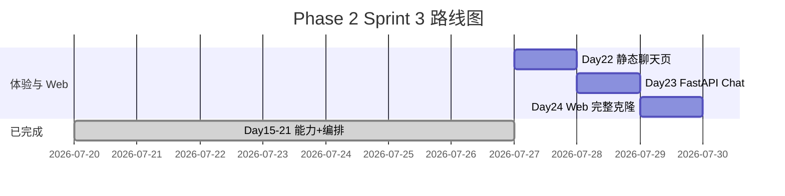

# Day 22 企业背景与今日任务

**日期**：2026 年 7 月 27 日  
**Sprint**：Sprint 3 第八日 — 前端速成 / 静态聊天页面

## 晨会纪要

### 赵岩（产品）

> 「Sprint 3 后半程目标：网页版 Chat。业务方周五要看可点击的演示。今日交付 `frontend/` 静态聊天页：品牌头、消息区、输入框、FAQ/路由视觉区分。Mock 模式下必须能演示『投资有风险吗』直答与『总结要点』路由。」

### 陈默（架构）

> 「五文件：`index.html`、`style.css`、`app.js`、`mock.js`、`README.md`。`mock.js` 导出 `window.NexusMock`，`useMock: true` 走 `sendMessage`，`false` 走 `sendMessageApi` 占位 `POST /api/chat`。`app.js` 不直接写 Mock 规则，保持 Day 23 单点切换。」

### 周航（DevOps）

> 「`frontend_audit.py` 审计目录与元素 id；`tests/day22/test_frontend.py` 十二项进 CI。预览命令 `cd frontend && python3 -m http.server 8080`。不引入 Node 构建链。」

### 林晓（学员代表）

> 「没写过前端，BEM 类名 `msg--user` 是什么意思？`aria-live` 必须加吗？」

陈默：「`msg--user` 是 Block-Element-Modifier 命名，用户气泡与助手气泡样式分离。`aria-live="polite"` 让读屏软件在助手回复时播报，智链科技无障碍基线要求。」

## 任务分配

| ID | 任务 | 负责人 | 优先级 |
|----|------|--------|--------|
| ZL-NA-REQ-022 | 静态聊天页 + Mock 桥 | 全员 | P0 |
| ZL-NA-601 | `index.html` 骨架与 id | 林晓 | P0 |
| ZL-NA-602 | `style.css` 气泡与标签 | 林晓 | P0 |
| ZL-NA-603 | `app.js` 交互与 parseReply | 助教 | P0 |
| ZL-NA-604 | `mock.js` FAQ/路由规则 | 助教 | P0 |
| ZL-NA-605 | `day22/*` 审计与演示脚本 | 助教 | P1 |
| ZL-NA-606 | `tests/day22/test_frontend.py` 全绿 | 周航 | P0 |

## Definition of Done

- [ ] `cd frontend && python3 -m http.server 8080` 可预览
- [ ] 输入「投资有风险吗」出现 FAQ 直答标签
- [ ] 输入「总结要点」出现紫色路由标签 `doc_summary`
- [ ] `python3 src/day22/frontend_audit.py` 全部通过
- [ ] `python3 src/day22/mock_bridge_demo.py` 打印后端对照
- [ ] `pytest tests/day22/test_frontend.py -v` 12 passed
- [ ] 能口述：`parseReply` 三种 kind、`NexusMock.useMock` 作用
- [ ] 能说明：六个必选元素 id 及其 DOM 职责

## 今日节奏

| 时段 | 内容 |
|------|------|
| 09:00-09:45 | HTML/CSS 速成讲义（11_ 节选） |
| 09:45-10:30 | `index.html` + `style.css` 走读 |
| 10:45-12:00 | `app.js` 与 `mock.js` 实操 |
| 14:00-15:30 | 浏览器联调 + `mock_bridge_demo` 对照 |
| 15:45-17:00 | Lab 26_ + `frontend_audit` + pytest |

## 环境准备

```bash
# 终端 1：静态服务
cd frontend
python3 -m http.server 8080

# 终端 2：审计与测试
cd nexus-agent-platform
export PYTHONPATH=src
python3 src/day22/frontend_audit.py
python3 src/day22/mock_bridge_demo.py
python3 src/day22/html_demos.py
python3 -m pytest tests/day22/test_frontend.py -v
```

## Sprint 3 全景（Day 15–24）



## 智链科技情境

内测会上，合规同事问：「页面上能不能一眼看出哪些是 FAQ 直答、哪些是模型生成？」赵岩展示 `style.css` 中 `.msg__tag--faq` 绿色与 `.msg__tag--route` 紫色。陈默补充：「标签解析自 reply 前缀，与 Day 21 编排器一致，避免运营误解。」周航承诺：「任何改 id 或删 FAQ 字符串的 PR，CI 十二测会拦。」

林晓负责在欢迎语中加入示例问句，降低首次使用门槛。四人组今日目标：让 NexusAgent 第一次「长出脸」。

---

## 延伸阅读

- [02_需求文档.md](02_需求文档.md) — FR-001 至 FR-007
- [11_静态聊天页详解.md](11_静态聊天页详解.md) — 四文件深度专题
- [27_Day23_FastAPI预习.md](27_Day23_FastAPI预习.md) — 明日 API 契约

## 智链科技 NexusAgent Day 22 扩展读本（培训部）

### 关于前端速成在七十天路线图中的坐标

NexusAgent 七十天培训并非要把每位学员都培养成专业前端工程师，而是要在 Sprint 3 的关键节点上建立**浏览器视角**。当林晓在 Day 15 调试 Token 计数时，她面对的是 Python 解释器里的整数；当她在 Day 22 调试聊天气泡时，她面对的是 DOM 树里的节点。这两种视角的差异，正是全栈工程师需要跨越的鸿沟。陈默在架构评审中反复强调：Day 22 的代码量不足三百行，但其象征意义是「用户可见交付」的起点。赵岩从产品经理角度补充：内测用户并不关心你用了 ToolRegistry 还是 EmbeddingRetriever，他们只关心输入问题后三秒内能否看到清晰、可信、带来源提示的回答。周航则从工程角度指出：静态页虽然没有后端逻辑，却同样纳入 CI，这说明在智链科技，**一切用户触达面都是产品面**。

### HTML 语义与可维护性

很多初学者倾向于用 div 包裹一切。Day 22 的 index.html 刻意使用 header、main、footer，是为了让六个月后的自己在 Code Review 时一眼看出页面骨架。main 元素上的 role="main" 在语义 HTML 中通常冗余，但在部分读屏软件组合下仍能提供额外保障。form 元素包裹输入区而非散落的 input 与 button，是为了让 Enter 键提交成为浏览器默认行为的一部分，app.js 中的 requestSubmit 则是对这一行为的增强而非替代。林晓在练习中曾把 footer 改成 div，样式未变，但陈默在 Review 中要求改回，理由是「语义是文档契约，不只服务于当日样式」。

### CSS 变量与主题扩展

:root 中的 CSS 自定义属性是 Day 22 最重要的扩展点之一。品牌色、文字色、圆角、阴影均集中定义，使得智链科技未来若统一升级 VI，只需修改变量表。学员在作业 E 中修改 --brand 时，应同时检查 :focus 状态的 box-shadow 是否仍使用 rgba(26, 86, 219, 0.15) 硬编码；若是，可选地将焦点环颜色也变量化，作为加分项。深色模式在金融行业后台并不少见，但 Day 22 不要求实现；可在 13_ 深度扩展中阅读 prefers-color-scheme 方案，作为 Sprint 4 选修。

### JavaScript 异步与用户体验

mock.js 中的 await delay(350) 不是装饰。没有延迟时，loading 元素几乎无法被肉眼捕捉，用户会怀疑「是否真在处理」。产品心理学上，适度的等待暗示系统在工作；但超过一秒又会引发焦虑。350 毫秒是智链科技 UX 小组在内测中的折中值。app.js 在 finally 块中调用 inputEl.focus()，保证连续对话时键盘流不中断，这对高频客服场景尤为重要。错误处理 catch 分支将 err.message 渲染为 bot 气泡，避免静默失败；Day 23 接 API 后，网络错误与 500 错误将走同一通道，学员应思考是否要区分「网络不可用」与「服务器错误」的文案。

### Mock 规则与真实业务的差距

必须向学员坦白：mock.js 中的正则规则是**教学简化**，不能等同于 SimilarQuestionMatcher 的向量相似度。FAQ 规则用「风险|有风险」匹配，而后端可能对「有没有风险」「风险大吗」给出不同 score。mock_bridge_demo.py 的价值正在于并排展示这种差距。运营人员若只看浏览器 Mock 做合规签字，是错误的；应看 Day 23 接真后端后的输出。培训部在 14_ 企业案例中记录了「Mock 与生产混淆」的教训，要求演示前 status-badge 必须显示 Mock 模式。

### parseReply 的正则与国际化

当前路由正则假定中文前缀「路由:」。若未来引入英文界面，parseReply 需重构为可配置前缀表。这是陈默在架构备忘中记录的 Day 30 技术债。学员在作业 C 中扩展 system 类前缀时，应使用 startsWith 而非随意正则，保持与 FAQ 分支一致的可读性。meta 字段目前由 mock 返回、app.js 原样展示；Day 23 API 可由服务端计算 meta，减轻前端解析负担。

### 测试哲学：静态审计的价值

test_frontend.py 不启动浏览器，被部分学员质疑「不测真交互」。周航的解释是：结构契约比像素位置更稳定，CI 应在十秒内反馈。E2E 测试成本高，留给 Day 24 集成阶段。静态审计能捕获「删了 mock.js」「改错 id」类低级错误，这类错误在四十人教学中出现频率极高。frontend_audit.py 与测试共用 constants.py，体现单源真相原则，与 Day 21 工具层设计一脉相承。

### 安全与合规提示

静态页通过 http.server 提供时，无 HTTPS，仅限内网教学。不得在公网暴露未鉴权的 Mock 聊天页并宣称是生产系统。输入 maxlength=2000 是简单防护，后端 Day 23 须再次校验长度。XSS 方面，app.js 使用 textContent 而非 innerHTML 插入用户消息，是正确做法；若学员作业改为 innerHTML，讲师应坚决制止。

### 与 ChatOrchestrator 的字段级对照

handle_message 在 FAQ 命中时返回单一字符串，不返回 JSON。Day 23 API 层将承担「字符串 → 结构化响应」的职责。kind 字段在 Day 22 由 mock 显式返回，在 app.js 中 parseReply 也会推断 kind；存在冗余，但有利于 API 直接返回 kind 时跳过解析。陈默建议 Day 23 服务端根据 reply 前缀填充 kind，与前端 parseReply 逻辑保持同步，可抽取共享文档而非共享代码（前后端语言不同）。

### 团队协作情景练习

设想四人组接到紧急任务：明早九点向投资人演示。林晓负责确认 http.server 与端口；陈默负责 mock_bridge 对照无异常偏差；赵岩准备三条标准问句与话术；周航在 CI 打 green 标签。今晚任何人改 frontend 须通知全组。这种协作模式模拟真实 Sprint，是培训部除技术外的隐性目标。

### 常见面试题延伸（内部晋升参考）

1. 为何 script 标签放 body 底？—— 传统上避免阻塞解析；现代 defer 亦可。  
2. 如何用 fetch 实现超时？—— AbortController。  
3. 同域与 CORS？—— Day 23 重点。  
4. 无障碍 aria-live 的 polite 与 assertive？—— polite 不打断朗读。  

### 结语

Day 22 看似「只是几个静态文件」，实则是 NexusAgent 从工程师工具到用户产品的闸门。掌握 HTML 结构、CSS 布局、JS 事件、Mock 契约四要素，等于掌握明日 FastAPI 集成的语言。请林晓、陈默、赵岩、周航与全体学员带着「让用户看见编排器」的信念完成今日作业与预习。智链科技培训组，二零二六年七月二十七日。
