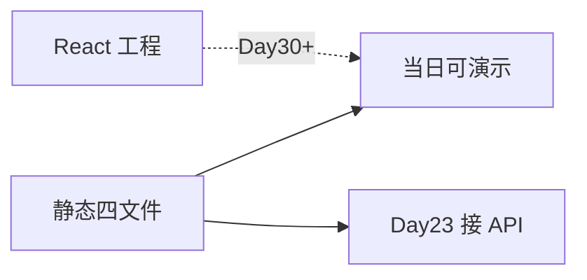

# Day 22 静态聊天页详解

**专题**：HTML / CSS / JavaScript 与 ChatOrchestrator 契约  
**需求**：ZL-NA-REQ-022  
**前置**：Day 21 `handle_message`

---

## 1. 为何用静态页而非 React？

智链科技 Day 22 目标：**最快可演示**。引入 npm、Webpack、TS 会消耗 Sprint 3 宝贵时间。纯静态文件具备：

- 零安装，Python 内置 HTTP 即可  
- 源码可读，适合培训走查  
- 与 Day 23 FastAPI 解耦，仅通过 `fetch` 连接  



---

## 2. index.html 结构详解

### 2.1 文档头

```html
<meta charset="UTF-8" />
<meta name="viewport" content="width=device-width, initial-scale=1.0" />
```

UTF-8 保障中文；viewport 保障手机基本可读（480px 断点隐藏副标题）。

### 2.2 品牌区 header

- `.header__logo` 装饰菱形 ◆  
- `#status-badge` 显示「Mock 模式」，Day 23 可改为「在线」  
- 副标题明确 Day 22 Mock，管理预期  

### 2.3 消息区 main

```html
<main class="chat" id="chat-container" role="main">
  <div class="chat__messages" id="messages" aria-live="polite">
```

`aria-live="polite"`：新消息到达时读屏软件播报，不打断用户。

### 2.4 欢迎 bot 消息

静态 HTML 内嵌首条 bot 消息，降低空页面冷启动。示例问句引导用户尝试 FAQ/路由。

### 2.5 输入区 footer

```html
<form id="chat-form" autocomplete="off">
  <input id="user-input" maxlength="2000" required />
  <button type="submit" id="send-btn">发送</button>
</form>
```

`autocomplete="off"` 避免浏览器历史下拉干扰演示。`maxlength=2000` 与后端合理上限对齐。

---

## 3. style.css 设计系统

### 3.1 CSS 变量

```css
:root {
  --brand: #1a56db;
  --faq-accent: #059669;
  --route-accent: #7c3aed;
}
```

全站改色只改变量，作业 E 改 `--brand` 即可。

### 3.2 Flex 布局

`.app`：`display: flex; flex-direction: column; min-height: 100vh`  
`.chat__messages`：`flex: 1; overflow-y: auto` — 消息增多时仅中间滚动。

### 3.3 BEM 命名

| 类名 | 含义 |
|------|------|
| `msg` | 消息行 Block |
| `msg--user` | 用户 Modifier |
| `msg__bubble` | 气泡 Element |
| `msg__tag--faq` | FAQ 标签 Modifier |

### 3.4 动画

- `fadeIn` 新消息淡入  
- `bounce` 加载三点跳动  

非功能需求，但赵岩要求「不能像 1990 年论坛」。

---

## 4. app.js 交互详解

### 4.1 IIFE 与严格模式

```javascript
(function () {
  "use strict";
  // ...
})();
```

避免 `appendMessage` 泄漏到全局，与 `window.NexusMock` 唯一全局约定配合。

### 4.2 parseReply 契约解析

```javascript
function parseReply(reply) {
  if (reply.startsWith("[FAQ 直答")) {
    return { kind: "faq", text: reply };
  }
  const routeMatch = reply.match(/^\[路由:\s*([^\]]+)\]\s*(.*)$/s);
  if (routeMatch) {
    return { kind: "route", template: routeMatch[1].trim(), text: routeMatch[2].trim() || reply };
  }
  return { kind: "bot", text: reply };
}
```

与 `orchestrator.py` FAQ 格式 `f"[FAQ 直答·{score:.0%}] {answer}"` 对齐。路由正则匹配 `chat_turn` 返回的 `[路由: template] body`。

### 4.3 appendMessage DOM 工厂

根据 `content.kind` 插入 `.msg__tag--faq` 或 `.msg__tag--route`。用户消息 `role === "user"` 右对齐蓝色气泡。

### 4.4 dispatchMessage 切换点

```javascript
async function dispatchMessage(text) {
  const mock = window.NexusMock;
  if (mock.useMock) return mock.sendMessage(text);
  return mock.sendMessageApi(text);
}
```

**Day 23 唯一开关**：`NexusMock.useMock = false`。

### 4.5 加载态状态机

`setLoading(true)`：显示 loading、禁用 input/button。`finally` 中恢复并 `inputEl.focus()`。

---

## 5. mock.js Mock 桥详解

### 5.1 规则表驱动

```javascript
const FAQ_RULES = [
  { test: (t) => /风险|有风险/.test(t), reply: "[FAQ 直答·72%] ...", meta: "FAQ 直答" },
  // ...
];
```

先遍历 FAQ，再 ROUTE — **与 ChatOrchestrator 先 FAQ 后 chat_turn 一致**。

### 5.2 人工延迟

`DELAY_MS = 350`：`await delay(DELAY_MS)` 模拟异步，使 loading UI 可见。

### 5.3 sendMessageApi 占位

```javascript
async function sendMessageApi(text) {
  const res = await fetch("/api/chat", {
    method: "POST",
    headers: { "Content-Type": "application/json" },
    body: JSON.stringify({ message: text }),
  });
  // ...
}
```

Day 23 `src/api/chat.py` 将实现此端点，内部调用 `orchestrator.handle_message(body.message)`。

### 5.4 与 mock_bridge_demo 对照

运行 `python3 src/day22/mock_bridge_demo.py` 查看后端真实输出前缀，调整 Mock 规则措辞。

---

## 6. 后端契约回顾（Day 21）

```python
def handle_message(self, user_text: str) -> str:
    user_text = (user_text or "").strip()
    if not user_text:
        return "请输入有效内容。"
    if self.config.enable_faq_direct and self.faq_matcher:
        match = self.faq_matcher.match(user_text)
        if match and match.score >= self.config.faq_direct_threshold:
            return f"[FAQ 直答·{match.score:.0%}] {match.entry.answer}"
    return self.assistant.chat_turn(user_text)
```

前端 Mock **不必**复现 score 计算，但 FAQ 前缀必须是 `[FAQ 直答·` 开头供 `parseReply` 识别。

---

## 7. test_frontend.py 十二测解读

| 测试 | 守护内容 |
|------|----------|
| test_frontend_directory_exists | frontend/ 目录 |
| test_required_files_exist ×5 | 五文件 |
| test_index_has_element_ids ×6 | 六 id |
| test_index_loads_scripts | mock/app 顺序 |
| test_mock_has_send_message | NexusMock API |
| test_mock_faq_pattern | FAQ 字符串 |
| test_app_append_message | 核心函数 |
| test_css_bubble_styles | 气泡+标签 |
| test_frontend_audit_passes | 审计函数 |
| test_mock_api_placeholder | Day 23 占位 |
| test_readme_has_serve_command | 文档 |

---

## 8. 调试技巧

1. **Chrome DevTools → Elements**：检查动态插入的 `.msg` 结构  
2. **Console**：`NexusMock.sendMessage('风险')` 手动测 Mock  
3. **Network**：Day 22 仅静态资源；Day 23 可见 POST `/api/chat`  
4. **审计失败**：对照 `constants.REQUIRED_ELEMENT_IDS`  

---

## 9. 常见坑

| 现象 | 原因 | 解决 |
|------|------|------|
| NexusMock undefined | script 顺序 | mock 在前 |
| 无 FAQ 标签 | reply 前缀不对 | 检查 Mock 字符串 |
| pytest 路径错 | cwd 不对 | 在 nexus-agent-platform 跑 |
| 页面空白 | 未启服务 | http.server 8080 |

---

## 10. 扩展方向

- localStorage 会话历史（作业 E 选做）  
- 暗色模式 `prefers-color-scheme`  
- 流式打字机效果（Day 16 + WebSocket，Sprint 4）  

---

## 11. 智链科技案例：合规演示脚本

赵岩对外演示固定三句：

1. 「这款理财产品有没有风险？」→ FAQ  
2. 「请根据宣传资料做合规审阅」→ compliance_review  
3. 「帮我总结产品要点」→ doc_summary  

林晓练习时在欢迎语中加入相同引导，降低访客学习成本。

---

## 12. 小结

Day 22 四文件构成**可见的 NexusAgent**：HTML 定结构，CSS 定体验，app.js 定交互，mock.js 定数据。契约字符串是连接 Day 21 与 Day 23 的纽带。掌握 `parseReply` 与 `useMock`，即掌握全栈衔接关键一环。

详解完。实操见 [26_实操Lab手册.md](26_实操Lab手册.md)，明日见 [27_Day23_FastAPI预习.md](27_Day23_FastAPI预习.md)。

## 智链科技 NexusAgent Day 22 扩展读本（培训部）

### 关于前端速成在七十天路线图中的坐标

NexusAgent 七十天培训并非要把每位学员都培养成专业前端工程师，而是要在 Sprint 3 的关键节点上建立**浏览器视角**。当林晓在 Day 15 调试 Token 计数时，她面对的是 Python 解释器里的整数；当她在 Day 22 调试聊天气泡时，她面对的是 DOM 树里的节点。这两种视角的差异，正是全栈工程师需要跨越的鸿沟。陈默在架构评审中反复强调：Day 22 的代码量不足三百行，但其象征意义是「用户可见交付」的起点。赵岩从产品经理角度补充：内测用户并不关心你用了 ToolRegistry 还是 EmbeddingRetriever，他们只关心输入问题后三秒内能否看到清晰、可信、带来源提示的回答。周航则从工程角度指出：静态页虽然没有后端逻辑，却同样纳入 CI，这说明在智链科技，**一切用户触达面都是产品面**。

### HTML 语义与可维护性

很多初学者倾向于用 div 包裹一切。Day 22 的 index.html 刻意使用 header、main、footer，是为了让六个月后的自己在 Code Review 时一眼看出页面骨架。main 元素上的 role="main" 在语义 HTML 中通常冗余，但在部分读屏软件组合下仍能提供额外保障。form 元素包裹输入区而非散落的 input 与 button，是为了让 Enter 键提交成为浏览器默认行为的一部分，app.js 中的 requestSubmit 则是对这一行为的增强而非替代。林晓在练习中曾把 footer 改成 div，样式未变，但陈默在 Review 中要求改回，理由是「语义是文档契约，不只服务于当日样式」。

### CSS 变量与主题扩展

:root 中的 CSS 自定义属性是 Day 22 最重要的扩展点之一。品牌色、文字色、圆角、阴影均集中定义，使得智链科技未来若统一升级 VI，只需修改变量表。学员在作业 E 中修改 --brand 时，应同时检查 :focus 状态的 box-shadow 是否仍使用 rgba(26, 86, 219, 0.15) 硬编码；若是，可选地将焦点环颜色也变量化，作为加分项。深色模式在金融行业后台并不少见，但 Day 22 不要求实现；可在 13_ 深度扩展中阅读 prefers-color-scheme 方案，作为 Sprint 4 选修。

### JavaScript 异步与用户体验

mock.js 中的 await delay(350) 不是装饰。没有延迟时，loading 元素几乎无法被肉眼捕捉，用户会怀疑「是否真在处理」。产品心理学上，适度的等待暗示系统在工作；但超过一秒又会引发焦虑。350 毫秒是智链科技 UX 小组在内测中的折中值。app.js 在 finally 块中调用 inputEl.focus()，保证连续对话时键盘流不中断，这对高频客服场景尤为重要。错误处理 catch 分支将 err.message 渲染为 bot 气泡，避免静默失败；Day 23 接 API 后，网络错误与 500 错误将走同一通道，学员应思考是否要区分「网络不可用」与「服务器错误」的文案。

### Mock 规则与真实业务的差距

必须向学员坦白：mock.js 中的正则规则是**教学简化**，不能等同于 SimilarQuestionMatcher 的向量相似度。FAQ 规则用「风险|有风险」匹配，而后端可能对「有没有风险」「风险大吗」给出不同 score。mock_bridge_demo.py 的价值正在于并排展示这种差距。运营人员若只看浏览器 Mock 做合规签字，是错误的；应看 Day 23 接真后端后的输出。培训部在 14_ 企业案例中记录了「Mock 与生产混淆」的教训，要求演示前 status-badge 必须显示 Mock 模式。

### parseReply 的正则与国际化

当前路由正则假定中文前缀「路由:」。若未来引入英文界面，parseReply 需重构为可配置前缀表。这是陈默在架构备忘中记录的 Day 30 技术债。学员在作业 C 中扩展 system 类前缀时，应使用 startsWith 而非随意正则，保持与 FAQ 分支一致的可读性。meta 字段目前由 mock 返回、app.js 原样展示；Day 23 API 可由服务端计算 meta，减轻前端解析负担。

### 测试哲学：静态审计的价值

test_frontend.py 不启动浏览器，被部分学员质疑「不测真交互」。周航的解释是：结构契约比像素位置更稳定，CI 应在十秒内反馈。E2E 测试成本高，留给 Day 24 集成阶段。静态审计能捕获「删了 mock.js」「改错 id」类低级错误，这类错误在四十人教学中出现频率极高。frontend_audit.py 与测试共用 constants.py，体现单源真相原则，与 Day 21 工具层设计一脉相承。

### 安全与合规提示

静态页通过 http.server 提供时，无 HTTPS，仅限内网教学。不得在公网暴露未鉴权的 Mock 聊天页并宣称是生产系统。输入 maxlength=2000 是简单防护，后端 Day 23 须再次校验长度。XSS 方面，app.js 使用 textContent 而非 innerHTML 插入用户消息，是正确做法；若学员作业改为 innerHTML，讲师应坚决制止。

### 与 ChatOrchestrator 的字段级对照

handle_message 在 FAQ 命中时返回单一字符串，不返回 JSON。Day 23 API 层将承担「字符串 → 结构化响应」的职责。kind 字段在 Day 22 由 mock 显式返回，在 app.js 中 parseReply 也会推断 kind；存在冗余，但有利于 API 直接返回 kind 时跳过解析。陈默建议 Day 23 服务端根据 reply 前缀填充 kind，与前端 parseReply 逻辑保持同步，可抽取共享文档而非共享代码（前后端语言不同）。

### 团队协作情景练习

设想四人组接到紧急任务：明早九点向投资人演示。林晓负责确认 http.server 与端口；陈默负责 mock_bridge 对照无异常偏差；赵岩准备三条标准问句与话术；周航在 CI 打 green 标签。今晚任何人改 frontend 须通知全组。这种协作模式模拟真实 Sprint，是培训部除技术外的隐性目标。

### 常见面试题延伸（内部晋升参考）

1. 为何 script 标签放 body 底？—— 传统上避免阻塞解析；现代 defer 亦可。  
2. 如何用 fetch 实现超时？—— AbortController。  
3. 同域与 CORS？—— Day 23 重点。  
4. 无障碍 aria-live 的 polite 与 assertive？—— polite 不打断朗读。  

### 结语

Day 22 看似「只是几个静态文件」，实则是 NexusAgent 从工程师工具到用户产品的闸门。掌握 HTML 结构、CSS 布局、JS 事件、Mock 契约四要素，等于掌握明日 FastAPI 集成的语言。请林晓、陈默、赵岩、周航与全体学员带着「让用户看见编排器」的信念完成今日作业与预习。智链科技培训组，二零二六年七月二十七日。
