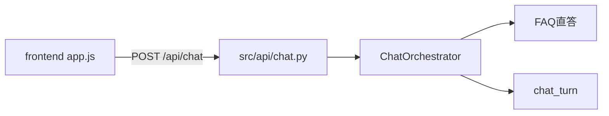
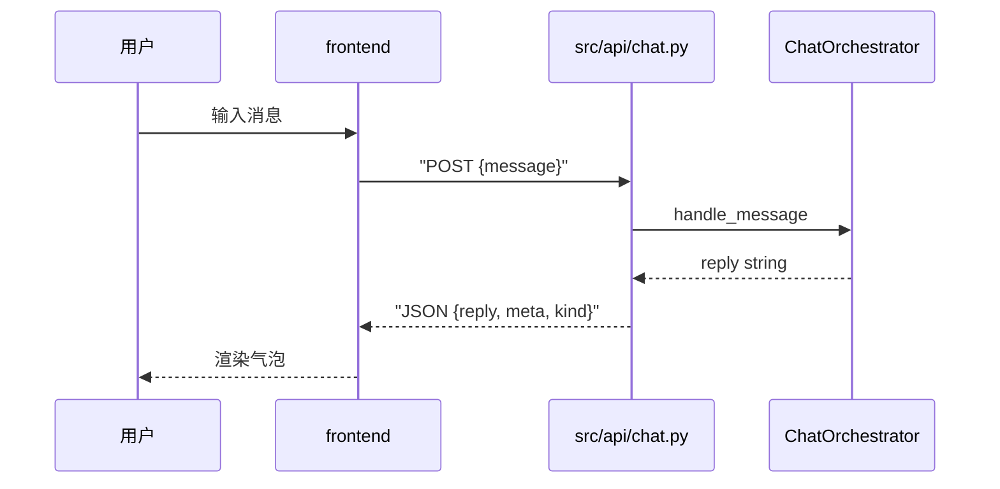

# Day 23 FastAPI Chat REST API 预习

**日期预告**：2026-07-28（星期二）  
**主题**：FastAPI Chat REST API  
**交付物**：`src/api/chat.py`  
**需求预告**：ZL-NA-REQ-023

---

## 1. 为何需要 API？

Day 22 静态页用 `mock.js` 本地模拟。真实产品必须调用 Python 编排器。Day 23 在 FastAPI 暴露 HTTP 端点，内部调用 `ChatOrchestrator.handle_message`。



---

## 2. Day 23 学习目标

| 目标 | 说明 |
|------|------|
| FastAPI 路由 | `@app.post("/api/chat")` |
| Pydantic 模型 | ChatRequest / ChatResponse |
| 编排器注入 | 依赖注入或 app.state |
| CORS | 开发环境允许 frontend 源 |
| 前端切换 | `NexusMock.useMock = false` |

---

## 3. 预期 API 契约

### 请求

```http
POST /api/chat HTTP/1.1
Content-Type: application/json

{"message": "投资有风险吗"}
```

### 响应 200

```json
{
  "reply": "[FAQ 直答·68%] 投资有风险，入市需谨慎。请阅读风险揭示书。",
  "meta": "FAQ 直答",
  "kind": "faq"
}
```

### 响应 400

```json
{"detail": "message 不能为空"}
```

与 `mock.js` 的 `sendMessageApi` 已对齐。

---

## 4. chat.py 骨架预习

```python
from fastapi import FastAPI, HTTPException
from pydantic import BaseModel

class ChatRequest(BaseModel):
    message: str

class ChatResponse(BaseModel):
    reply: str
    meta: str = ""
    kind: str = "bot"

@app.post("/api/chat", response_model=ChatResponse)
def chat(req: ChatRequest):
    text = (req.message or "").strip()
    if not text:
        raise HTTPException(status_code=400, detail="message 不能为空")
    reply = orchestrator.handle_message(text)
    # 从 reply 解析 meta/kind 或简化为 meta="API"
    return ChatResponse(reply=reply, meta="API", kind="api")
```

陈默注：正式版将复用 `parseReply` 同类逻辑于服务端辅助字段。

---

## 5. 启动命令预习

```bash
cd nexus-agent-platform
export PYTHONPATH=src NEXUS_LLM_MOCK=1
uvicorn api.main:app --reload --port 8000
```

nginx 或 FastAPI 静态挂载使 frontend 与 API 同域，避免 CORS。

---

## 6. 前端改动清单

1. `mock.js`：`useMock: false`  
2. 确认 `fetch` URL 与部署路径一致  
3. 处理网络错误展示（app.js 已有 catch）  

---

## 7. 预习任务

1. 阅读 FastAPI 官方 Tutorial - First Steps  
2. 复习 Day 21 `integrated_assistant_demo.py` 如何构建 orchestrator  
3. 本地尝试 `curl -X POST http://localhost:8000/api/chat -d '{"message":"test"}'`（Day 23 课堂）

---

## 8. 团队分工预告

| 成员 | Day 23 |
|------|--------|
| 林晓 | 前端 useMock 切换 |
| 陈默 | chat.py + 依赖注入 |
| 赵岩 | API 文案与错误信息 |
| 周航 | test_api.py CI |

---

## 9. 自检问题

1. Day 22 哪函数将变为真实 HTTP？  
2. handle_message 返回字符串如何变成 JSON？  
3. 为何建议同域部署？

<details><summary>参考答案</summary>
1. sendMessageApi / fetch /api/chat  
2. 放入 ChatResponse.reply，meta/kind 由服务端或前端解析  
3. 避免 CORS 预检复杂度，简化 Day 23 教学
</details>

---

## 10. 衔接示意图



祝预习顺利，明日见 FastAPI！

---

## 智链科技 Day 23 综合读本（节选）

### FastAPI 在 NexusAgent 中的位置

FastAPI 是 Python 异步 Web 框架，适合包装已有同步 `handle_message`。Day 23 不重构编排器，仅加 HTTP 薄层。

### 测试预告

`tests/day23/test_api.py` 将用 TestClient 测 POST /api/chat，覆盖空消息 400、FAQ 200。

### 流式预告

Day 16 流式输出将在 Sprint 4 以 SSE/WebSocket 接入，Day 23 仍是一次性 JSON 响应。

预习文档完。回归 Day 22 作业 [08_作业.md](08_作业.md)。

## 智链科技 NexusAgent Day 22 扩展读本（培训部）

### 关于前端速成在七十天路线图中的坐标

NexusAgent 七十天培训并非要把每位学员都培养成专业前端工程师，而是要在 Sprint 3 的关键节点上建立**浏览器视角**。当林晓在 Day 15 调试 Token 计数时，她面对的是 Python 解释器里的整数；当她在 Day 22 调试聊天气泡时，她面对的是 DOM 树里的节点。这两种视角的差异，正是全栈工程师需要跨越的鸿沟。陈默在架构评审中反复强调：Day 22 的代码量不足三百行，但其象征意义是「用户可见交付」的起点。赵岩从产品经理角度补充：内测用户并不关心你用了 ToolRegistry 还是 EmbeddingRetriever，他们只关心输入问题后三秒内能否看到清晰、可信、带来源提示的回答。周航则从工程角度指出：静态页虽然没有后端逻辑，却同样纳入 CI，这说明在智链科技，**一切用户触达面都是产品面**。

### HTML 语义与可维护性

很多初学者倾向于用 div 包裹一切。Day 22 的 index.html 刻意使用 header、main、footer，是为了让六个月后的自己在 Code Review 时一眼看出页面骨架。main 元素上的 role="main" 在语义 HTML 中通常冗余，但在部分读屏软件组合下仍能提供额外保障。form 元素包裹输入区而非散落的 input 与 button，是为了让 Enter 键提交成为浏览器默认行为的一部分，app.js 中的 requestSubmit 则是对这一行为的增强而非替代。林晓在练习中曾把 footer 改成 div，样式未变，但陈默在 Review 中要求改回，理由是「语义是文档契约，不只服务于当日样式」。

### CSS 变量与主题扩展

:root 中的 CSS 自定义属性是 Day 22 最重要的扩展点之一。品牌色、文字色、圆角、阴影均集中定义，使得智链科技未来若统一升级 VI，只需修改变量表。学员在作业 E 中修改 --brand 时，应同时检查 :focus 状态的 box-shadow 是否仍使用 rgba(26, 86, 219, 0.15) 硬编码；若是，可选地将焦点环颜色也变量化，作为加分项。深色模式在金融行业后台并不少见，但 Day 22 不要求实现；可在 13_ 深度扩展中阅读 prefers-color-scheme 方案，作为 Sprint 4 选修。

### JavaScript 异步与用户体验

mock.js 中的 await delay(350) 不是装饰。没有延迟时，loading 元素几乎无法被肉眼捕捉，用户会怀疑「是否真在处理」。产品心理学上，适度的等待暗示系统在工作；但超过一秒又会引发焦虑。350 毫秒是智链科技 UX 小组在内测中的折中值。app.js 在 finally 块中调用 inputEl.focus()，保证连续对话时键盘流不中断，这对高频客服场景尤为重要。错误处理 catch 分支将 err.message 渲染为 bot 气泡，避免静默失败；Day 23 接 API 后，网络错误与 500 错误将走同一通道，学员应思考是否要区分「网络不可用」与「服务器错误」的文案。

### Mock 规则与真实业务的差距

必须向学员坦白：mock.js 中的正则规则是**教学简化**，不能等同于 SimilarQuestionMatcher 的向量相似度。FAQ 规则用「风险|有风险」匹配，而后端可能对「有没有风险」「风险大吗」给出不同 score。mock_bridge_demo.py 的价值正在于并排展示这种差距。运营人员若只看浏览器 Mock 做合规签字，是错误的；应看 Day 23 接真后端后的输出。培训部在 14_ 企业案例中记录了「Mock 与生产混淆」的教训，要求演示前 status-badge 必须显示 Mock 模式。

### parseReply 的正则与国际化

当前路由正则假定中文前缀「路由:」。若未来引入英文界面，parseReply 需重构为可配置前缀表。这是陈默在架构备忘中记录的 Day 30 技术债。学员在作业 C 中扩展 system 类前缀时，应使用 startsWith 而非随意正则，保持与 FAQ 分支一致的可读性。meta 字段目前由 mock 返回、app.js 原样展示；Day 23 API 可由服务端计算 meta，减轻前端解析负担。

### 测试哲学：静态审计的价值

test_frontend.py 不启动浏览器，被部分学员质疑「不测真交互」。周航的解释是：结构契约比像素位置更稳定，CI 应在十秒内反馈。E2E 测试成本高，留给 Day 24 集成阶段。静态审计能捕获「删了 mock.js」「改错 id」类低级错误，这类错误在四十人教学中出现频率极高。frontend_audit.py 与测试共用 constants.py，体现单源真相原则，与 Day 21 工具层设计一脉相承。

### 安全与合规提示

静态页通过 http.server 提供时，无 HTTPS，仅限内网教学。不得在公网暴露未鉴权的 Mock 聊天页并宣称是生产系统。输入 maxlength=2000 是简单防护，后端 Day 23 须再次校验长度。XSS 方面，app.js 使用 textContent 而非 innerHTML 插入用户消息，是正确做法；若学员作业改为 innerHTML，讲师应坚决制止。

### 与 ChatOrchestrator 的字段级对照

handle_message 在 FAQ 命中时返回单一字符串，不返回 JSON。Day 23 API 层将承担「字符串 → 结构化响应」的职责。kind 字段在 Day 22 由 mock 显式返回，在 app.js 中 parseReply 也会推断 kind；存在冗余，但有利于 API 直接返回 kind 时跳过解析。陈默建议 Day 23 服务端根据 reply 前缀填充 kind，与前端 parseReply 逻辑保持同步，可抽取共享文档而非共享代码（前后端语言不同）。

### 团队协作情景练习

设想四人组接到紧急任务：明早九点向投资人演示。林晓负责确认 http.server 与端口；陈默负责 mock_bridge 对照无异常偏差；赵岩准备三条标准问句与话术；周航在 CI 打 green 标签。今晚任何人改 frontend 须通知全组。这种协作模式模拟真实 Sprint，是培训部除技术外的隐性目标。

### 常见面试题延伸（内部晋升参考）

1. 为何 script 标签放 body 底？—— 传统上避免阻塞解析；现代 defer 亦可。  
2. 如何用 fetch 实现超时？—— AbortController。  
3. 同域与 CORS？—— Day 23 重点。  
4. 无障碍 aria-live 的 polite 与 assertive？—— polite 不打断朗读。  

### 结语

Day 22 看似「只是几个静态文件」，实则是 NexusAgent 从工程师工具到用户产品的闸门。掌握 HTML 结构、CSS 布局、JS 事件、Mock 契约四要素，等于掌握明日 FastAPI 集成的语言。请林晓、陈默、赵岩、周航与全体学员带着「让用户看见编排器」的信念完成今日作业与预习。智链科技培训组，二零二六年七月二十七日。
