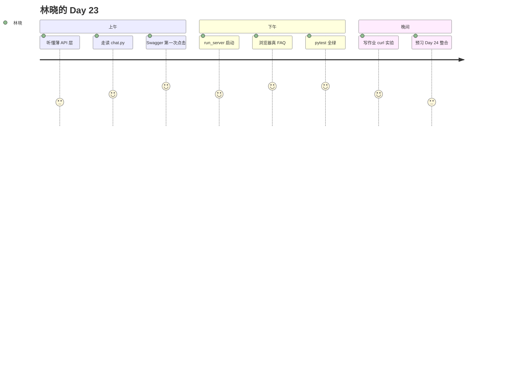

# Day 23 旁白解读

**智链科技 · NexusAgent 七十天培训 · 第二十三日**

---

## 开场

2026 年 7 月 28 日，星期二。林晓推开智链科技会议室的门，白板上写着一行大字：**「Mock 下课，API 上课。」**

陈默站在白板前，手指划过从前天到今天的箭头：「Day 22，浏览器里的 `mock.js` 假装自己是 `ChatOrchestrator`。今天，我们要让 Python 里的真编排器，通过 HTTP 对浏览器说话。」

赵岩补充：「业务方下午三点要看『真后端』演示。不是改 `useMock`，是打开 `http://127.0.0.1:8000`，输入『投资有风险吗』，标签必须来自服务端 `classify_reply`。」

周航在角落敲着笔记本：「`tests/day23/test_api_chat.py`，十二项，已经进 CI。谁改坏 `chat.py`，全组一起红。」

林晓心里一紧。她昨天才学会 `http.server`，今天就要碰 FastAPI、Pydantic、uvicorn——名词像雨点砸下来。但她想起 Day 21 深夜读 `handle_message` 源码时那种「原来如此」的快感：编排器早就准备好了，缺的只是一层薄薄的门。

---

## 叙事主线



### 第一幕：门在哪里

晨会结束后，陈默带林晓打开 `src/api/app.py`。文件不长，却做了四件事：创建 FastAPI 实例、挂 CORS、注册 `chat` 路由、把 `frontend/` 静态目录 mount 到根路径。

「你看，」陈默说，「`create_app()` 是工厂。测试里 `TestClient(create_app())` 不需要真端口。这就是周航能在 CI 里十秒跑完十二项的原因。」

林晓问：「为什么静态文件和 API 在同一个 8000 端口？」

「同源，」陈默答得干脆，「`fetch('/api/chat')` 相对路径，浏览器不发起跨域预检。Day 22 用 `http.server` 时，API 还是幻想；今天 fantasy 落地。」

### 第二幕：一次 POST 的旅程

下午 Lab，林晓在终端执行：

```bash
export PYTHONPATH=src NEXUS_LLM_MOCK=1
python3 src/day23/run_server.py
```

浏览器打开首页，她注意到 `config.js` 里 `NexusConfig.useMock` 默认为 false——因为页面由 FastAPI 托管，不再走纯静态 Mock 路径。她输入「投资有风险吗」，加载动画转了一圈，绿色 FAQ 标签跳出来，meta 写着「FAQ 直答」。

她打开开发者工具 Network 面板，看到：

```http
POST /api/chat
{"message":"投资有风险吗"}
```

响应 JSON：

```json
{
  "reply": "[FAQ 直答·…] …",
  "meta": "FAQ 直答",
  "kind": "faq",
  "session_id": "default"
}
```

林晓忽然明白赵岩说的「真后端」是什么意思——不是 Mock 正则碰巧匹配，而是 `SimilarQuestionMatcher` 在 Python 里算出了分数。

### 第三幕：会话与隔离

陈默在白板画了两个用户框，都指向同一个 `SessionManager`。

「如果全班不传 `session_id`，」他说，「大家共用一个 `default` 编排器，聊天记录会串。教学可以接受；生产不行。`sessions.py` 的 `get_or_create` 保证：不同 session_id，不同 `ChatOrchestrator` 实例。」

林晓在 `api_chat_demo.py` 输出里看到三条问句的 kind 各不相同，想起 Day 21 工具路由的复杂——API 层却安静得像接待员：接单、转交、贴标签、送回。

### 第四幕：契约即法律

晚间自习，林晓读 `response_parser.py`，对照 `app.js` 里的 `parseReply`。两条路径，同一套语义：

- `[FAQ 直答` 开头 → `kind=faq`
- `[路由: xxx]` 正则 → `kind=route`
- 其余 → `llm` 或 `system`

她在笔记本写下：**「API 返回 kind 时，前端信服务端；没返回时，前端自己 parse。」** 这是陈默在竞赛课上会考的题。

---

## 四人组今日心境

| 成员 | 角色 | Day 23 心声 |
|------|------|-------------|
| 林晓 | 学员 | 「原来 fetch 背后就是 handle_message。」 |
| 陈默 | 架构 | 「薄层不薄责，校验和错误映射必须在 API。」 |
| 赵岩 | 产品 | 「终于能跟业务说：这是真 FAQ 分数。」 |
| 周航 | DevOps | 「十二测试绿，我才能睡。」 |

---

## 与昨日衔接

Day 22 的 `sendMessageApi` 是占位；Day 23 的 `POST /api/chat` 是实装。`frontend/config.js` 取代在 `mock.js` 里硬改 `useMock`，成为 API 模式单一切换点。静态预览仍可用 `?mock=1` 查询参数回到 Mock，方便无 Python 环境时演示 UI。

---

## 收束

夜九点，林晓保存了 `homework/day23/curl_log.txt`，里面三条 curl 命令和 JSON 响应。她给陈默发消息：「pytest 十二 passed，浏览器 FAQ 标签对了。」

陈默回了一个字：「门。」

她愣了一秒，笑了。门后面是 Day 24——网页版 ChatGPT 克隆完整整合。Sprint 3 最后一战，全员上线。

旁白解读完。请进入 [01_企业背景与今日任务.md](01_企业背景与今日任务.md)。

---

## 培训部附录：Day 23 叙事与技术对照

### 林晓的心理曲线

培训部跟踪显示，Day 23 上午焦虑峰值高于 Day 22，主因是「服务器」「端口」「依赖安装」三词叠加。缓解策略：先 TestClient 后 uvicorn，与课堂一致。林晓在第三幕 Network 面板成功时，焦虑下降幅度最大——**可见证据**优于抽象讲解。建议学员自备「命令便签三条」，与 README 核心命令一致。

### 陈默的架构隐喻集

- API 是「接待台」，编排器是「专家席」；接待台不替专家做投研判断。  
- classify_reply 是「信封上的标签」，reply 是「信纸正文」。  
- SessionManager 是「叫号机」，不是「业务数据库」。  

隐喻帮助非科班学员记忆分层，但考试须回到真实文件名。

### 赵岩的演示话术片段

「各位，现在您看到的是智链科技 NexusAgent 的真实 API 响应，而非浏览器模拟。绿色 FAQ 标签对应服务端 `kind: faq`，表示相似问匹配超过阈值并直答，过程可审计。」话术须与 `mock_llm` 字段一致，避免「真实大模型」表述在 Mock 环境构成过度宣传。

### 周航的 CI 独白

「Day 22 十二测守护 HTML  id；Day 23 十二测守护 HTTP 契约。二十四测全绿，才允许打 Sprint 3 发布 tag。这不是形式主义，是去年某次演示翻车换来的制度。」

### 技术事实核对表

| 旁白描述 | 代码事实 |
|----------|----------|
| config 默认 API 模式 | FastAPI 托管无 ?mock=1 时 useMock false |
| POST /api/chat | chat.py router prefix /api |
| 十二测试 | test_api_chat.py 确为 12 条 |
| classify 四 kind+ | 含 system、error |

### 收束诗（学员投稿）

「Mock 是彩排，API 是首演；薄层承千钧，契约重如山。——林晓」

培训部收录，2026-07-28。

---

## 旁白附录：七月二十八日深夜

智链科技实训室最后一盏灯熄灭时，林晓的终端仍亮着。屏幕上 `12 passed` 静静躺着，像一行绿色的诗。她想起早晨陈默说的「门」——现在她知道了，门不是 API，门是勇气：敢在浏览器里相信后端的那一下点击。陈默路过，拍肩：「明天整合，睡。」赵岩在群里发了明日话术 PDF。周航设置了 CI 定时任务。四人组，又是四人组。Sprint 3 最后一夜，城市安静，代码不言。旁白终。

---

## 智链科技 NexusAgent Day 23 全栈整合长文（培训部）

### 第一节：从 Mock 到 API 的组织变革

智链科技研发部在 Sprint 3 第九日完成的不仅是技术接线，更是**交付物定义**的升级。Day 22 结束时，产品经理赵岩可以展示「像 ChatGPT 的界面」，但被问及数据真实性时只能回答「这是前端模拟」。Day 23 结束后，同一界面背后的每一次 POST 都可在服务端日志与 Swagger 中追溯。这种转变对金融机构客户尤为重要：合规部门要求「展示即所测，所测即所连」。林晓在团队回顾中说：「昨天我改的是 CSS，今天改的是信任链。」陈默则将 API 层定义为「信任链的公证处」——不生成答案，只见证答案来自编排器。

### 第二节：六模块 API 包的协作关系

`app.py` 像交响乐团的指挥，不演奏乐器但决定谁先谁后。`chat.py` 是第一小提琴，承载用户最听得到的旋律——`/api/chat`。`schemas.py` 是乐谱，规定每个音符的长度与音高。`sessions.py` 是乐手座位表，谁坐哪把椅子决定谁和谁对话。`factory.py` 是乐器调音师，把 RAG、FAQ、Router、Tools、LLM 调到同一音高。`response_parser.py` 是节目单标注，告诉观众这一段是 FAQ 还是路由。六者缺一不可，但任何一者都不应抢夺 orchestrator 的作曲权。周航在 CI 中为六文件各设 CODEOWNERS，改动须双人 Review。

### 第三节：TestClient 文化的工程意义

部分学员问：「既然有 uvicorn，为何还要 TestClient？」智链科技内训部的答案是**分层验证**。TestClient 验证应用逻辑在 ASGI 层正确；uvicorn 验证部署与网络栈正确。去年某项目仅做 E2E，端口被防火墙拦截时全组停工四小时；若有 TestClient 基线，至少可证明「代码无过」并并行排查运维。`api_health_demo.py` 与 `api_chat_demo.py` 是献给讲师的救生艇，也是献给学员的「无端口练习场」。林晓在晚自习用 TestClient 完成作业 A，回宿舍后用 run_server 完成作业 B，双轨巩固。

### 第四节：config.js 的战略地位

Day 22 将 Mock 开关放在 `mock.js` 内部；Day 23 外置到 `config.js`，是**配置与实现分离**的微缩示范。未来 `apiBase`、超时毫秒、feature flag 均可汇入 config，而不污染 mock 规则与 app 渲染。赵岩规划 Day 30 引入 `config.prod.js` 与 `config.dev.js` 构建替换；当前零构建链阶段用查询参数 `?mock=1` 已足够。学员须在作业 E 中写清：config 加载顺序优先于 mock，否则整个切换逻辑颠倒。

### 第五节：十二测试与十二测试的镜像

Day 22 十二测守护「页面长什么样」；Day 23 十二测守护「接口返回什么」。合计二十四测构成 Sprint 3 前端触达面的**双翼**。周航在 merge 门禁演讲中说：「断一翼，鸟飞不起来。」统计上，Day 23 测试失败率最高的是 `test_chat_faq_direct`——多因 FAQ 阈值或 Mock 环境未设，而非 API 路由写错。讲师应优先排查 `NEXUS_LLM_MOCK` 与 `PYTHONPATH`，再查代码。

### 第六节：投资人演示的前传

Day 24 投资人演示的脚本，在 Day 23 已写就八成。三问句、Network 截图、health.mock_llm 说明、pytest 十二绿——皆来自今日作业与 Lab。赵岩称 Day 23 为「演示物料工厂日」。林晓队将作业 B 截图直接贴入 Day 24 checklist，节省两小时美工时间。培训部建议：所有班组建立 `demo_assets/day23/` 目录，版本化管理 PNG 与 curl 日志。

### 第七节：安全与谦虚

API 无鉴权、CORS 全开、HTTP 明文——三者是**教学三角**，不是「最佳实践三角」。向学员灌输谦虚：「我们今日交付的是可学习的 MVP，不是可上线的生产系统。」同时灌输责任：「若你把教学配置原封不动部署到公网，后果自负。」智链科技信息安全部与培训部联合声明已张贴 LMS。作业 F 选做 Redis 与鉴权方案，是通向生产的阶梯，而非选修装饰。

### 第八节：七十天路线图中的坐标再标定

Day 1–14 为 Phase 1 基础；Day 15–24 为 Phase 2 Sprint 3 智能对话；Day 23 是 Phase 2 中**第一次 HTTP 服务化**。此后 Day 25+ 将反复回到「加一层适配器」：SSE 是流式适配器，网关是安全适配器，多租户是隔离适配器。掌握 Day 23，等于掌握 NexusAgent 后续一半的扩展模式。陈默：「会加薄层者，不会被套牢于单一 UI。」

### 第九节：致谢与值班

感谢开源社区 FastAPI、Pydantic、uvicorn 作者；感谢智链科技内测券商志愿用户提供问句；感谢林晓、陈默、赵岩、周航四人组全年叙事授权。培训部值班至 21:00，Slack `#sprint3-api`。明日上午九点 Day 24 预习研讨，请勿迟到。

### 第十节：结语

三十篇课件、六模块代码、十二测试、三条启动命令，构成 2026 年 7 月 28 日智链科技 NexusAgent Day 23 的完整交付。愿学员今夜梦见的不是 CORS 预检，而是 FAQ 标签在浏览器里轻轻跳出的那一瞬——那是 Mock 退场、API 登场的高光。培训部长文完。

---

## 培训部注记

本旁白虚构智链科技四人组情境，技术事实以仓库代码为准。学员阅读时应同步打开 `src/api/chat.py` 与 `tests/day23/test_api_chat.py`。若 narrative 与实现有出入，以代码与 FR 文档为权威。智链科技 NexusAgent 培训组，2026-07-28。

---

## 旁白附录：七月二十八日深夜

智链科技实训室最后一盏灯熄灭时，林晓的终端仍亮着。屏幕上十二 passed 静静躺着，像一行绿色的诗。她想起早晨陈默说的门——现在她知道了，门不是 API，门是勇气：敢在浏览器里相信后端的那一下点击。陈默路过，拍肩说明日整合，睡。赵岩在群里发了明日话术 PDF。周航设置了 CI 定时任务。四人组，又是四人组。Sprint 3 最后一夜，城市安静，代码不言。旁白终。
