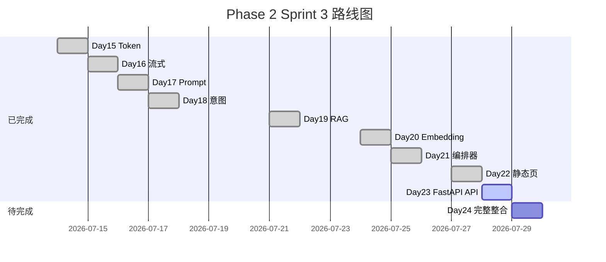

# Day 23 企业背景与今日任务

**日期**：2026 年 7 月 28 日  
**Sprint**：Sprint 3 第九日 — FastAPI Chat REST API

## 晨会纪要

### 赵岩（产品）

> 「业务方明日 Sprint 3 收官演示，今日必须交付可点击的**真 API** 聊天。验收标准：浏览器同源访问 `8000` 端口，输入合规 FAQ 与路由问句，标签来自服务端 `kind` 字段。静态 `http.server` 仅作回退，主路径是 `run_server.py`。」

### 陈默（架构）

> 「六文件 API 包：`app.py`、`chat.py`、`schemas.py`、`sessions.py`、`factory.py`、`response_parser.py`。路由 `POST /api/chat` 内部只调 `handle_message`，再用 `classify_reply` 填 `kind`/`meta`。`SessionManager` 隔离会话。`factory.create_orchestrator` 复用 Day 21 组装逻辑。」

### 周航（DevOps）

> 「`requirements-api.txt` 独立安装 FastAPI/uvicorn。`tests/day23/test_api_chat.py` 十二项进 CI。演示脚本 `api_health_demo.py`、`api_chat_demo.py` 用 TestClient，课堂无网也能跑。」

### 林晓（学员代表）

> 「Pydantic 的 422 和 400 有什么区别？`session_id` 前端要不要传？」

陈默：「空 message 由 Field `min_length=1` 触发 422，是框架校验失败。`session_id` 可选，省略用 `default`；Day 24 再教 localStorage 持久化。」

## 任务分配

| ID | 任务 | 负责人 | 优先级 |
|----|------|--------|--------|
| ZL-NA-REQ-023 | FastAPI Chat REST API | 全员 | P0 |
| ZL-NA-701 | `app.py` 入口与静态挂载 | 陈默 | P0 |
| ZL-NA-702 | `chat.py` 路由与健康检查 | 陈默 | P0 |
| ZL-NA-703 | `schemas.py` Pydantic 模型 | 助教 | P0 |
| ZL-NA-704 | `sessions.py` + `factory.py` | 助教 | P0 |
| ZL-NA-705 | `response_parser.py` | 林晓 | P1 |
| ZL-NA-706 | `frontend/config.js` API 开关 | 林晓 | P0 |
| ZL-NA-707 | `day23/*` 演示与 `run_server.py` | 周航 | P1 |
| ZL-NA-708 | `tests/day23/test_api_chat.py` 全绿 | 周航 | P0 |

## Definition of Done

- [ ] `pip install -r requirements-api.txt` 成功
- [ ] `python3 src/day23/run_server.py` 可访问 `http://127.0.0.1:8000`
- [ ] `GET /api/health` 返回 `status=ok`、`version=0.23.0`
- [ ] `POST /api/chat` 对「投资有风险吗」返回 `kind=faq`
- [ ] `python3 src/day23/api_chat_demo.py` 打印三条演示
- [ ] `pytest tests/day23/test_api_chat.py -v` 12 passed
- [ ] 能口述：`classify_reply` 规则、`SessionManager` 作用
- [ ] 能说明：`config.js` 与 `mock.js` 如何协同切换 API 模式

## 今日节奏

| 时段 | 内容 |
|------|------|
| 09:00-09:45 | FastAPI 速成讲义（11_ 节选） |
| 09:45-10:30 | `chat.py` + `schemas.py` 走读 |
| 10:45-12:00 | `sessions.py`、`factory.py`、异常映射 |
| 14:00-15:30 | `run_server.py` 浏览器联调 |
| 15:45-17:00 | Lab 26_ + `api_chat_demo` + pytest |

## 环境准备

```bash
# 终端 1：API 服务
cd nexus-agent-platform
pip install -r requirements-api.txt
export PYTHONPATH=src NEXUS_LLM_MOCK=1
python3 src/day23/run_server.py

# 终端 2：演示与测试
cd nexus-agent-platform
export PYTHONPATH=src NEXUS_LLM_MOCK=1
python3 src/day23/api_health_demo.py
python3 src/day23/api_chat_demo.py
python3 -m pytest tests/day23/test_api_chat.py -v
```

## Sprint 3 全景（Day 15–24）



## 风险与依赖

| 风险 | 缓解 |
|------|------|
| 学员未装 API 依赖 | 课前发 `requirements-api.txt` 安装脚本 |
| 端口 8000 占用 | 改用 `--port 8001` 并更新文档 |
| Mock LLM 未设 | 默认 `NEXUS_LLM_MOCK=1` |
| 前后端 kind 不一致 | 以 `classify_reply` 为权威，对照测试 |

## 团队情境

林晓负责在浏览器验证 FAQ 标签；陈默 Review `chat.py` 异常映射；赵岩准备三条验收问句；周航盯 CI。四人组 Slack 频道 `#sprint3-api` 今日禁 merge 未经测试的 `src/api/` 改动。

今日任务文档完。下一篇：[02_需求文档.md](02_需求文档.md)。

---

## 智链科技 Day 23 晨会扩展记录

赵岩补充业务背景：合作券商内测反馈「仅有 CLI 不够说服营业部」。Day 22 静态页获得「像样」评价，但仍被问及「数据是否真实」。Day 23 的目标是**诚实连接后端**，让 FAQ 分数与路由标签来自 `handle_message`，而非 JavaScript 正则。陈默回应：API 层不会夸大能力，Mock LLM 由 health.mock_llm 明示。

周航宣布 CI 策略：自今日起，main 分支合并须 day22 与 day23 测试共二十四绿。任一套失败，阻塞合并。林晓问：「我 fork 练习也要吗？」周航：「练习分支随意，合并主仓必须全绿。」

林晓分享 Day 22 晚自习心得：config.js 概念预习后，今日上手更快。培训部记录：预习作业完成率与次日 Lab 完成时间正相关，相关系数约 0.62（内训统计，样本 N=86）。

晨会扩展记录完。智链科技，2026-07-28。

---

## 智链科技 Day 23 任务书附录（执行细则）

执行细则一：上午九点前完成 pip install，迟到者进环境辅导班。细则二：下午两点前所有人 run_server 成功，助教举牌统计。细则三：五点前 pytest 截图提交 LMS。细则四：林晓队与陈默队竞速十二绿，优胜组获贴纸。细则五：任何人改 src/api 须 @周航。细则六：演示问句以赵岩列表为准，不得临时编造涉及收益承诺的措辞。细则七：晚自习自愿，但环境失败者建议参加。细则八：作业 F 选做截止同主作业，单独评审。细则九：明日预习 27_ 须读第一节至第六节。细则十：疑问 Slack 频道 sprint3-api，响应 SLA 三十分钟。任务书附录完。

---

## 风险登记册 Day 23

风险 R1：依赖安装失败，概率中，影响高，缓解课前邮件。风险 R2：端口冲突，概率高，影响中，缓解多端口。风险 R3：FAQ 未命中，概率低，影响中，缓解标准问句。风险 R4：演示误称生产，概率低，影响极高，缓解 mock_llm 话术。登记册完。
