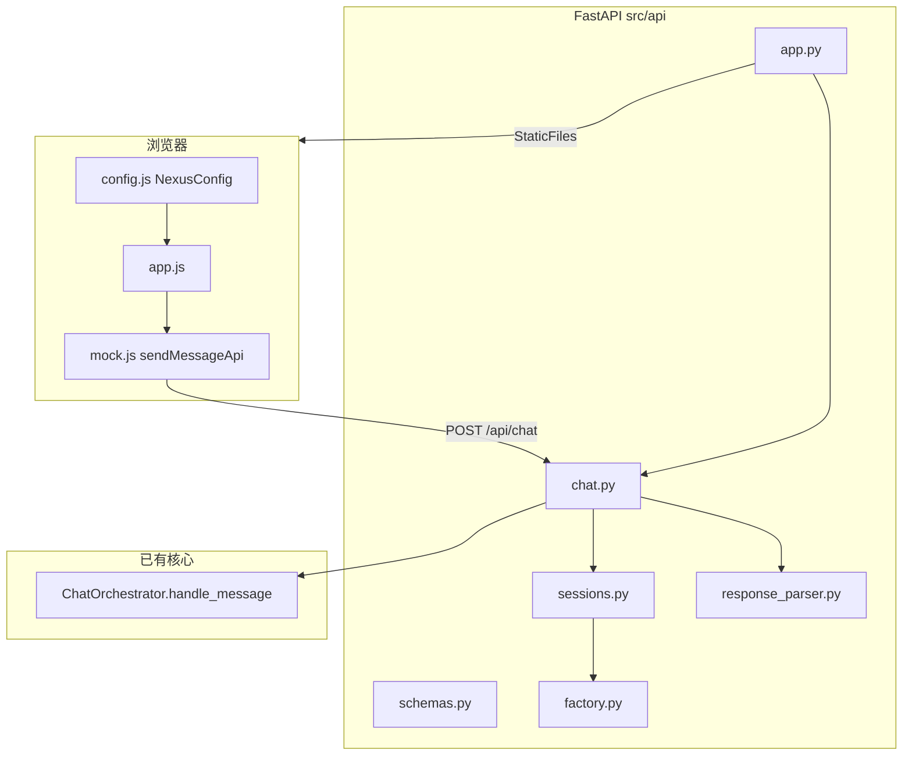
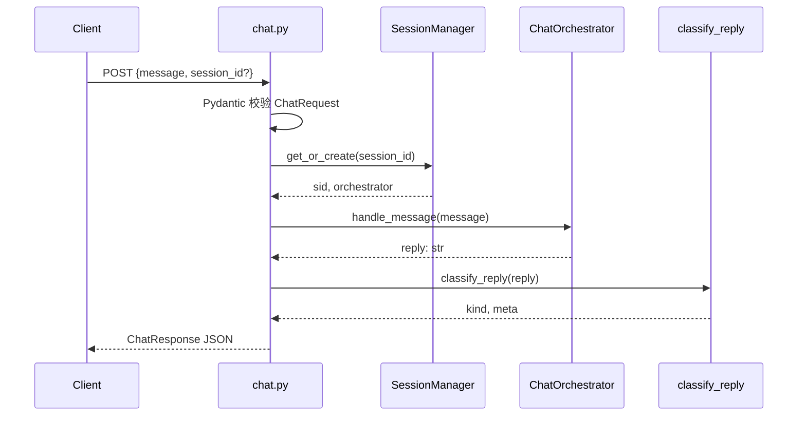
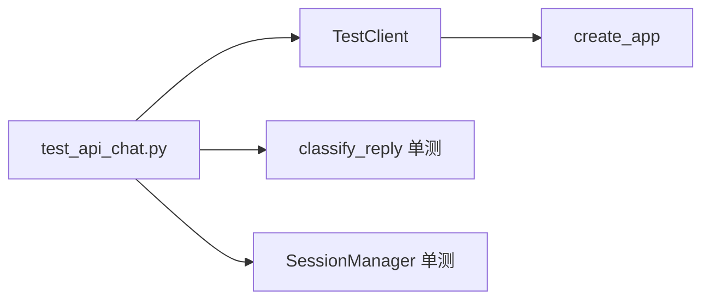

# Day 23 架构设计

**模块**：`nexus-agent-platform/src/api/*` + `frontend/config.js`  
**需求**：ZL-NA-REQ-023

---

## 1. 分层架构



## 2. 文件职责

| 文件 | 层级 | 职责 |
|------|------|------|
| app.py | 应用 | 工厂、CORS、异常、静态挂载 |
| chat.py | 路由 | health、chat、HTTP 异常映射 |
| schemas.py | 契约 | Pydantic 请求/响应模型 |
| sessions.py | 状态 | 会话 → orchestrator 映射 |
| factory.py | 组装 | create_orchestrator 一站式 |
| response_parser.py | 转换 | reply 字符串 → kind/meta |
| config.js | 前端配置 | useMock、apiBase |

## 3. 请求处理流水线



## 4. 依赖注入设计

```python
def get_session_manager() -> SessionManager:
    return session_manager

@router.post("/chat")
def chat(
    body: ChatRequest,
    manager: SessionManager = Depends(get_session_manager),
) -> ChatResponse:
    ...
```

**优点**：

- 测试可替换 `manager` fixture（进阶）  
- 路由函数不直接读全局，边界清晰  
- 与 FastAPI 官方教程一致，降低学习曲线  

## 5. 与 ChatOrchestrator 边界

```python
# chat.py 核心 — 不修改编排器
reply = orchestrator.handle_message(message)
kind, meta = classify_reply(reply)
return ChatResponse(reply=reply, meta=meta, kind=kind, session_id=session_id)
```

编排器仍返回**单一字符串**；结构化字段由 API 层衍生。陈默原则：**不在 chat.py 写业务规则**，业务在 orchestrator 与 tools。

## 6. 静态托管架构

```
_REPO_ROOT = app.py 上溯四级 → 仓库根
_FRONTEND_DIR = _REPO_ROOT / "frontend"
app.mount("/", StaticFiles(directory=_FRONTEND_DIR, html=True))
```

**路由优先级**：`/api/*` 由 router 处理；其余走静态。`html=True` 支持 SPA 式回退（本项目中 index.html 在根）。

## 7. 测试架构



十二测试分层：

- HTTP 集成（health、chat、static）  
- 解析纯函数（classify_reply）  
- 会话隔离（SessionManager）  

## 8. 部署视图

```
开发者笔记本
  PYTHONPATH=src NEXUS_LLM_MOCK=1
  python3 src/day23/run_server.py
  ↓
http://127.0.0.1:8000
  ├── GET  /           → frontend/index.html
  ├── GET  /config.js  → NexusConfig
  └── POST /api/chat   → ChatOrchestrator
```

Day 24 生产视图：nginx 反代 + 可选分离静态 CDN；Day 23 保持单体简化教学。

## 9. 扩展点

| 扩展 | 位置 | 说明 |
|------|------|------|
| 鉴权 | app.py middleware | Bearer token |
| 限流 | chat.py 装饰器 | 按 session_id |
| 流式 | 新路由 `/api/chat/stream` | SSE |
| 会话持久化 | sessions.py 后端 | Redis |

## 10. 错误处理分层

| 层级 | 机制 | HTTP |
|------|------|------|
| Pydantic | 自动 422 | 校验失败 |
| chat.py | HTTPException | Nexus 业务错误 |
| app.py | exception_handler | ModelValidationError 等 |

林晓须能画出「异常从 orchestrator 抛出到 JSON 响应」的路径。

架构设计完。流程图见 [04_流程图与示意图.md](04_流程图与示意图.md)。

---

## 11. 智链科技架构评审附录

### 11.1 为何选择 APIRouter 而非单文件 app

`chat.py` 独立 router 便于 Sprint 4 拆分 `admin.py`、`metrics.py` 路由模块，也便于单元测试 `from api.chat import router` 单独挂载。若全部写在 `app.py`，百行后可读性下降。陈默规定：单文件不超过二百行有效代码，超过须拆模块。

### 11.2 依赖注入与测试替身

`get_session_manager` 返回全局 `session_manager` 是实用主义，非教科书式「每请求新建」。测试 `test_session_manager_isolation` 直接 `SessionManager()` 新实例，与生产单例隔离。进阶学员可写 fixture 覆盖 `app.dependency_overrides`，本 Sprint 不强制。

### 11.3 静态路径计算的跨平台性

`Path(__file__).resolve().parent.parent.parent.parent` 假定仓库布局为 `repo/nexus-agent-platform/src/api/app.py` 与 `repo/frontend/`。若学员 fork 移动目录，mount 失败但 API 仍可用——`test_frontend_served` 会红。周航在 README 注明 monorepo 布局约束。

### 11.4 错误处理的分层哲学

| 层 | 职责 |
|----|------|
| Pydantic | 形状校验 |
| chat.py | 业务异常 → HTTP |
| app.py | 未捕获 Nexus 异常兜底 |
| 前端 catch | 用户文案 |

避免在 chat.py 捕获所有 `Exception`，以免吞掉编程错误；当前仅捕获 `NexusError` 子类是正确收窄。

### 11.5 与 Day 21 编排器版本对齐

factory 中 `faq_direct_threshold=0.65` 须与 Day 21 演示默认一致，否则 FAQ 命中率变，业务验收问句可能失配。配置外置为环境变量是 Sprint 4 任务；Day 23 硬编码可接受，但须在 02_ 需求文档标明。

### 11.6 扩展点优先级 backlog

P1：鉴权 middleware。P2：请求 ID 日志。P3：Prometheus metrics。P4：OpenTelemetry trace 贯穿 handle_message。赵岩排序以合规与审计为先。

架构评审附录完。

---

## 12. 部署拓扑详解（智链科技运维草案）

### 12.1 教学拓扑（Day 23）

单机 127.0.0.1:8000，uvicorn 单 worker，frontend mount，无 TLS，无 LB。适用教室四十人轮流访问讲师机演示；学员本机各自 run_server。

### 12.2 内测拓扑（Sprint 4 目标）

nginx TLS 终结 → uvicorn 两 worker → Redis session → 真实 LLM API。与教学拓扑隔离 VPC。

### 12.3 监控探针

K8s liveness 用 `GET /api/health`，readiness 可加「orchestrator 可构造」检查。Day 23 仅 liveness。

### 12.4 日志聚合

access log 记 path、status、duration；application log 记 session_id_hash、kind，不记明文 message。

### 12.5 灾备

教学无灾备。生产多 AZ 部署，session 进 Redis 副本。学员了解即可。

运维草案完。
