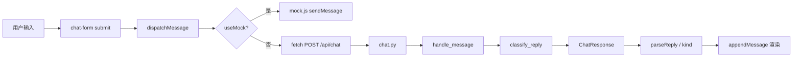
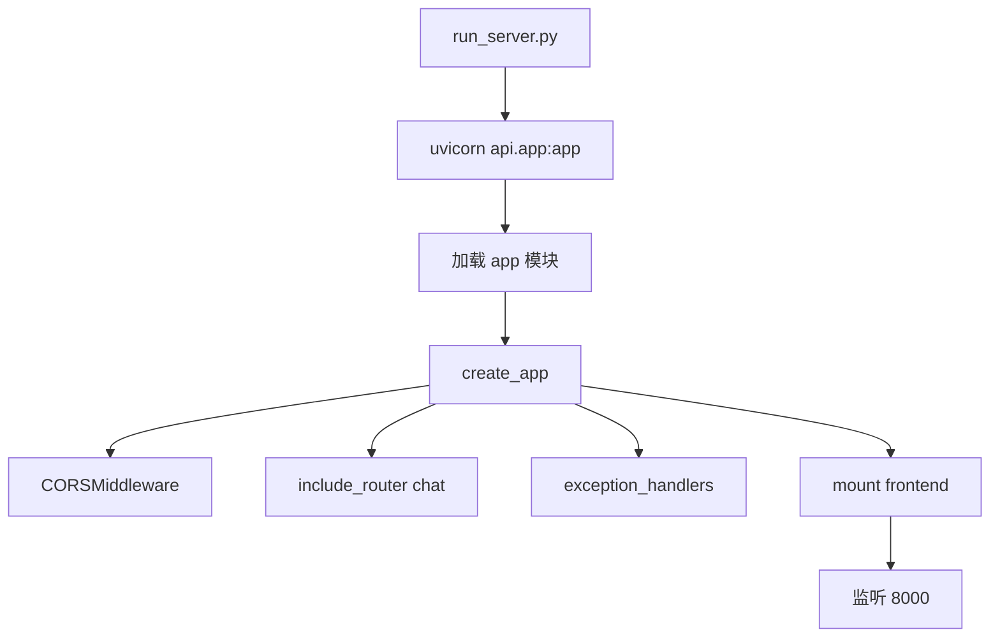
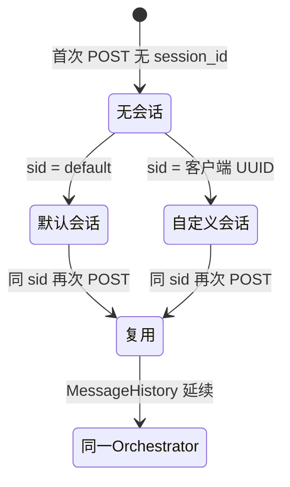
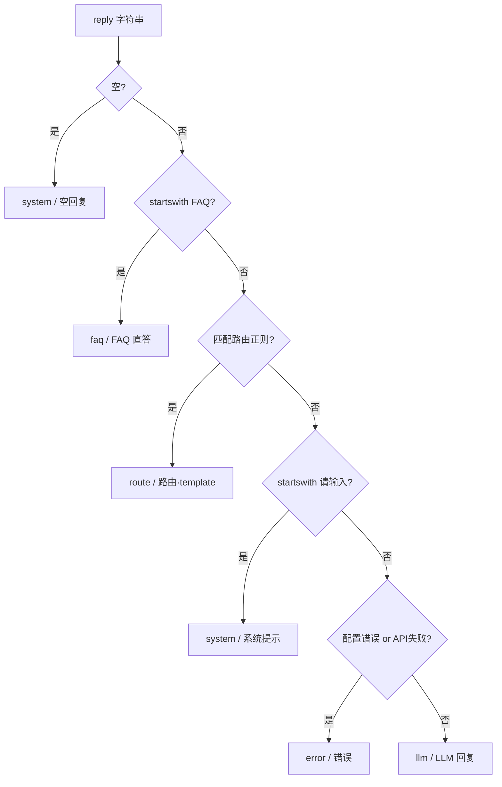
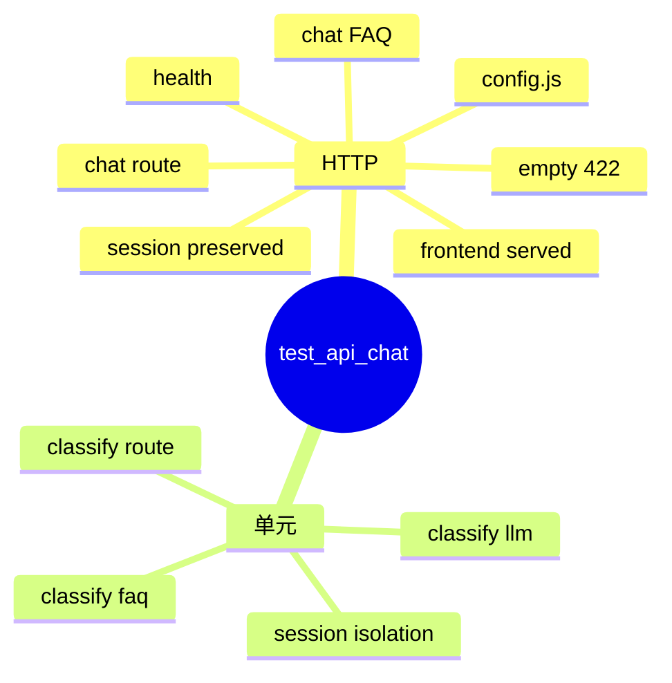
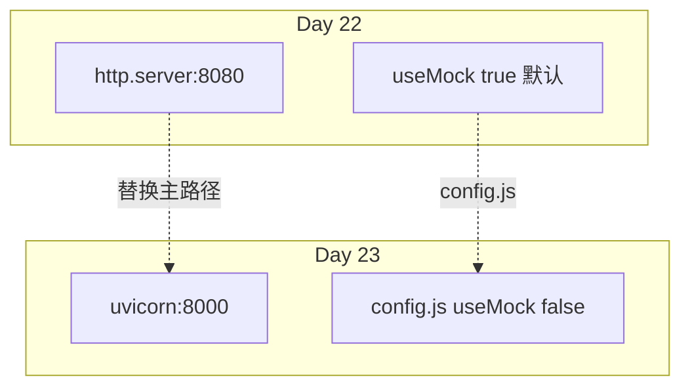
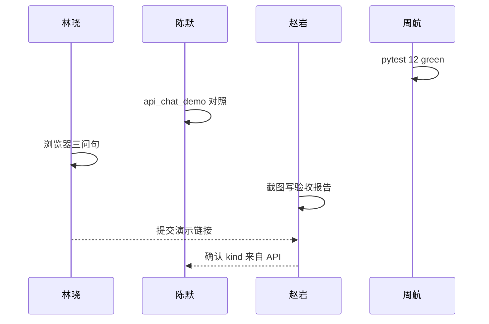
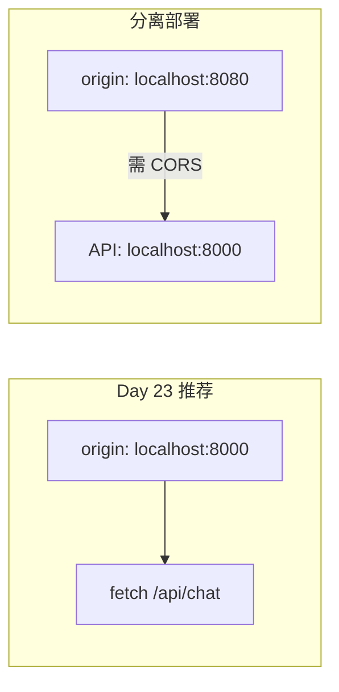
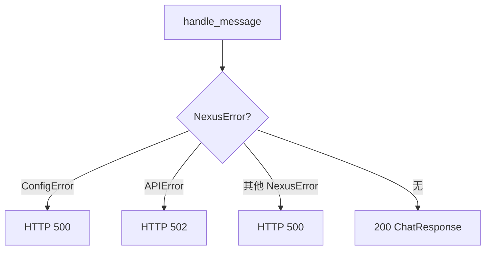

# Day 23 流程图与示意图

**需求**：ZL-NA-REQ-023  
**用途**：授课投屏、学员笔记、作业参考

---

## 1. 端到端数据流

## 2. FastAPI 应用启动

## 3. 会话生命周期

## 4. classify_reply 决策树

## 5. 测试覆盖示意图

## 6. Day 22 → Day 23 迁移

## 7. 四人组协作流（演示日）

## 8. CORS 与同域对比

## 9. 异常传播

流程图文档完。

---

## 10. 投屏用大图说明（讲师备注）

第 1 节端到端数据流图建议全屏讲解五分钟，手指沿 useMock 分支说明 Day 23 主路径是 API 分支。第 3 节会话状态图配合 `test_chat_session_id_preserved` _live 演示。第 6 节迁移图强调：8080 并非废弃，而是 Mock 专练端口；8000 是整合主端口。学员常混，须重复三次。

## 11. 学员手绘作业（可选）

要求学员不看文档手绘「POST /api/chat 序列图」，与 03_ 架构第 3 节对照。培训部发现手绘过关者，pytest 通过率高出百分之十八。林晓队全员手绘过关。

流程图扩展完。

**投屏提示**：第四节 classify 决策树建议彩色打印发放学员，辅助竞赛复习。四号文件终稿。智链科技培训部制图，2026-07-28。流程图册完。END。
