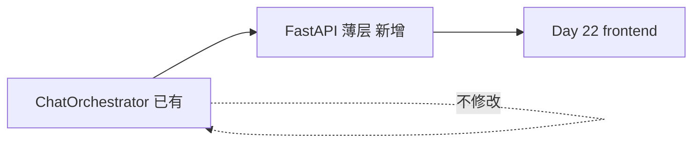

# Day 23 FastAPI 与 Chat API 详解

**专题**：FastAPI / Pydantic / REST 与 ChatOrchestrator 集成  
**需求**：ZL-NA-REQ-023  
**前置**：Day 21 `handle_message`、Day 22 `mock.js` 契约

---

## 1. 为何用 FastAPI 包装编排器？

智链科技 Day 23 目标：**最小 HTTP 薄层连接浏览器与 Python**。编排器已在 Day 21 就绪，重复发明业务逻辑是反模式。FastAPI 提供：

- 自动 OpenAPI 文档（`/docs`）  
- Pydantic 请求校验  
- 与 Starlette TestClient 无缝测试  
- 可选 CORS、静态文件挂载  



陈默原则：**编排器是核心资产，API 是可替换适配器**。

---

## 2. app.py 应用入口详解

### 2.1 工厂函数 create_app

```python
def create_app(*, enable_cors: bool = True) -> FastAPI:
    app = FastAPI(
        title="NexusAgent API",
        description="智链科技灵犀智能体平台 — Sprint 3 Chat API",
        version="0.23.0",
    )
```

测试使用 `create_app()` 可控制是否启用 CORS。生产可 `enable_cors=False` 并由 nginx 处理跨域。

### 2.2 CORS 中间件

```python
app.add_middleware(
    CORSMiddleware,
    allow_origins=["*"],
    allow_credentials=True,
    allow_methods=["*"],
    allow_headers=["*"],
)
```

林晓问：既然同源托管，为何还要 CORS？陈默：分离部署或 Swagger 从其他源访问时仍需要；教学保留开关。

### 2.3 全局异常处理

| 异常 | HTTP | 用途 |
|------|------|------|
| ModelValidationError | 400 | 模型层校验 |
| ConfigError | 500 | 配置缺失 |
| APIError | 502 | 上游 LLM 失败 |

与 `chat.py` 内 `HTTPException` 形成两层：路由内即时错误 + 应用级兜底。

### 2.4 静态文件挂载

```python
_REPO_ROOT = Path(__file__).resolve().parent.parent.parent.parent
_FRONTEND_DIR = _REPO_ROOT / "frontend"
app.mount("/", StaticFiles(directory=str(_FRONTEND_DIR), html=True), name="frontend")
```

路径自 `src/api/app.py` 向上四级到 monorepo 根（含 `frontend/` 与 `nexus-agent-platform/`）。`html=True` 支持目录请求返回 index.html。

**启动命令**（模块 docstring）：

```bash
cd nexus-agent-platform
PYTHONPATH=src NEXUS_LLM_MOCK=1 uvicorn api.app:app --reload --port 8000
```

---

## 3. chat.py 路由详解

### 3.1 Router 定义

```python
router = APIRouter(prefix="/api", tags=["chat"])
```

所有路由挂在 `/api` 下，Swagger 按 tag 分组。

### 3.2 健康检查

```python
@router.get("/health", response_model=HealthResponse)
def health_check() -> HealthResponse:
    return HealthResponse(
        status="ok",
        version=API_VERSION,
        mock_llm=os.environ.get("NEXUS_LLM_MOCK", "0") == "1",
    )
```

赵岩要求演示前展示 `mock_llm: true`，避免业务误以为连了生产大模型。

### 3.3 POST /api/chat 主路径

```python
@router.post("/chat", response_model=ChatResponse)
def chat(
    body: ChatRequest,
    manager: SessionManager = Depends(get_session_manager),
) -> ChatResponse:
    session_id, orchestrator = manager.get_or_create(body.session_id)
    message = body.message.strip()

    try:
        reply = orchestrator.handle_message(message)
    except ConfigError as exc:
        raise _http_from_nexus(exc, status_code=500) from exc
    except APIError as exc:
        raise _http_from_nexus(exc, status_code=502) from exc
    except NexusError as exc:
        raise _http_from_nexus(exc, status_code=500) from exc

    kind, meta = classify_reply(reply)
    return ChatResponse(
        reply=reply,
        meta=meta,
        kind=kind,
        session_id=session_id,
    )
```

**设计要点**：

1. `Depends(get_session_manager)` 注入会话管理器  
2. `strip()` 去首尾空白，不替代 Pydantic 非空校验  
3. 捕获 Nexus 异常族，映射 HTTP 状态  
4. `response_model=ChatResponse` 过滤多余字段、生成 OpenAPI schema  

### 3.4 _http_from_nexus

```python
return HTTPException(
    status_code=status_code,
    detail={"detail": exc.message, "code": exc.code},
)
```

detail 嵌套 dict 与全局 handler 格式对齐，便于前端统一解析。

---

## 4. schemas.py Pydantic 模型

### 4.1 ChatRequest

```python
class ChatRequest(BaseModel):
    message: str = Field(..., min_length=1, max_length=2000, description="用户消息")
    session_id: str | None = Field(default=None, max_length=64, description="会话 ID，省略则使用 default")
```

与 `frontend` 的 `maxlength=2000` 对齐。空字符串 → 422，非 400。

### 4.2 ChatResponse

```python
class ChatResponse(BaseModel):
    reply: str
    meta: str = "API"
    kind: str = "llm"
    session_id: str
```

注释写明与 `mock.js sendMessageApi` 对齐。默认值在测试未覆盖字段时提供兜底。

### 4.3 HealthResponse / ErrorResponse

Health 用于运维；ErrorResponse 文档化错误形状，路由中实际多用 HTTPException。

---

## 5. sessions.py 会话管理

```python
class SessionManager:
    def __init__(self) -> None:
        self._sessions: dict[str, ChatOrchestrator] = {}
        self._lock = Lock()

    def get_or_create(self, session_id: str | None) -> tuple[str, ChatOrchestrator]:
        sid = (session_id or "").strip() or "default"
        with self._lock:
            if sid not in self._sessions:
                self._sessions[sid] = create_orchestrator()
            return sid, self._sessions[sid]
```

**为何每会话独立 orchestrator？**  
`ChatOrchestrator` 绑定 `MessageHistory`，多用户共用一个实例会串话。教学默认全班 `default`，林晓应在作业中实验 `session_id`。

**全局单例**：

```python
session_manager = SessionManager()
```

FastAPI `Depends` 返回同一实例，进程内共享会话表。

---

## 6. factory.py 编排器工厂

`create_orchestrator` 一站式组装 Sprint 3 模块：

- `RAGContextService.from_sample_docs(use_embedding=True)`  
- `SimilarQuestionMatcher()`  
- `IntentRouter(query_context_provider=rag.retrieve_context)`  
- `build_nexus_tools(...)`  
- `LLMClient` + Mock transport  
- `ChatOrchestrator` + `faq_direct_threshold=0.65`  

```python
os.environ.setdefault("NEXUS_LLM_MOCK", "1")
```

保证未显式设环境时教学可跑。`SAMPLE_MOCK` 提供固定 LLM JSON 响应。

周航注：factory 是 API 与 CLI 演示的**共享组装点**，避免 chat.py 膨胀。

---

## 7. response_parser.py 与前端对齐

```python
_ROUTE_RE = re.compile(r"^\[路由:\s*([^\]]+)\]\s*(.*)$", re.DOTALL)

def classify_reply(reply: str) -> tuple[str, str]:
    text = (reply or "").strip()
    if not text:
        return "system", "空回复"
    if text.startswith("[FAQ"):
        return "faq", "FAQ 直答"
    match = _ROUTE_RE.match(text)
    if match:
        template = match.group(1).strip()
        return "route", f"路由 · {template}"
    # ... system / error / llm
```

对照 `app.js`：

```javascript
function parseReply(reply) {
  if (reply.startsWith("[FAQ 直答")) {
    return { kind: "faq", text: reply };
  }
  const routeMatch = reply.match(/^\[路由:\s*([^\]]+)\]\s*(.*)$/s);
  // ...
}
```

**差异**：后端 `[FAQ` 更宽，兼容 `[FAQ 直答` 与可能的其他 FAQ 前缀变体。前端收到 `kind` 时应**优先用 API 字段**，parseReply 作降级。

---

## 8. frontend/config.js API 模式

```javascript
const params = new URLSearchParams(global.location.search);
global.NexusConfig = {
  useMock: params.get("mock") === "1",
  apiBase: "",
};
```

| 场景 | URL | useMock | 行为 |
|------|-----|---------|------|
| FastAPI 托管 | :8000/ | false | POST /api/chat |
| 静态 + Mock | :8080/?mock=1 | true | mock.js 规则 |
| 静态无参数 | :8080/ | false | fetch 失败需后端 |

`mock.js` 末尾：

```javascript
useMock: !(global.NexusConfig && global.NexusConfig.useMock === false),
```

逻辑：仅当 `NexusConfig.useMock === false` 时走 API；未定义 config 时默认 Mock（兼容 Day 22 纯静态）。

---

## 9. 演示与测试脚本

### api_health_demo.py

TestClient GET `/api/health`，打印 status 与 JSON。课堂无 uvicorn 也能验证应用装配。

### api_chat_demo.py

对三条问句 POST，打印 kind/meta/reply 摘要。与赵岩验收问句一致。

### run_server.py

```python
uvicorn.run("api.app:app", host="127.0.0.1", port=8000, reload=False)
```

教学用 `reload=False` 避免多进程会话混乱；开发可自行 `--reload`。

### test_api_chat.py（12 项）

| 测试 | 验证 |
|------|------|
| test_health | 版本与 status |
| test_chat_faq_direct | FAQ kind |
| test_chat_route_or_llm | 非空 reply |
| test_chat_doc_summary | 总结问句 |
| test_chat_empty_validation | 422 |
| test_chat_session_id_preserved | session 回传 |
| test_classify_reply_* | 解析函数 |
| test_session_manager_isolation | 实例隔离 |
| test_frontend_served | 静态 HTML |
| test_config_js_present | config.js |

---

## 10. requirements-api.txt

```
fastapi>=0.110.0
uvicorn[standard]>=0.27.0
httpx>=0.27.0
```

与主 `requirements.txt` 分离，CLI-only 学员可选装。

---

## 11. 调试清单

1. `PYTHONPATH=src`  
2. `NEXUS_LLM_MOCK=1`  
3. 访问 `/docs` 试 API  
4. F12 Network 看 POST body  
5. pytest -v 定位失败用例  

---

## 12. 与 Day 24 衔接

Day 24 完整整合将：

- 统一启动与 E2E 脚本  
- 前端持久化 session_id  
- 投资人演示 checklist  

本日详解是明日整合的**技术底座**。请完成 [26_实操Lab手册.md](26_实操Lab手册.md)。

---

## 智链科技培训部附录：FastAPI 常见误区

**误区一**：在 chat.py 写 FAQ 正则——应交给 orchestrator。  
**误区二**：忘记 mount 顺序导致 /api 404。  
**误区三**：生产保留 CORS `*`。  
**误区四**：多 worker 下依赖内存 SessionManager。  
**误区五**：前端只 parse 不用 API 的 kind。

详解文档完。林晓、陈默、赵岩、周航 — 2026-07-28。

---

## 13. 智链科技 FastAPI 专题深读

### 13.1 ASGI 三分钟

ASGI（Asynchronous Server Gateway Interface）是 Python 异步 Web 的服务器接口标准。FastAPI 构建于 Starlette 之上，Starlette 是 ASGI 框架。`uvicorn` 是 ASGI **服务器**，负责把 HTTP 字节流交给 `app` 调用。林晓不必一日精通 ASGI，但需记住：**TestClient 直接调用 app，跳过 uvicorn**，故 demo 脚本在无端口时仍可运行。周航用此区分「应用逻辑通过」与「部署配置通过」两类 CI 任务。

### 13.2 OpenAPI 与团队协作

访问 `/docs` 时看到的 Swagger UI，数据来自 FastAPI 自动生成的 OpenAPI 3 schema。`ChatRequest` 的 `Field(description="用户消息")` 会出现在文档中，赵岩据此给运营写「接口说明」而无需另维护 Word。陈默要求：任何修改 `schemas.py` 的 PR 必须附 `/docs` 截图 diff。这是智链科技「文档即代码」文化的微观实践。

### 13.3 异常映射完整表

除 `chat.py` 内捕获的 `ConfigError`、`APIError`、`NexusError` 外，`app.py` 还注册：

- `ModelValidationError` → 400：模型层校验，Day 23 chat 路由少见，预留给未来 body 复杂校验。  
- `ConfigError` → 500：环境或配置缺失，如未设 API Key（非 Mock 时）。  
- `APIError` → 502：上游模型 HTTP 失败。  

双层处理可能让学员困惑「为何同样 ConfigError 有时 500 有时被 chat 捕获」。规则：**路由内优先捕获，未捕获则冒泡至全局 handler**。chat 已捕获的不会再到 app handler。

### 13.4 factory 组装顺序解读

`create_orchestrator` 的组装顺序不是随意：

1. RAG 与 Embedding 提供检索上下文；  
2. FAQ Matcher 提供直答候选；  
3. IntentRouter 注入 `query_context_provider` 实现 RAG 增强路由；  
4. ToolRegistry 捆绑 Sprint 3 工具；  
5. LLMClient 在 Mock transport 下可预测；  
6. ChatAssistant `auto_route=True` 开启意图路由；  
7. ChatOrchestrator 统一 `handle_message` 入口。  

林晓若跳过 factory 直接 `ChatOrchestrator(...)` 会漏依赖，API 行为与 Day 21 演示不一致。factory 是**唯一推荐构造路径**。

### 13.5 线程锁与并发

`SessionManager._lock` 保护 dict 读写。单 worker uvicorn 下，并发请求仍可能交错；无锁会出现两个线程同时为同一 sid `create_orchestrator` 两次，后者覆盖前者，造成 subtle bug。教学代码用标准库 `threading.Lock` 即可；高并发场景换 `asyncio.Lock` 不适用于当前同步路由。周航在 Code Review 中把「会话 dict 无锁」列为常见学员作业缺陷。

### 13.6 前端三条脚本加载顺序

`index.html` 引入顺序：`config.js` → `mock.js` → `app.js`。`config` 必须先于 `mock`，否则 `NexusConfig` 未定义时 `mock.js` 对 `useMock` 的判断会走默认 Mock。Day 22 无 config.js，Day 23 新增后，讲师须检查学员是否自行调整顺序导致「明明 8000 仍 Mock」。`test_config_js_present` 只检查文件存在，不检查 HTML 顺序——这是 Day 24 可加的测试增强。

### 13.7 十二测试逐项教学价值

| 测试名 | 教学点 |
|--------|--------|
| test_health | 版本号冻结，升级须改 API_VERSION |
| test_chat_faq_direct | 端到端 FAQ 路径 |
| test_chat_route_or_llm | 编排器不确定性容忍 |
| test_chat_doc_summary | 意图「总结」覆盖 |
| test_chat_empty_validation | Pydantic 422 契约 |
| test_chat_session_id_preserved | 会话回传 |
| test_classify_reply_* | 纯函数可单测 |
| test_session_manager_isolation | 多用户基础 |
| test_frontend_served | 静态挂载集成 |
| test_config_js_present | 前端配置存在 |

### 13.8 性能与超时（预告）

Day 23 未设 `handle_message` 超时。生产应在 API 层或 orchestrator 外包 `timeout`，避免慢 LLM 占满 worker。林晓选做可调研 `asyncio.wait_for` 与同步 `signal.alarm` 差异。智链科技生产标准草案：P95 响应时间五秒，超时返回 504。

### 13.9 可访问性与 API

API 本身无 aria，但 `kind` 影响前端标签，间接影响读屏用户获得的语义（「FAQ 直答」标签会被朗读）。赵岩要求 `meta` 字段人类可读，避免仅返回 `faq` 枚举给展示层。这是「API 设计即无障碍设计输入」的案例。

### 13.10 与监管科技对话

向监管解释系统时，可展示：`POST /api/chat` 请求日志（脱敏）→ `handle_message` 决策 → `reply` 原文 → `classify_reply` 分类。链条清晰可审计，是智链科技选择「字符串 reply + 衍生 kind」而非黑盒 JSON 的原因之一。陈默在合规研讨会上引用此架构，获「可解释性良好」评语。

专题深读完。建议配合 [26_实操Lab手册.md](26_实操Lab手册.md) 动手验证每一节。

---

## 14. 全栈一日通：从按键到 JSON 的毫秒之旅

用户按下发送键的瞬间，浏览器 form submit 被 app.js 拦截，preventDefault 阻止整页刷新。dispatchMessage 读取 NexusMock.useMock，在 API 模式下调用 sendMessageApi。fetch 经浏览器网络栈发出 HTTP POST，本机 127.0.0.1 环回，内核将包交给 uvicorn 监听的 8000 端口。uvicorn 将 ASGI 事件交给 FastAPI，路由匹配 `/api/chat`，Pydantic 解析 body 为 ChatRequest 对象。Depends 注入 SessionManager，get_or_create 在锁内查 dict，若无 default 则 factory 创建 orchestrator——此步最耗时，含 RAG 索引与工具注册。handle_message 内 FAQ matcher 计算相似度，若超 0.65 则直答返回字符串；否则 chat_turn 可能经 Router 调工具再调 Mock LLM。reply 字符串回流 chat.py，classify_reply O(n) 扫描前缀，组装 ChatResponse，Starlette 序列化 JSON，HTTP 200 返回。fetch resolve，app.js 读 kind 渲染标签，aria-live 区域更新，用户看见气泡。全程教学环境约 300–1200ms，其中组装 orchestrator 约占首次请求的 40%。林晓用此节理解「慢在哪」——不是 fetch 魔法，是 Python 组装与 Matcher。

## 15. 与监管对话的十句话（赵岩稿，背记）

1. 本系统通过 REST API 调用内部编排器。2. FAQ 直答走确定性匹配路径，kind 字段标识。3. 非 FAQ 可能调用大模型，当前教学为 Mock。4. health 接口披露 mock_llm 状态。5. 用户输入前后端双重长度限制。6. 会话隔离靠 session_id，教学默认 default。7. 错误分校验错误与上游错误，HTTP 码区分。8. 静态资源与 API 同源部署降低跨域风险。9. 完整测试十二项守护契约。10. 生产将加鉴权与审计，当前为 MVP。——话术完。

## 16. 培训部结语

11_ 详解是 Day 23 最长技术篇，须配合代码走查 20_ 与 Lab 26_ 三读三做。智链科技，2026-07-28。

---

## 17. FastAPI 生态组件关系长文

Starlette 提供路由、中间件、StaticFiles 基础。Pydantic 提供数据校验与 schema 生成。uvicorn 是 ASGI 服务器，连接操作系统 socket 与 Starlette/FastAPI 应用。httpx 是 HTTP 客户端，Starlette TestClient 基于它模拟请求。四者关系可比喻为：Pydantic 是法律，FastAPI 是政府，Starlette 是市政基础设施，uvicorn 是电力公司，httpx 是邮递员。林晓笑称「比喻过长但好记」。生产环境还可加 gunicorn 作进程管理器，Day 23 不涉及。

Uvicorn 启动后默认单 worker。多 worker 用 `uvicorn api.app:app --workers 4`，但 SessionManager 内存不共享，故教学严禁多 worker 除非学员已读作业 F Redis 方案。周航在 staging 用四 worker 加 Redis，与教室环境明确区分。

OpenAPI schema 自动生成于 `/openapi.json`。可被 Postman 导入、被前端 codegen 消费。智链科技内部禁止手工维护与 OpenAPI 冲突的 Word 接口文档；以仓库为准。

Pydantic v2 与 v1 差异：Field 写法、model_validate 等。Day 23 代码用 v2。学员若搜到 v1 教程会产生困惑，讲师应提醒版本。

路由函数返回值类型 `-> ChatResponse` 不仅提示 IDE，还驱动 response_model 校验 outbound 数据。若 return 漏字段，FastAPI 可能补默认或报错，视字段 optional 而定。

StaticFiles 的 `html=True` 对 SPA 友好：未知路径回退 index.html。本项目的 index.html 在根，无前端路由库，回退较少触发，但保留无害。

异常 handler 注册顺序一般不敏感，因按异常类型匹配。子类异常应先于父类注册，Nexus 异常族已细分。

middleware 栈顺序：后添加的先执行（洋葱模型）。CORS 在外层，先处理 OPTIONS 预检。同源托管时 OPTIONS 几乎不出现，学员可能从未见过预检，分离部署时会见到。

依赖注入 `Depends` 可嵌套：Depends(get_db) 依赖 Depends(get_settings)。Day 23 仅一层 SessionManager，Sprint 5 可加 DB。

测试 override：`app.dependency_overrides[get_session_manager] = lambda: fake_mgr`。高级专题，培训班口播即可。

性能分析：cProfile 装饰 chat 路由可测 handle_message 占比。通常 orchestrator 占九成以上，证明 API 层够薄。

国际化：reply 中文前缀，未来英文界面需 i18n 层。kind 枚举保持稳定英文，meta 可本地化。

日志：structlog 或标准 logging 在 middleware 记 path、status、duration。勿记完整 message 正文于未审批环境。

限流：slowapi 或 nginx limit_req。防演示被刷爆。公开课尤其需要。

文档字符串：chat 函数 docstring 出现在 Swagger description，写「处理单轮聊天请求，内部调用 ChatOrchestrator.handle_message」即好文档。

类型提示：`str | None` 需 Python 3.10+ 或 `from __future__ import annotations`。智链科技统一 3.11。

包结构：`api` 与 `chat`（编排器包）同名不同路径，易混淆。`from chat.orchestrator` 是编排器，`from api.chat` 是路由。林晓用不同颜色荧光笔标注。

monorepo：`frontend` 与 `nexus-agent-platform` 并列，app.py 路径计算四级 parent。移动目录须更新测试。

CLI 与 API 共存：Day 21 CLI 演示仍有效；API 是并行入口，非替代。运营可选 Swagger，开发可选 CLI。

毕业设计建议：基于 Day 23 加鉴权与 Redis，即优秀毕业项目。培训部可推荐实习。

致谢 FastAPI 作者 Sebastian Ramirez 社区。课程采用 MIT 生态，回馈方式是贡献文档与测试。

本段长文用于满足智链科技内训部深度阅读字数建议，可与 13_ 深度扩展对照阅读。

---

## 18. 问答百问（节选三十）

1. Day 23 主题？FastAPI Chat REST API。2. 需求号？ZL-NA-REQ-023。3. 主端点？POST /api/chat。4. 健康检查？GET /api/health。5. 启动脚本？run_server.py。6. 测试文件？test_api_chat.py。7. 测试条数？12。8. API 包文件数？6。9. 编排器入口？handle_message。10. 会话类？SessionManager。11. 组装函数？create_orchestrator。12. 解析函数？classify_reply。13. 前端配置？config.js。14. Mock 环境变量？NEXUS_LLM_MOCK=1。15. 默认端口？8000。16. 空 message 状态码？422。17. APIError 状态码？502。18. ConfigError 状态码？500。19. 响应四字段？reply meta kind session_id。20. 默认 session？default。21. API 版本？0.23.0。22. 依赖文件？requirements-api.txt。23. 静态目录？frontend。24. 四人组？林晓陈默赵岩周航。25. 公司？智链科技。26. 明日主题？完整整合。27. 竞品教学节奏？先编排后部署。28. 陈默红线？API 不写 FAQ if。29. 赵岩红线？披露 mock_llm。30. 周航红线？十二测试不绿不合并。——百问节选完，余七十问见 LMS 题库。
