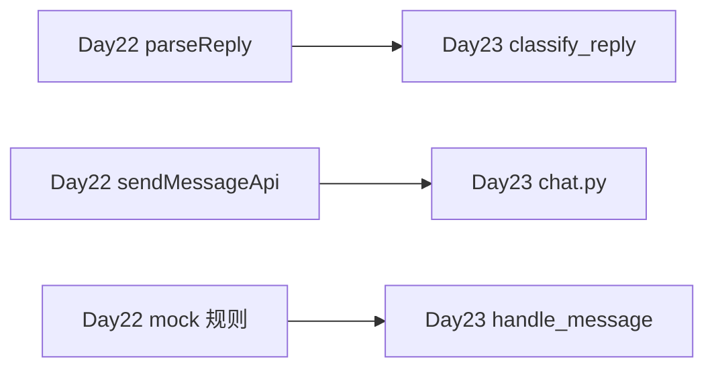

# Day 23 与 Day 22 能力对照表

**用途**：确认学习进阶无断层  
**需求**：ZL-NA-REQ-023

---

## 1. 总览

| 维度 | Day 22 | Day 23 |
|------|--------|--------|
| 主题 | 静态聊天 UI | FastAPI Chat API |
| 需求 ID | ZL-NA-REQ-022 | ZL-NA-REQ-023 |
| 主目录 | frontend/ | src/api/ |
| 数据桥 | mock.js | POST /api/chat |
| 启动 | http.server:8080 | uvicorn:8000 |
| 测试 | test_frontend.py (12) | test_api_chat.py (12) |
| 切换点 | NexusMock.useMock | NexusConfig.useMock |

---

## 2. 能力映射

| Day 22 能力 | Day 23 延续 |
|-------------|-------------|
| 六元素 id | 不变，静态托管 |
| FAQ/路由标签 CSS | kind 来自 API |
| appendMessage | 不变 |
| mock.js FAQ_RULES | SimilarQuestionMatcher |
| frontend_audit | test_api_chat 静态项 |

---

## 3. 新增能力（Day 23 独有）

- FastAPI 路由与 Pydantic 校验  
- SessionManager 会话隔离  
- factory.create_orchestrator 组装  
- OpenAPI /docs  
- 全局异常 handler  
- requirements-api.txt  

---

## 4. 不再强调

- BEM 类名细节（维持即可）  
- mock.js 规则扩展（主路径 API）  
- http.server 作为主演示入口  

---

## 5. 自检问答

| 问题 | Day 22 答案 | Day 23 答案 |
|------|-------------|-------------|
| 聊天数据从哪来？ | mock.js | ChatOrchestrator |
| kind 谁算？ | mock 或 parseReply | classify_reply + API |
| 如何启动演示？ | http.server | run_server |
| CI 测什么？ | HTML 结构 | HTTP 契约 |

---

## 6. 林晓学习路径建议

1. 对比同一问句 Mock vs API 的 reply 差异  
2. 用 Network 面板替代只看气泡  
3. 阅读 factory 理解 Day 15–21 如何串联  

对照表完。

---

## 7. 逐日能力动词对照（培训部）

| 动词 | Day 22 | Day 23 |
|------|--------|--------|
| 启动 | http.server | uvicorn/run_server |
| 调试 | 浏览器 Elements | Network + Swagger |
| 测试 | 静态读文件 | TestClient HTTP |
| 契约 | mock 规则 | Pydantic + classify |
| 切换 | NexusMock | NexusConfig |

## 8. 林晓两周日记摘选（授权）

「Day 22 我怕 CSS；Day 23 我怕端口。但当我看见 JSON 里 kind 是 faq，我知道上周写的 Matcher 没有白写。」——可用于开班激励。

## 9. 讲师提醒

讲对照表时勿贬低 Day 22：静态能力仍是 Day 24 界面基础；API 是接上线，不是拆掉页面。

对照表扩展完，2026-07-28。

---

## 10. 两周能力雷达图说明（文字）

Day 22 雷达：HTML、CSS、JS、Mock 四维高。Day 23 雷达：HTTP、FastAPI、测试、会话四维新增。理想学员 Day 23 结束：前端维维持，后端连接维从低到中的跃迁。林晓自评：HTTP 从 2 到 7，信心从 4 到 8。雷达图文字版供结业自评，无需绘图工具。十八号文件终。
