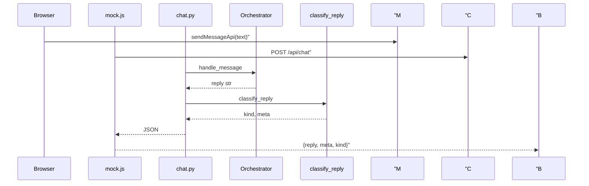

# Day 23 完整代码走查

**需求**：ZL-NA-REQ-023  
**方式**：按请求路径自顶向下

---

## 走查 1：应用启动链

```
run_server.py
  → uvicorn.run("api.app:app")
    → import api.app
      → app = create_app()
```

**检查点**：`app` 模块级单例；测试 `create_app()` 独立实例。

---

## 走查 2：GET /

```
Request GET /
  → StaticFiles (mount "/")
    → frontend/index.html
      → script: config.js → mock.js → app.js
```

**检查点**：`config.js` 在 mock 之前；`NexusConfig.useMock` 默认 false（无 ?mock=1）。

---

## 走查 3：POST /api/chat 全链

```
1. browser: mock.js sendMessageApi
     fetch('/api/chat', {method:'POST', body: JSON.stringify({message})})

2. FastAPI routing: chat_router prefix /api

3. Pydantic: ChatRequest 校验

4. Depends: session_manager.get_or_create(session_id)
     → factory.create_orchestrator() [若新会话]

5. orchestrator.handle_message(message.strip())
     → FAQ / chat_turn / tools [Day 21 逻辑]

6. classify_reply(reply) → kind, meta

7. ChatResponse 序列化 JSON

8. app.js: data.kind 用于 appendMessage 标签
```



---

## 走查 4：异常路径

```
handle_message raises APIError
  → chat.py except → HTTPException 502
    → FastAPI → JSONResponse

ModelValidationError (非本路由)
  → app.py handler → 400
```

---

## 走查 5：测试如何挂钩

```python
@pytest.fixture
def client():
    return TestClient(create_app())

def test_chat_faq_direct(client):
    resp = client.post("/api/chat", json={"message": "投资有风险吗"})
```

无网络、无端口，直接 ASGI 调用。

---

## 走查 6：关键代码片段索引

| 文件 | 行级职责 |
|------|----------|
| app.py | create_app, mount, handlers |
| chat.py | health_check, chat, _http_from_nexus |
| schemas.py | Field 约束 |
| sessions.py | Lock, dict, get_or_create |
| factory.py | SAMPLE_MOCK, create_orchestrator |
| response_parser.py | _ROUTE_RE, classify_reply |

---

## 走查 7：林晓自检清单

- [ ] 能不看代码说出 POST body 字段  
- [ ] 能解释为何 mount 在最后  
- [ ] 能指出 classify_reply 与 parseReply 一处差异  
- [ ] 能运行 demo 并读输出  

走查完。进入 [21_课堂知识竞赛.md](21_课堂知识竞赛.md)。

---

## 走查 8：逐文件林晓问答（20 组）

1. app.py 的 version 字符串在哪定义？— FastAPI 构造参数 0.23.0。  
2. chat router 的 tag 叫什么？— chat。  
3. health 如何知 Mock？— 读 NEXUS_LLM_MOCK 环境变量。  
4. ChatRequest message 最长？— 2000。  
5. session_id 最长？— 64。  
6. SessionManager 用什么同步？— threading.Lock。  
7. factory 默认 FAQ 阈值？— 0.65。  
8. SAMPLE_MOCK 里 model 名？— deepseek-chat。  
9. classify 路由正则常量名？— _ROUTE_RE。  
10. config.js 如何强制 Mock？— ?mock=1。  
11. mock sendMessageApi 的 method？— POST。  
12. test_client 用的什么类？— TestClient。  
13. 空 message 测名？— test_chat_empty_validation。  
14. 静态页测名？— test_frontend_served。  
15. mount 的目录名？— frontend。  
16. APIError 映射 HTTP？— 502。  
17. ConfigError 映射 HTTP？— 500。  
18. run_server 端口？— 8000。  
19. requirements-api 第三项？— httpx。  
20. Day 24 主题关键词？— 完整整合。  

走查问答可用于下课前闪电测验。
