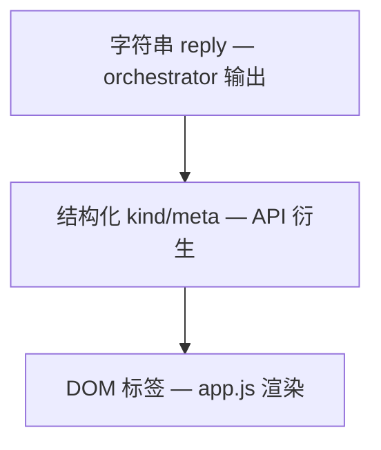

# Day 23 API 契约与 classify_reply 讲义

**需求**：ZL-NA-REQ-023  
**关联**：Day 22 Mock 桥接讲义

---

## 1. 契约三层



**权威顺序**：L1 业务真相 > L2 API 契约 > L3 展示

---

## 2. reply 字符串格式（继承 Day 21–22）

| 类型 | 格式示例 |
|------|----------|
| FAQ | `[FAQ 直答·72%] 投资有风险…` |
| 路由 | `[路由: doc_summary] 要点…` |
| LLM | 普通文本 |
| 系统 | `请输入有效内容。` |
| 错误 | `配置错误…` / `API 调用失败…` |

---

## 3. classify_reply 完整规则

```python
# 优先级自上而下
1. 空 → ("system", "空回复")
2. startswith "[FAQ" → ("faq", "FAQ 直答")
3. 路由正则匹配 → ("route", f"路由 · {template}")
4. startswith "请输入" → ("system", "系统提示")
5. startswith "配置错误" or "API 调用失败" → ("error", "错误")
6. 默认 → ("llm", "LLM 回复")
```

与 `test_classify_reply_faq/route/llm` 一一对应。

---

## 4. ChatResponse JSON 契约

```typescript
// 逻辑类型（非仓库文件）
interface ChatResponse {
  reply: string;
  meta: string;
  kind: string;
  session_id: string;
}
```

前端 `sendMessageApi`：

```javascript
return {
  reply: data.reply || "",
  meta: data.meta || "API",
  kind: data.kind || "api",
};
```

**建议**：当 `data.kind` 存在时，appendMessage 信任 API，可跳过 parseReply 的 kind 推断。

---

## 5. 错误响应契约

| 场景 | 状态 | body 形状 |
|------|------|-----------|
| Pydantic | 422 | `{detail: [...]}` |
| Nexus HTTPException | 500/502 | `{detail: {detail, code}}` |
| 全局 handler | 400/500/502 | `{detail, code}` |

前端统一 catch：`res.ok` 检查 + `err.message`。

---

## 6. 契约演进规则

陈默冻结：

1. 改 reply 前缀须同时改 classify_reply、parseReply、测试  
2. 新增 kind 须更新 schemas 文档与 CSS 标签  
3. 破坏性变更升 API version  

---

## 7. 对照实验

运行：

```bash
python3 src/day23/api_chat_demo.py
```

对比三条问句的 kind 与 reply 前缀是否一致。

---

## 8. 练习

给定 reply=`[路由: rag_qa] 根据资料…`，手写 JSON 响应四项字段。

<details><summary>答案</summary>

```json
{
  "reply": "[路由: rag_qa] 根据资料…",
  "meta": "路由 · rag_qa",
  "kind": "route",
  "session_id": "default"
}
```

</details>

讲义完。

---

## 9. 契约版本化与变更流程（智链科技 API 治理）

当 reply 前缀格式变更时，须执行以下检查清单：（1）更新 response_parser.py；（2）更新 frontend/app.js parseReply；（3）更新 mock.js 规则；（4）更新 test_classify_reply_* 与 test_chat_*；（5）更新 02_ 需求文档与 Swagger description；（6）通知赵岩更新演示话术。版本号 `0.23.0` 在破坏性变更时升 minor。陈默任 API 契约 Owner，周航任测试门禁 Owner。

## 10. 前后端字段冗余策略

ChatResponse 同时含 reply 与 kind，看似冗余，实则是**防御性设计**：老版本前端可只 parse reply；新版本信任 kind。meta 为人类可读摘要，kind 为机器分类。未来 i18n 时 meta 本地化，kind 保持稳定枚举。培训部要求学员在作业 E 中讨论此策略，体现工程权衡思维。

## 11. 错题集：契约常见误解

误解一：「kind=faq 则 reply 必含 FAQ 二字」— 应以 classify 规则为准，非反向推断。误解二：「error kind 时 HTTP 必 200」— 当前错误多嵌在 reply 字符串，HTTP 仍 200；真正异常走 5xx。误解三：「session_id 由服务端生成 UUID」— 当前由客户端传入或 default，服务端不自动生成新 UUID。林晓在竞赛后应能纠正这三条。

讲义扩展完，2026-07-28。

---

## 12. 契约测试编写指南（周航）

### 12.1 先写测试还是先写路由

智链科技倾向**路由与测试同 PR**。test_chat_faq_direct 是活文档：message 用「投资有风险吗」是赵岩从合规库挑选的标准句。

### 12.2 断言宽容度

`assert data["kind"] in ("route", "llm", "faq")` 体现编排器不确定性。过严断言导致 flaky。产品关心用户可见 reply，非固定 kind。

### 12.3 fixture 复用

client fixture 每个测试新 TestClient，隔离状态。session 测试依赖内存，顺序无关。

### 12.4 静态测试价值

test_frontend_served 防止 mount 路径错误，是 Day 22 与 Day 23 的桥梁测试。

### 12.5 CI 时间预算

十二测十一秒，达标。超三十秒须优化 factory 或缓存 app。

契约测试指南完。
