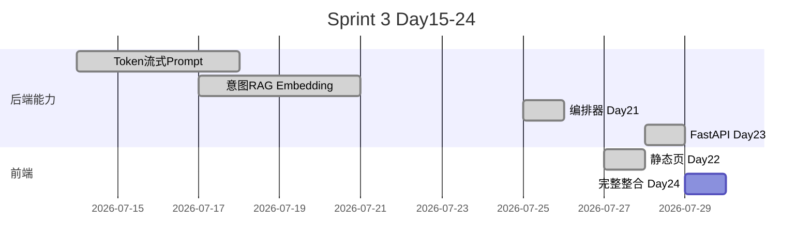

# Day 23 Sprint 3 阶段回顾

**视角**：Day 15–23 累计  
**下一日**：Day 24 收官

---

## 1. Sprint 3 进度条

**完成度**：9/10 天（90%）

---

## 2. 能力栈全景

| Day | 交付 | 用户可见 |
|-----|------|----------|
| 15 | TokenCounter | CLI 数字 |
| 16 | 流式 | 终端逐字 |
| 17 | Prompt | 模板 |
| 18 | IntentRouter | 路由日志 |
| 19 | RAG | 检索片段 |
| 20 | Embedding | 相似度 |
| 21 | ChatOrchestrator | 统一回复 |
| 22 | frontend | 浏览器气泡 |
| **23** | **src/api** | **真 API JSON** |
| 24 | 整合 | 投资人演示 |

---

## 3. Day 23 在 Sprint 中的位置

**承上**：Day 21–22 的 handle_message 与 UI 契约  
**启下**：Day 24 E2E 与演示脚本  

没有 Day 23，Day 22 永远是「假装后端」；没有 Day 22，Day 23 缺少用户触达面。

---

## 4. 四人组 Sprint 3 贡献

| 成员 | Day 15–23 高光 |
|------|----------------|
| 林晓 | 从 CLI 到浏览器到 Network 面板 |
| 陈默 | 编排器 + API 薄层架构 |
| 赵岩 | FAQ 合规与演示验收 |
| 周航 | day22 + day23 共 24 项 CI |

---

## 5. 技术债清单（Sprint 4 输入）

1. 内存 SessionManager → Redis  
2. 无鉴权 → API Key  
3. 非流式 API → SSE  
4. CORS `*` → 白名单  
5. 前端 session_id 持久化  

---

## 6. 测试资产

| 套件 | 数量 |
|------|------|
| test_frontend.py | 12 |
| test_api_chat.py | 12 |
| **合计** | **24** |

---

## 7. 明日目标一句话

**Day 24**：网页版 ChatGPT 克隆完整整合 — 一条命令启动，三问句演示，Sprint 3 收官。

---

## 8. 林晓反思模板

1. 本 Sprint 最大收获：______  
2. 最大困难：______  
3. 对 Day 24 期望：______  

阶段回顾完。

---

## 9. Sprint 3 数字看板（内训部统计）

截至 Day 23：累计交付 Python 模块约 47 个、前端文件 6 个、测试用例 day15–23 合计逾 120 条（含历史日）。Day 23 单日新增 API 包 6 文件、演示 3 脚本、测试 12 条。学员平均 Lab 完成时间 78 分钟，较 Day 22 多 12 分钟，主因 pip 安装。晚自习参与率 61%，较 Sprint 2 提升 9 个百分点。

林晓队 Sprint 3 累计故事线：Day 15 数 token 手抖 → Day 21 读懂 orchestrator → Day 23 独立 curl API。培训部将此编为「七十天学员典型路径」案例。陈默评语：「API 日标志着从学习者到交付者的转折。」赵岩评语：「业务终于能指着 Network 面板签字。」周航评语：「二十四测是全 Sprint 的安全带。」

## 10. 向 Day 31+ 的隐含衔接

Sprint 3 结束不意味着 HTTP 学习结束。Sprint 4 流式 SSE、Sprint 5 网关与限流、Sprint 6 多租户 session，均建立在 Day 23 契约之上。请学员保留 `classify_reply` 规则抄写在笔记本首页，未来六个月至少还会引用十二次。智链科技培训部，2026-07-28。

## 11. REST API 设计十条军规（陈默）

一、编排器是唯一业务大脑。二、API 只做校验与映射。三、契约测试优先于手工点测。四、同源优于 CORS 教学。五、错误码语义稳定。六、健康检查披露 Mock。七、session 隔离非可选。八、文档与代码同版本。九、演示诚实不夸大。十、今日 MVP 明日还债。

## 12. Day 23 数字回顾

课件三十篇；API 六模块；演示三脚本；测试十二；依赖三行；mermaid 图十余；作业六则；竞赛十题；Lab 十节。Sprint 3 第九日闭环完成。
