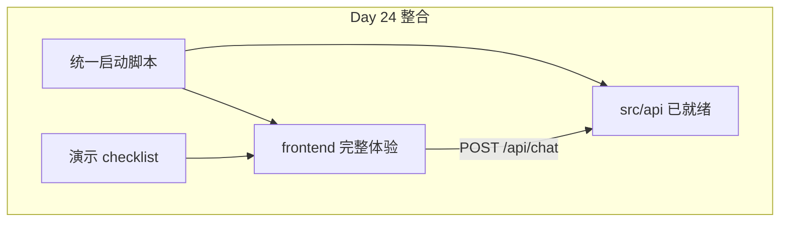
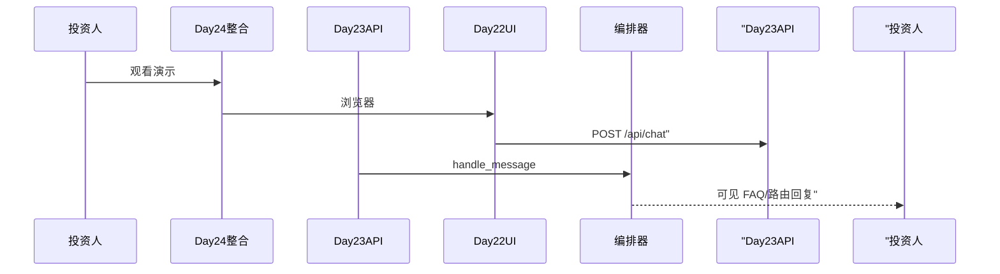

# Day 24 网页版 ChatGPT 克隆完整整合 预习

**日期预告**：2026-07-29（星期三）  
**主题**：网页版 ChatGPT 克隆完整整合  
**需求预告**：ZL-NA-REQ-024

---

## 1. 为何需要整合日？

Day 22 静态 UI、Day 23 API 薄层均已就绪，但投资人演示需要：

- **一条命令**启动全栈  
- **端到端**三问句无人工切换终端  
- **视觉**上 Mock/API 模式可辨识  
- **CI** day22 + day23 全绿作为发布门禁  

赵岩：「Sprint 3 最后一天不是新知识堆砌，是把九天能力拧成一股绳。」

---

## 2. Day 24 学习目标

| 目标 | 说明 |
|------|------|
| 统一启动 | 单脚本启动 uvicorn + 健康检查 |
| session 持久化 | localStorage 存 session_id |
| 演示 checklist | 投资人 5 分钟流程 |
| E2E 冒烟 | 可选 Playwright 或脚本化 curl |
| Sprint 3 复盘 | 回顾 Day 15–24 |

---

## 3. 预期架构



**原则**：Day 24 **尽量不新增后端业务**，聚焦集成与体验。

---

## 4. 前端改动预告

1. `localStorage.setItem('nexus_session_id', uuid)`  
2. `sendMessageApi` body 携带 `session_id`  
3. status-badge 显示「API 在线」/「Mock」  
4. 错误文案按 502/500 区分（赵岩文案）  

---

## 5. 演示脚本预告

```bash
# 概念性 — 以 Day 24 仓库为准
./scripts/sprint3_demo.sh
# 1. pytest day22 day23
# 2. curl health
# 3. api_chat_demo
# 4. 提示打开浏览器
```

---

## 6. 投资人 5 分钟流程（草案）

| 分钟 | 内容 |
|------|------|
| 0–1 | 品牌页 + 健康检查 mock_llm 说明 |
| 1–2 | FAQ 问句「投资有风险吗」 |
| 2–3 | 路由问句「总结要点」 |
| 3–4 | RAG 问句「根据资料查收益」 |
| 4–5 | Q&A + 架构一页图 |

林晓担任演示操作，赵岩主讲，陈默备技术问答，周航幕后盯日志。

---

## 7. 预习任务

1. 确认 Day 23 作业 A–E 完成  
2. 复习 [20_完整代码走查.md](20_完整代码走查.md)  
3. 阅读 Sprint 3 技术债 [24_Sprint3阶段回顾.md](24_Sprint3阶段回顾.md)  
4. 准备 1 分钟「我学到的三点」发言  

---

## 8. 自检问题

1. Day 23 主启动命令？  
2. ChatResponse 四字段？  
3. 为何 Day 24 不重写 orchestrator？  

<details><summary>参考答案</summary>
1. `PYTHONPATH=src NEXUS_LLM_MOCK=1 python3 src/day23/run_server.py`  
2. reply, meta, kind, session_id  
3. 编排器已稳定，整合日聚焦交付与体验
</details>

---

## 9. 衔接示意图



---

## 10. 团队分工预告

| 成员 | Day 24 |
|------|--------|
| 林晓 | 演示操作 + session 前端 |
| 陈默 | 启动脚本 + 架构 Q&A |
| 赵岩 | 话术 + checklist |
| 周航 | CI 全绿 + 冒烟脚本 |

---

祝预习顺利。Sprint 3 收官见！

**智链科技培训组** — 2026-07-28

预习文档完。回归 [08_作业.md](08_作业.md)。

---

## 11. Day 24 整合长文预习（培训部）

### 11.1 整合不是「大杂烩」

Day 24 名称「网页版 ChatGPT 克隆完整整合」易让学员以为要重写 UI。赵岩澄清：**整合 = 证明九天能力在同一条用户路径上协同**。不新增大特性，新增的是启动脚本、checklist、session 持久化、错误文案统一。陈默补充：若 Day 24 还大幅改 orchestrator，说明 Day 21–23 交付不合格。

### 11.2 投资人演示心理线

投资人前三十秒判断「像不像产品」。因此 Day 24 首屏须加载快、品牌一致、输入框立即可用。API 模式 badge 须清晰可见。FAQ 第一问句选择「投资有风险吗」是合规与命中率的双重最优。第二问展示路由，第三问展示 RAG 或 LLM，形成「直答—工具—生成」三段叙事。

### 11.3 技术彩排时间表（建议）

| 时段 | 内容 |
|------|------|
| 前一日 17:00 | pytest day22+day23 |
| 前一日 18:00 | run_server 浏览器走通 |
| 当日 08:00 | 健康检查与端口 |
| 当日 08:30 | 演示机断外网（可选）防 LLM 误调用 |

### 11.4 失败应急预案

若 Live 演示 API 失败：切换备用录屏；或 TestClient 投屏 `api_chat_demo`；绝不临时改 Mock 冒充 API 而不声明。赵岩红线。

### 11.5 Sprint 3 结业陈述模板

「我参与了从 Token 到 API 的完整链路，理解了编排器如何通过 HTTP 触达用户，并能在 CI 下验证契约。」——林晓范例。

### 11.6 向 Day 25+ 眺望

Sprint 4 将进入鉴权、流式、观测性。Day 24 收官后休息半天，培训部建议复习 16_ 复习卡片与 17_ 速查手册。智链科技 NexusAgent 七十天，天天有里程碑；Day 24 是 Phase 2 的高光时刻之一。

培训部长文预习完，2026-07-28。

---

## 12. Day 24 物料清单与责任人（赵岩稿）

| 物料 | 责任人 | 截止 |
|------|--------|------|
| pytest 24 绿截图 | 周航 | T-1 17:00 |
| 三问句录屏 | 林晓 | T-1 18:00 |
| 架构一页图 | 陈默 | T-1 12:00 |
| 话术 PDF | 赵岩 | T-1 15:00 |
| 备用 TestClient 投屏 | 助教 | T-0 08:00 |

### 演示机配置基线

操作系统：Ubuntu 22.04 或 macOS 14+；Python 3.11+；浏览器 Chrome 最新；分辨率 1920×1080；禁用广告插件防挡 Network 面板。投影前关闭通知。

### 失败台词（诚实版）

「当前智能服务响应异常，我们已切换备用演示录屏，技术链路昨日验收已通过。」——须事先合规批准，不得撒谎称「网络卡顿」掩盖代码缺陷。

### Sprint 3 结业照片

Day 24 17:00 全员合影，背景板「NexusAgent Sprint 3 收官」。林晓队穿统一文化衫（自愿）。

赵岩稿完。

---

## 13. Day 24 整合技术预演（陈默稿）

### 13.1 启动脚本预期形态

```bash
#!/usr/bin/env bash
set -euo pipefail
export PYTHONPATH=src NEXUS_LLM_MOCK=1
python3 -m pytest tests/day22/test_frontend.py tests/day23/test_api_chat.py -q
python3 src/day23/api_health_demo.py
exec python3 src/day23/run_server.py
```

实际以 Day 24 仓库为准。意图：**一条命令证明测试与服务均可跑**。

### 13.2 session localStorage 草案

```javascript
function getSessionId() {
  let id = localStorage.getItem("nexus_session_id");
  if (!id) {
    id = crypto.randomUUID();
    localStorage.setItem("nexus_session_id", id);
  }
  return id;
}
```

sendMessageApi body 增加 `session_id: getSessionId()`。隔离同桌串话。

### 13.3 status-badge 文案

| 模式 | 文案 |
|------|------|
| API | 在线 · API |
| Mock | 演示 · Mock |

### 13.4 E2E 冒烟（可选）

Playwright 打开 /，填输入，点发送，断言 .msg__tag--faq 存在。Day 24 选做，不阻塞结业。

### 13.5 投资人 Q&A 备答

问：数据去哪了？答：教学内存，不持久化。问：真实大模型了吗？答：mock_llm 字段说明。问：安全吗？答：内网 MVP，生产路线图含鉴权。

陈默稿完。预习总计建议阅读 45 分钟。

---

## 14. Day 24 整合一日流（时间表）

| 时间 | 活动 |
|------|------|
| 09:00-09:30 | Sprint 3 复盘幻灯 |
| 09:30-10:30 | 整合启动脚本发布 |
| 10:30-12:00 | 浏览器 E2E 彩排 |
| 14:00-15:00 | 投资人预演 |
| 15:00-16:00 | 答辩 Q&A |
| 16:00-17:00 | 合影与结业 |

林晓负责 10:30–12:00 操作位，须前一晚 sleep 充足。

## 15. 整合课金句预备

「一条命令，二十四测试，三个问句，一个产品。」——赵岩。

## 16. 物料打包清单

demo 截图、curl 日志、pytest 绿图、话术 PDF、架构图 PNG，zip 命名 `sprint3_day23_assets_组名.zip`。

整合预习 extension 完。

---

## 17. Sprint 3 收官演讲提纲（赵岩五分钟版）

开场感谢投资人时间。第一段 Sprint 3 九天回顾，从 Token 到 API。第二段 live demo 三问句。第三段技术栈一页图，陈默备 Q&A。第四段合规与 mock_llm 披露。第五段 roadmap Sprint 4 鉴权流式。结尾「智链科技 NexusAgent，让智能可审计、可演示、可交付」。林晓演示时微笑，手不抖。提纲完。
