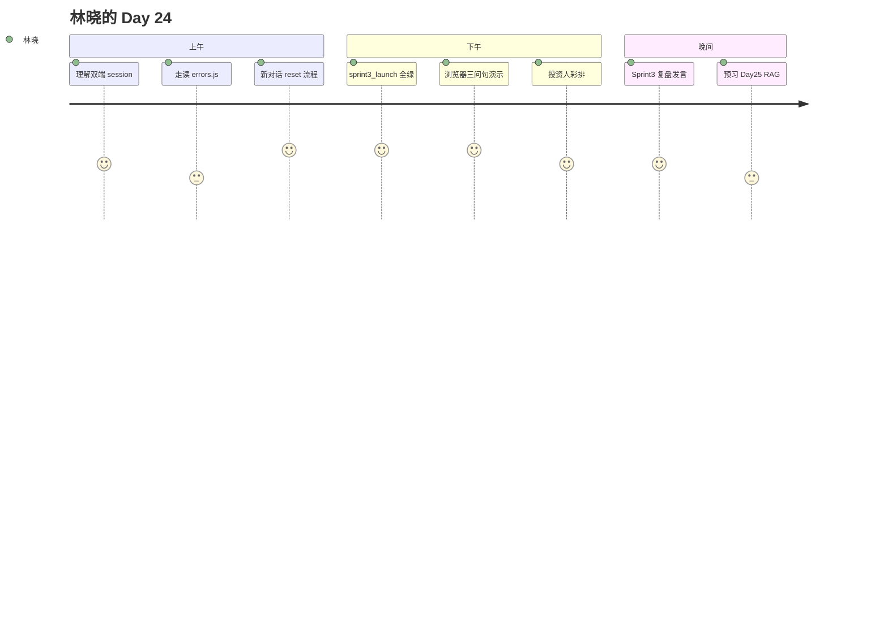

# Day 24 旁白解读

**智链科技 · NexusAgent 七十天培训 · 第二十四日**

---

## 开场

2026 年 7 月 29 日，星期三。会议室投影仪上是一张架构全景图，从 Day 15 的 Token 计数器一直画到昨天的 FastAPI。赵岩用马克笔在图的最右侧画了一个圈，写下两个字：**整合**。

「九天前我们还在算 prompt 里有多少 token，」赵岩说，「今天投资人下午四点进场。他们不想看十二个终端窗口，也不想听『理论上可以联调』。他们只想看：一条命令，打开浏览器，问三个问题，标签都对。」

林晓坐在第二排，手里攥着昨晚改好的 `session.js`。她昨天深夜发现一个 bug：点「新对话」只清了界面，服务端 `ChatOrchestrator` 还记着上一轮上下文。陈默在晨会上说：「整合日的敌人不是新技术，是**细节裂缝**。」

周航把 `sprint3_launch.py` 投到屏幕上：「pytest 不过，uvicorn 不许起。这是发布门禁，不是建议。」

---

## 叙事主线



### 第一幕：session 从哪来，到哪去

晨会结束后，陈默打开 `frontend/session.js`。代码不到五十行，却串联起整条用户旅程：

1. 首次访问，`getSessionId()` 生成 UUID 写入 `localStorage`
2. `mock.js` 的 `sendMessageApi` 在 JSON body 里带上 `session_id`
3. `SessionManager.get_or_create` 在服务端为该 ID 绑定独立 `ChatOrchestrator`
4. 用户刷新页面，ID 不变，对话上下文延续

林晓问：「如果用户点『新对话』呢？」

陈默切换到 `app.js`：「先 `POST /api/session/reset` 清服务端，再 `resetSession()` 换本地 ID，最后清空 DOM。顺序不能反——否则旧编排器还在内存里。」

### 第二幕：错误要说人话

上午第二节课，赵岩播放了一段「失败演示」录屏：API 返回 502，前端只显示 `Failed to fetch`。投资人皱眉。

「`errors.js` 的存在，」赵岩说，「就是让 502 变成『大模型服务繁忙，请稍后重试』。产品文案和 HTTP 状态码一样，都是契约。」

林晓在 Lab 里故意关掉 Mock，用错误 API 地址触发 404，确认 `mapApiError` 返回友好句子。她在笔记本上写：**整合 = 快乐路径 + 丑陋路径都要能演示**。

### 第三幕：一条命令

下午两点，全组盯着终端：

```bash
export PYTHONPATH=src NEXUS_LLM_MOCK=1
python3 src/day24/sprint3_launch.py --serve
```

先滚过 pytest 的绿色点，再打印 E2E 三问句的 `kind`，最后 uvicorn 监听 8000。林晓打开浏览器，session 标签显示 `a3f2b1c8…`，她输入「投资有风险吗」，FAQ 标签跳出。

赵岩点头：「这就是 Sprint 3 的句号。」

---

## 与前后日的关系

| 前日 | 今日承接 | 明日 |
|------|----------|------|
| Day 23 `/api/chat` | 透传 `session_id`、加 reset | Day 25 知识库 ingestion |
| Day 22 静态 UI | 新对话按钮、session 标签 | 文档上传组件 |
| Day 21 编排器 | 不改动核心逻辑 | RAG 索引持久化 |

---

## 学员心声（虚构摘录）

> 「原来整合日写的代码比 Day 23 少，但思考量更大。每一个『用户会怎么点』都要过一遍。」 —— 林晓

> 「`sprint3_launch.py` 让我第一次理解什么叫发布门禁。」 —— 周航

---

## 阅读建议

1. 先读 [01_企业背景与今日任务.md](01_企业背景与今日任务.md) 了解验收标准  
2. 对照 [20_完整代码走查.md](20_完整代码走查.md) 在 IDE 里同步翻文件  
3. 完成 [08_作业.md](08_作业.md) A 级必做后再跑 `./scripts/sprint3_demo.sh`
