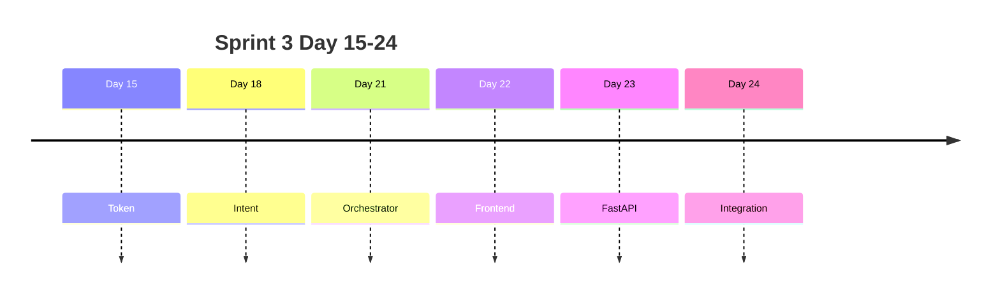

# Day 24 企业背景与今日任务

**日期**：2026 年 7 月 29 日  
**Sprint**：Sprint 3 第十日 — 网页版 ChatGPT 克隆完整整合（收官）

## 晨会纪要

### 赵岩（产品）

> 「今日 Sprint 3 收官演示。验收：执行 `sprint3_launch.py` 全绿后浏览器可访问；投资人三问句 FAQ / 总结 / RAG 标签正确；新对话不串话；502 显示统一文案。不新增编排业务，聚焦体验与门禁。」

### 陈默（架构）

> 「交付 `session.js`、`errors.js`、`POST /api/session/reset`。`sprint3_launch` 串联 pytest + `e2e_smoke`。`scripts/sprint3_demo.sh` 给运营一键彩排。版本升至 `0.24.0`。」

### 周航（DevOps）

> 「CI 增加 Day 24 步骤。`tests/day24/test_integration.py` 十二项。`frontend_audit` 检查 session/errors 脚本引入。」

### 林晓（学员代表）

> 「新对话为什么要先调 reset 再换 localStorage？」

陈默：「服务端 `SessionManager` 按 session_id 缓存 orchestrator。只换前端 ID 不 reset，旧实例仍占内存且可能被误复用。先 reset 再生成新 ID 是双端一致。」

## 任务分配

| ID | 任务 | 负责人 | 优先级 |
|----|------|--------|--------|
| ZL-NA-REQ-024 | Sprint 3 完整整合 | 全员 | P0 |
| ZL-NA-801 | `session.js` localStorage | 林晓 | P0 |
| ZL-NA-802 | `errors.js` 统一文案 | 林晓 | P0 |
| ZL-NA-803 | `POST /api/session/reset` | 陈默 | P0 |
| ZL-NA-804 | `sprint3_launch.py` | 周航 | P0 |
| ZL-NA-805 | `e2e_smoke.py` 三问句 | 周航 | P0 |
| ZL-NA-806 | `scripts/sprint3_demo.sh` | 周航 | P1 |
| ZL-NA-807 | `tests/day24/test_integration.py` | 周航 | P0 |
| ZL-NA-808 | 投资人 Demo 彩排 | 赵岩 | P0 |

## Definition of Done

- [ ] `python3 src/day24/sprint3_launch.py` pytest + smoke 全绿
- [ ] `GET /api/health` 返回 `version=0.24.0`
- [ ] 浏览器刷新后 `session_id` 不变
- [ ] 点击「新对话」清空消息且 session 标签更新
- [ ] `POST /api/chat` body 含 `session_id`
- [ ] `./scripts/sprint3_demo.sh` 可执行
- [ ] `pytest tests/day24/ -v` 12 passed
- [ ] 能口述：双端 session 流程、E2E 冒烟步骤

## 今日节奏

| 时段 | 内容 |
|------|------|
| 09:00-09:45 | session 持久化讲义（11_ 节选） |
| 09:45-10:30 | errors.js + 新对话流程走读 |
| 10:45-12:00 | sprint3_launch / e2e_smoke 源码 |
| 14:00-15:30 | 浏览器联调 + 投资人彩排 |
| 15:45-17:00 | Lab 26_ + Sprint3 复盘发言 |

## 环境准备

```bash
cd nexus-agent-platform
pip install -r requirements-api.txt
export PYTHONPATH=src NEXUS_LLM_MOCK=1
python3 src/day24/sprint3_launch.py --serve
```

## Sprint 3 收官全景


