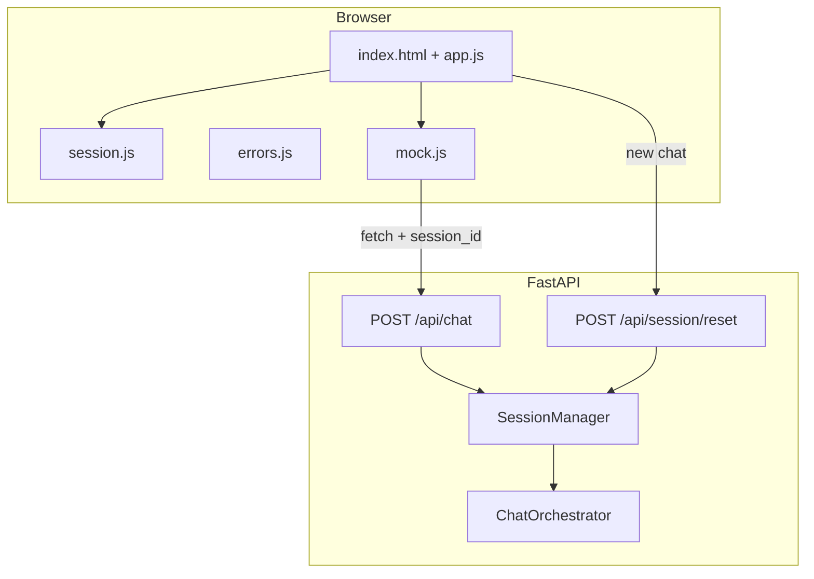
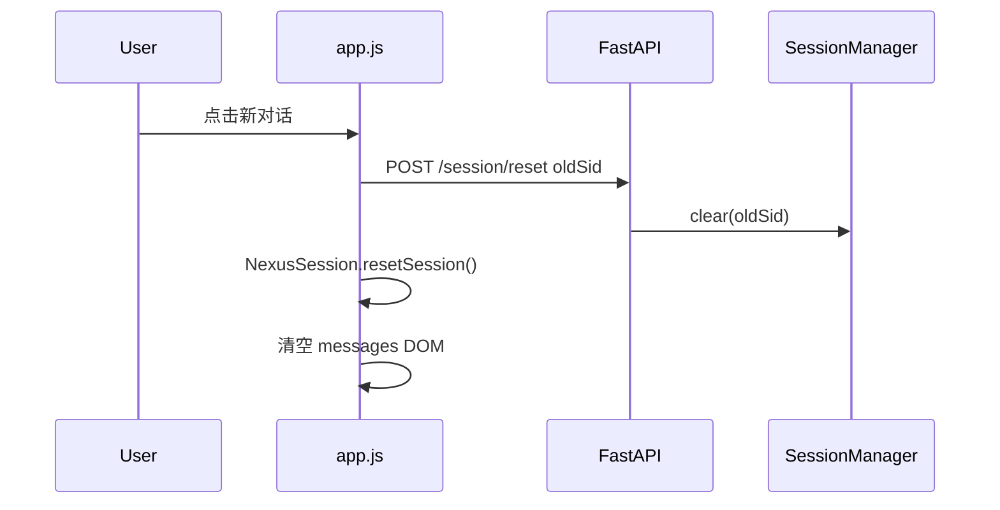

# Day 24 架构设计

## 1. 总体架构

## 2. 模块职责

| 模块 | 职责 | 新增/修改 |
|------|------|-----------|
| session.js | 客户端 session_id 生命周期 | 新增 |
| errors.js | HTTP 错误 → 用户文案 | 新增 |
| app.js | 新对话、健康检查、标签 | 修改 |
| chat.py | reset 路由、版本 0.24.0 | 修改 |
| sessions.py | clear(session_id) | 修改 |
| day24/* | 启动、冒烟、演示 | 新增 |

## 3. 新对话时序

## 4. 发布门禁

`sprint3_launch.py` 决策树：

1. `--skip-pytest`? 否 → 跑 day22-24 pytest  
2. 跑 `e2e_smoke.run_smoke()`  
3. `--serve`? 是 → uvicorn  

## 5. 与 Day 23 差异

- 版本号 0.23.0 → 0.24.0  
- 新增 reset 端点  
- 前端必引 session.js、errors.js  
- 无 orchestrator 内部变更

## 6. 技术债（转入 Phase 3）

- session 仅内存，进程重启丢失  
- 无 rate limit  
- 无 OpenAPI 鉴权  
