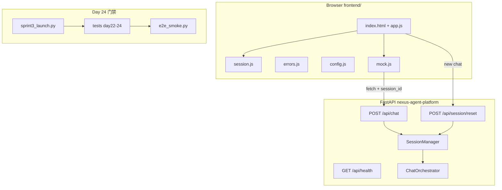
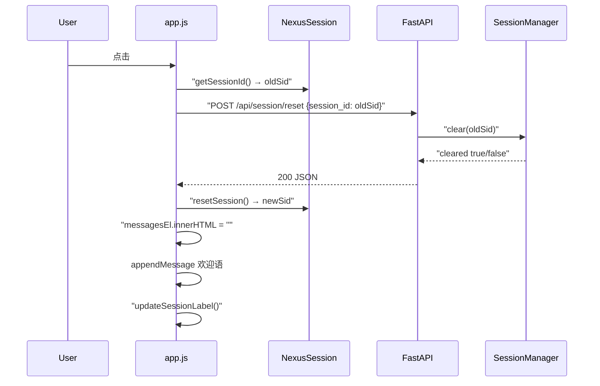
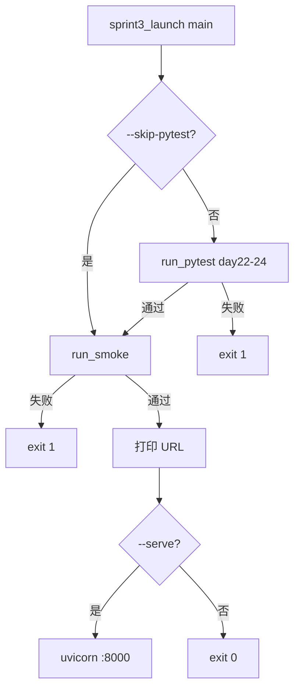
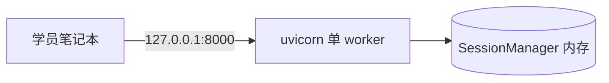

# Day 24 架构设计

**需求**：ZL-NA-REQ-024  
**版本**：0.24.0

## 1. 总体架构

## 2. 模块职责

| 模块 | 职责 | 新增/修改 |
|------|------|-----------|
| session.js | 客户端 session_id 生命周期 | 新增 |
| errors.js | HTTP 错误 → 用户文案 | 新增 |
| app.js | 新对话、健康检查、标签 | 修改 |
| mock.js | sendMessageApi 带 session_id | 修改 |
| chat.py | reset 路由 | 修改 |
| sessions.py | clear(session_id) | 修改 |
| day24/* | 启动、冒烟、常量 | 新增 |

## 3. 新对话时序

## 4. 发布门禁决策树

## 5. E2E 冒烟流水线（源码摘要）

"""
Sprint 3 E2E 冒烟 — TestClient 模拟投资人三问句

运行：NEXUS_LLM_MOCK=1 python3 src/day24/e2e_smoke.py
"""

from __future__ import annotations

import os
import sys
from pathlib import Path

_SRC = Path(__file__).resolve().parent.parent
if str(_SRC) not in sys.path:
    sys.path.insert(0, str(_SRC))

os.environ.setdefault("NEXUS_LLM_MOCK", "1")

from fastapi.testclient import TestClient

from api.app import create_app
from day24.constants import DEMO_QUERIES

def run_smoke() -> int:
    client = TestClient(create_app())
    print("=== Sprint 3 E2E 冒烟 ===\n")

    health = client.get("/api/health")
    if health.status_code != 200:

## 6. 与 Day 23 差异

- 版本号 0.23.0 → 0.24.0（课件口径）  
- 新增 reset 端点  
- 前端必引 session.js、errors.js  
- 无 orchestrator 内部变更  

## 7. 技术债（转入 Phase 3）

- session 仅内存，进程重启丢失  
- 无 rate limit  
- 无 OpenAPI 鉴权  
- localStorage 无加密  

---

## 8. 部署拓扑（教学单节点）

生产多 worker 需粘性会话或 Redis，见 19_ 讲师补充。

## 9. 安全边界

| 威胁 | 现状 | 后续 |
|------|------|------|
| XSS 偷 session | localStorage 可读 | HttpOnly cookie |
| 越权 sid | 无鉴权 | OAuth2 |
| DDoS | 无 limit | rate limit |

架构文档完。

---

## 10. 组件清单

- `session.js` — Sprint 3 收官关键组件
- `errors.js` — Sprint 3 收官关键组件
- `app.js` — Sprint 3 收官关键组件
- `mock.js` — Sprint 3 收官关键组件
- `e2e_smoke.py` — Sprint 3 收官关键组件
- `sprint3_launch.py` — Sprint 3 收官关键组件
- `constants.py` — Sprint 3 收官关键组件
- `chat.py reset` — Sprint 3 收官关键组件
- `sessions.py clear` — Sprint 3 收官关键组件
