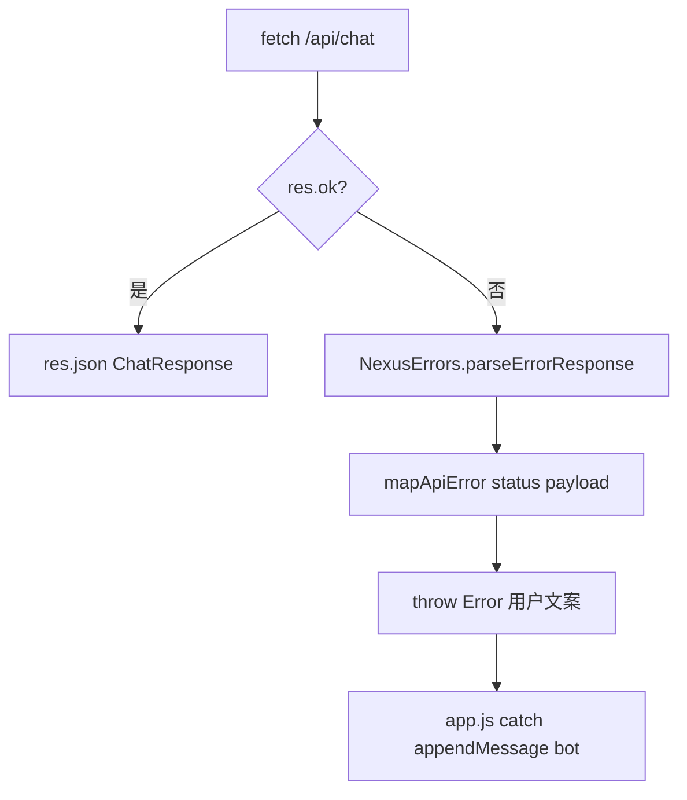
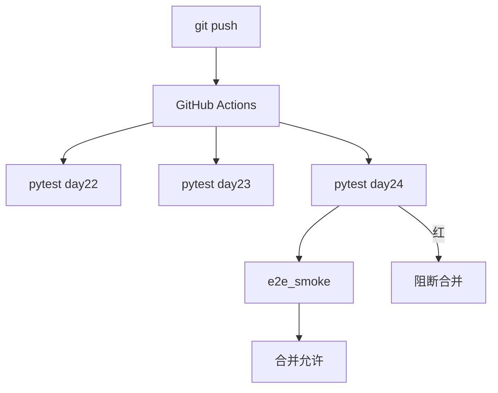
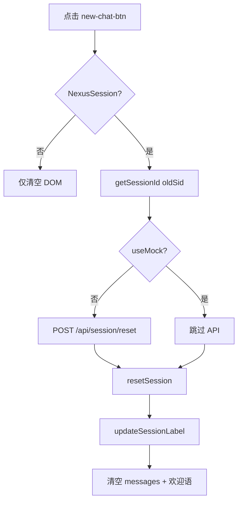

# Day 24 流程图与示意图

**需求**：ZL-NA-REQ-024

## 1. 投资人五分钟演示泳道图

```mermaid
flowchart LR
    subgraph minute0[0-1 min]
        M0A[运行 sprint3_launch --serve]
        M0B[打开 127.0.0.1:8000]
        M0C[指 status-badge 与 session-label]
    end
    subgraph minute1[1-2 min]
        M1[问：投资有风险吗]
        M1T[FAQ 标签]
    end
    subgraph minute2[2-3 min]
        M2[问：帮我总结要点]
        M2T[路由 doc_summary]
    end
    subgraph minute3[3-4 min]
        M3[问：根据资料查询年化收益率]
        M3T[路由 rag_qa]
    end
    subgraph minute4[4-5 min]
        M4[点击新对话]
        M4T[session 标签变化]
    end
    minute0 --> minute1 --> minute2 --> minute3 --> minute4
```



## 2. session_id 全链路数据流

```ascii
[首次访问]
  session.js getSessionId()
       │
       ▼
  localStorage["nexus_session_id"] = UUID
       │
       ▼
  mock.js sendMessageApi ──POST──► /api/chat {session_id}
       │
       ▼
  SessionManager._sessions[sid] ──► ChatOrchestrator 实例

[刷新页面]
  getSessionId() 读同一 UUID ──► 上下文延续

[新对话]
  reset API(clear oldSid) ──► resetSession() 新 UUID ──► 清空 DOM
```

## 3. 错误处理路径



## 4. CI 门禁示意



## 5. Sprint 3 能力堆叠

| 层 | Day | 能力 |
|----|-----|------|
| 表现 | 22-24 | HTML/CSS/JS + session/errors |
| 接入 | 23-24 | FastAPI REST + reset |
| 编排 | 21 | ChatOrchestrator |
| 检索 | 19-20 | RAG + Embedding |
| 基础 | 15-18 | Token/流式/Prompt/意图 |

图示完。深度讲解见 [11_session持久化与E2E整合详解.md](11_session持久化与E2E整合详解.md)。

---

## 6. app.js 新对话分支流程图



## 7. 测试金字塔（Day 24）

```ascii
        /  人工投资人彩排  \
       /   Lab 6-7 浏览器   \
      /  test_integration 12 \
     /     e2e_smoke.py      \
    /________________________\
```

流程图文档完。

---

## 智链科技 Day 24 读本附录：图示阅读法

### 附录 1

本附录专属于 `04_流程图与示意图.md`，主题「图示阅读法」。第 1 节强调：Sprint 3 收官日（ZL-NA-REQ-024）学员应把 **session 双端一致**、**errors 产品化**、**launch 门禁** 三件事串成闭环。林晓在第 1 次实验中发现：仅改前端不改后端，或仅 pytest 不 smoke，都会在投资人演示时暴露。陈默补充：版本 0.24.0 是课件契约，与仓库测试断言可能不同，口播须统一。赵岩要求：图示阅读法相关物料须在彩排前完成，不得临场改 DEMO_QUERIES。周航记录：第 1 轮 CI 绿条是合并前提。

### 附录 2

本附录专属于 `04_流程图与示意图.md`，主题「图示阅读法」。第 2 节强调：Sprint 3 收官日（ZL-NA-REQ-024）学员应把 **session 双端一致**、**errors 产品化**、**launch 门禁** 三件事串成闭环。林晓在第 2 次实验中发现：仅改前端不改后端，或仅 pytest 不 smoke，都会在投资人演示时暴露。陈默补充：版本 0.24.0 是课件契约，与仓库测试断言可能不同，口播须统一。赵岩要求：图示阅读法相关物料须在彩排前完成，不得临场改 DEMO_QUERIES。周航记录：第 2 轮 CI 绿条是合并前提。

### 附录 3

本附录专属于 `04_流程图与示意图.md`，主题「图示阅读法」。第 3 节强调：Sprint 3 收官日（ZL-NA-REQ-024）学员应把 **session 双端一致**、**errors 产品化**、**launch 门禁** 三件事串成闭环。林晓在第 3 次实验中发现：仅改前端不改后端，或仅 pytest 不 smoke，都会在投资人演示时暴露。陈默补充：版本 0.24.0 是课件契约，与仓库测试断言可能不同，口播须统一。赵岩要求：图示阅读法相关物料须在彩排前完成，不得临场改 DEMO_QUERIES。周航记录：第 3 轮 CI 绿条是合并前提。

### 附录 4

本附录专属于 `04_流程图与示意图.md`，主题「图示阅读法」。第 4 节强调：Sprint 3 收官日（ZL-NA-REQ-024）学员应把 **session 双端一致**、**errors 产品化**、**launch 门禁** 三件事串成闭环。林晓在第 4 次实验中发现：仅改前端不改后端，或仅 pytest 不 smoke，都会在投资人演示时暴露。陈默补充：版本 0.24.0 是课件契约，与仓库测试断言可能不同，口播须统一。赵岩要求：图示阅读法相关物料须在彩排前完成，不得临场改 DEMO_QUERIES。周航记录：第 4 轮 CI 绿条是合并前提。

### 附录 5

本附录专属于 `04_流程图与示意图.md`，主题「图示阅读法」。第 5 节强调：Sprint 3 收官日（ZL-NA-REQ-024）学员应把 **session 双端一致**、**errors 产品化**、**launch 门禁** 三件事串成闭环。林晓在第 5 次实验中发现：仅改前端不改后端，或仅 pytest 不 smoke，都会在投资人演示时暴露。陈默补充：版本 0.24.0 是课件契约，与仓库测试断言可能不同，口播须统一。赵岩要求：图示阅读法相关物料须在彩排前完成，不得临场改 DEMO_QUERIES。周航记录：第 5 轮 CI 绿条是合并前提。

### 附录 6

本附录专属于 `04_流程图与示意图.md`，主题「图示阅读法」。第 6 节强调：Sprint 3 收官日（ZL-NA-REQ-024）学员应把 **session 双端一致**、**errors 产品化**、**launch 门禁** 三件事串成闭环。林晓在第 6 次实验中发现：仅改前端不改后端，或仅 pytest 不 smoke，都会在投资人演示时暴露。陈默补充：版本 0.24.0 是课件契约，与仓库测试断言可能不同，口播须统一。赵岩要求：图示阅读法相关物料须在彩排前完成，不得临场改 DEMO_QUERIES。周航记录：第 6 轮 CI 绿条是合并前提。

### 附录 7

本附录专属于 `04_流程图与示意图.md`，主题「图示阅读法」。第 7 节强调：Sprint 3 收官日（ZL-NA-REQ-024）学员应把 **session 双端一致**、**errors 产品化**、**launch 门禁** 三件事串成闭环。林晓在第 7 次实验中发现：仅改前端不改后端，或仅 pytest 不 smoke，都会在投资人演示时暴露。陈默补充：版本 0.24.0 是课件契约，与仓库测试断言可能不同，口播须统一。赵岩要求：图示阅读法相关物料须在彩排前完成，不得临场改 DEMO_QUERIES。周航记录：第 7 轮 CI 绿条是合并前提。

### 附录 8

本附录专属于 `04_流程图与示意图.md`，主题「图示阅读法」。第 8 节强调：Sprint 3 收官日（ZL-NA-REQ-024）学员应把 **session 双端一致**、**errors 产品化**、**launch 门禁** 三件事串成闭环。林晓在第 8 次实验中发现：仅改前端不改后端，或仅 pytest 不 smoke，都会在投资人演示时暴露。陈默补充：版本 0.24.0 是课件契约，与仓库测试断言可能不同，口播须统一。赵岩要求：图示阅读法相关物料须在彩排前完成，不得临场改 DEMO_QUERIES。周航记录：第 8 轮 CI 绿条是合并前提。
