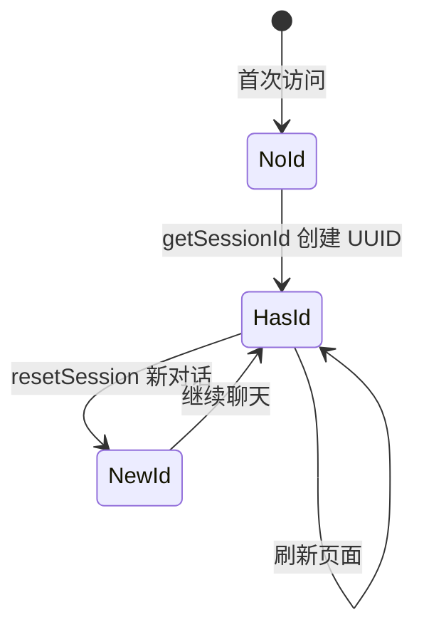

# session 持久化与 E2E 整合详解

**需求**：ZL-NA-REQ-024  
**版本**：0.24.0

---

## 1. 为何需要双端 session？

Day 23 已支持 `session_id` 字段，但前端未持久化，刷新后回到 `default` sid，多学员共用演示机时会串话。Day 24 用 localStorage 绑定浏览器实例。



## 2. localStorage 语义

`Storage` API 在同源策略下按域名隔离。智链演示环境使用 `http://127.0.0.1:8000`，与 FastAPI 静态托管同源。

核心逻辑（摘自 session.js）：

```javascript
/**
 * NexusAgent Day 24 — 浏览器会话 ID 持久化
 *
 * 使用 localStorage 保存 session_id，供 POST /api/chat 携带，避免刷新后串话。
 *
 * 需求：ZL-NA-REQ-024
 */
(function (global) {
  "use strict";

  const STORAGE_KEY = "nexus_session_id";

  function generateId() {
    if (global.crypto && crypto.randomUUID) {
      return crypto.randomUUID();
    }
    return "sess-" + Date.now().toString(36) + "-" + Math.random().toString(36).slice(2, 10);
  }

  function getSessionId() {
    let id = localStorage.getItem(STORAGE_KEY);
    if (!id) {
      id = generateId();
      localStorage.setItem(STORAGE_KEY, id);
    }
    return id;
  }

  function resetSession() {
    const id = generateId();
    localStorage.setItem(STORAGE_KEY, id);
    return id;
  }

  function shortId(id) {
    if (!id || id.length <= 12) return id || "";
    return id.slice(0, 8) + "…";
  }

  global.NexusSession = {
    getSessionId,
    resetSession,
    shortId,
    STORAGE_KEY,
  };
})(window);
```


## 3. 服务端 SessionManager

Day 23 引入的 `SessionManager` 使用 `threading.Lock` 保护 dict。`clear(session_id)` 在 Day 24 被 reset 路由调用：

```python
cleared = manager.clear(body.session_id)
return SessionResetResponse(session_id=body.session_id, cleared=cleared)
```

`cleared=False` 表示该 sid 从未创建过 orchestrator，仍返回 200（幂等）。

## 4. mock.js 联调

`sendMessageApi` 构造 body 含 `session_id`。错误分支调用 `NexusErrors.mapApiError`。

## 5. E2E 设计哲学

`e2e_smoke.py` 不用 Selenium：课堂 CI 要求稳定、无头、快速。`TestClient` 验证 HTTP 契约与静态资源。浏览器行为由 test_index_* 与人工 Lab 补充。

## 6. DEMO_QUERIES 设计

```python
DEMO_QUERIES = (
    "投资有风险吗",
    "帮我总结要点",
    "根据资料查询年化收益率",
)
```

覆盖 FAQ、总结路由、RAG 问句，确保 `kinds` 集合多样。

## 7. 故障案例

| 现象 | 原因 | 修复 |
|------|------|------|
| 刷新后串话 | 未引 session.js | index.html 加 script |
| 新对话仍记得上文 | 未调 reset API | 检查 app.js 顺序 |
| smoke 缺 script | 静态路径错误 | app.py mount frontend |

专题完。精读见 [22_session与errors.js精读.md](22_session与errors.js精读.md)。

---

## 8. constants.py 全文

```python
"""Day 24 常量"""

DAY = 24
REQ_ID = "ZL-NA-REQ-024"
PLATFORM_VERSION = "0.24.0"

# 投资人演示三问句
DEMO_QUERIES = (
    "投资有风险吗",
    "帮我总结要点",
    "根据资料查询年化收益率",
)
```


## 9. SessionManager.clear 源码逻辑（口述）

`clear` 在锁内 `pop` sid，返回是否曾存在。与 `get_or_create` 共用锁，避免竞态。新对话并发点击可能导致双 reset，幂等可接受。

## 10. 与 GDPR 擦除请求（畅想）

用户「删除我的数据」需清 localStorage + 服务端 clear + 日志脱敏。教学未实现，产品路线图 Q4 讨论。

专题完。

---

## 11. 双端 session 故障案例库（10 则）

| ID | 现象 | 根因 | 修复 |
|----|------|------|------|
| C1 | 刷新后变 default | 未引 session.js | index.html 加 script |
| C2 | 新对话仍记得上文 | 未 reset API | app.js 顺序 |
| C3 | 标签不更新 | 未调 updateSessionLabel | 新对话末尾调用 |
| C4 | smoke 缺 script | 静态路径 | app mount |
| C5 | 两用户串话 | 共用 default sid | 用 UUID |
| C6 | localStorage 空 | 隐私模式 | 文档说明限制 |
| C7 | reset 404 | 路由未注册 | chat.py |
| C8 | cleared 始终 false | sid 从未 chat | 正常幂等 |
| C9 | Mock 仍调 reset | 逻辑错误 | useMock 分支 |
| C10 | 标签显示全 UUID | shortId 未用 | 检查 session.js |

## 12. E2E 与单元测试分工表

| Concern | e2e_smoke | test_integration |
|---------|-----------|------------------|
| health | ✅ | ✅ |
| 静态 JS 内容 | GET 200 | 断言关键字 |
| DEMO_QUERIES | 循环 POST | 独立 test |
| reset | ✅ | ✅ |
| index HTML 按钮 | 间接 | 读文件断言 |

## 13. 线程安全口述

SessionManager 在 get_or_create 与 clear 时持锁。高并发下教学 dict 足够；生产 Redis 须原子 DEL。

专题续完。
