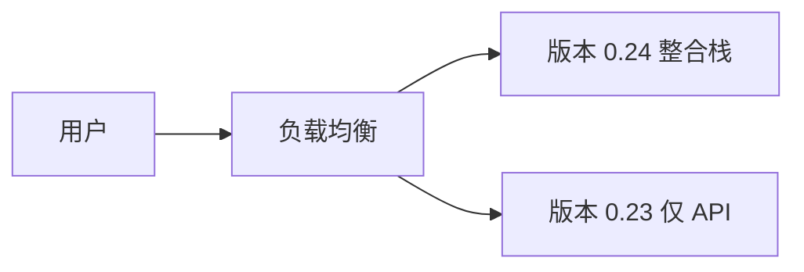

# 深度扩展：全栈整合与企业演示

**需求**：ZL-NA-REQ-024

## 1. 整合方法论

智链内部「整合日」清单：

1. **契约冻结**：不再改 POST /api/chat 字段  
2. **双路径验证**：Mock + API 都要能演示  
3. **门禁脚本**：可重复、可 CI、可一行命令  
4. **丑陋路径**：错误、空输入、服务离线  

## 2. Feature Flag 视角

`config.js` 的 `useMock` 本质是 feature flag。生产可扩展为远程配置，教学用 URL 参数即可。

## 3. 灰度发布草图

Day 24 栈为 V24：含 session/errors。

## 4. 可观测性

health 端点暴露 `mock_llm` 是轻量可观测性。未来可加 `sessions_active` 计数（未实现）。

## 5. 企业演示 SOP

| 阶段 | 负责人 | 动作 |
|------|--------|------|
| T-1 天 | 周航 | pytest 全绿 |
| T-1 小时 | 林晓 | 浏览器缓存清理 |
| T-0 | 赵岩 | 话术彩排 |
| T+0 | 全员 | 仅演示 happy path + 一条错误恢复 |

## 6. 技术债登记

- Redis SessionManager  
- OAuth2  
- WebSocket 流式  

扩展阅读：12-Factor App 配置、Release It! 门禁模式。

---

## 7. Conway 定律与四人组

组织架构决定系统架构。智链四人组映射：产品→演示脚本、架构→API、前端学员→session、运维→CI。整合日成功依赖沟通，非仅代码。

## 8. 契约测试展望

未来可对 POST /api/chat 做 Pact 契约测试，frontend mock 与 backend 独立仓库仍可对齐。今日同源 monorepo 降低需求。

## 9. 读书记录

推荐：《持续交付》第 10 章自动化测试；《设计数据密集型应用》第 5 章复制与分区（session 扩展）。

扩展完。

---

## 智链科技 Day 24 读本附录：整合方法论

### 附录 1

本附录专属于 `13_深度扩展_全栈整合与企业演示.md`，主题「整合方法论」。第 1 节强调：Sprint 3 收官日（ZL-NA-REQ-024）学员应把 **session 双端一致**、**errors 产品化**、**launch 门禁** 三件事串成闭环。林晓在第 1 次实验中发现：仅改前端不改后端，或仅 pytest 不 smoke，都会在投资人演示时暴露。陈默补充：版本 0.24.0 是课件契约，与仓库测试断言可能不同，口播须统一。赵岩要求：整合方法论相关物料须在彩排前完成，不得临场改 DEMO_QUERIES。周航记录：第 1 轮 CI 绿条是合并前提。

### 附录 2

本附录专属于 `13_深度扩展_全栈整合与企业演示.md`，主题「整合方法论」。第 2 节强调：Sprint 3 收官日（ZL-NA-REQ-024）学员应把 **session 双端一致**、**errors 产品化**、**launch 门禁** 三件事串成闭环。林晓在第 2 次实验中发现：仅改前端不改后端，或仅 pytest 不 smoke，都会在投资人演示时暴露。陈默补充：版本 0.24.0 是课件契约，与仓库测试断言可能不同，口播须统一。赵岩要求：整合方法论相关物料须在彩排前完成，不得临场改 DEMO_QUERIES。周航记录：第 2 轮 CI 绿条是合并前提。

### 附录 3

本附录专属于 `13_深度扩展_全栈整合与企业演示.md`，主题「整合方法论」。第 3 节强调：Sprint 3 收官日（ZL-NA-REQ-024）学员应把 **session 双端一致**、**errors 产品化**、**launch 门禁** 三件事串成闭环。林晓在第 3 次实验中发现：仅改前端不改后端，或仅 pytest 不 smoke，都会在投资人演示时暴露。陈默补充：版本 0.24.0 是课件契约，与仓库测试断言可能不同，口播须统一。赵岩要求：整合方法论相关物料须在彩排前完成，不得临场改 DEMO_QUERIES。周航记录：第 3 轮 CI 绿条是合并前提。

### 附录 4

本附录专属于 `13_深度扩展_全栈整合与企业演示.md`，主题「整合方法论」。第 4 节强调：Sprint 3 收官日（ZL-NA-REQ-024）学员应把 **session 双端一致**、**errors 产品化**、**launch 门禁** 三件事串成闭环。林晓在第 4 次实验中发现：仅改前端不改后端，或仅 pytest 不 smoke，都会在投资人演示时暴露。陈默补充：版本 0.24.0 是课件契约，与仓库测试断言可能不同，口播须统一。赵岩要求：整合方法论相关物料须在彩排前完成，不得临场改 DEMO_QUERIES。周航记录：第 4 轮 CI 绿条是合并前提。

### 附录 5

本附录专属于 `13_深度扩展_全栈整合与企业演示.md`，主题「整合方法论」。第 5 节强调：Sprint 3 收官日（ZL-NA-REQ-024）学员应把 **session 双端一致**、**errors 产品化**、**launch 门禁** 三件事串成闭环。林晓在第 5 次实验中发现：仅改前端不改后端，或仅 pytest 不 smoke，都会在投资人演示时暴露。陈默补充：版本 0.24.0 是课件契约，与仓库测试断言可能不同，口播须统一。赵岩要求：整合方法论相关物料须在彩排前完成，不得临场改 DEMO_QUERIES。周航记录：第 5 轮 CI 绿条是合并前提。

### 附录 6

本附录专属于 `13_深度扩展_全栈整合与企业演示.md`，主题「整合方法论」。第 6 节强调：Sprint 3 收官日（ZL-NA-REQ-024）学员应把 **session 双端一致**、**errors 产品化**、**launch 门禁** 三件事串成闭环。林晓在第 6 次实验中发现：仅改前端不改后端，或仅 pytest 不 smoke，都会在投资人演示时暴露。陈默补充：版本 0.24.0 是课件契约，与仓库测试断言可能不同，口播须统一。赵岩要求：整合方法论相关物料须在彩排前完成，不得临场改 DEMO_QUERIES。周航记录：第 6 轮 CI 绿条是合并前提。

### 附录 7

本附录专属于 `13_深度扩展_全栈整合与企业演示.md`，主题「整合方法论」。第 7 节强调：Sprint 3 收官日（ZL-NA-REQ-024）学员应把 **session 双端一致**、**errors 产品化**、**launch 门禁** 三件事串成闭环。林晓在第 7 次实验中发现：仅改前端不改后端，或仅 pytest 不 smoke，都会在投资人演示时暴露。陈默补充：版本 0.24.0 是课件契约，与仓库测试断言可能不同，口播须统一。赵岩要求：整合方法论相关物料须在彩排前完成，不得临场改 DEMO_QUERIES。周航记录：第 7 轮 CI 绿条是合并前提。

### 附录 8

本附录专属于 `13_深度扩展_全栈整合与企业演示.md`，主题「整合方法论」。第 8 节强调：Sprint 3 收官日（ZL-NA-REQ-024）学员应把 **session 双端一致**、**errors 产品化**、**launch 门禁** 三件事串成闭环。林晓在第 8 次实验中发现：仅改前端不改后端，或仅 pytest 不 smoke，都会在投资人演示时暴露。陈默补充：版本 0.24.0 是课件契约，与仓库测试断言可能不同，口播须统一。赵岩要求：整合方法论相关物料须在彩排前完成，不得临场改 DEMO_QUERIES。周航记录：第 8 轮 CI 绿条是合并前提。
