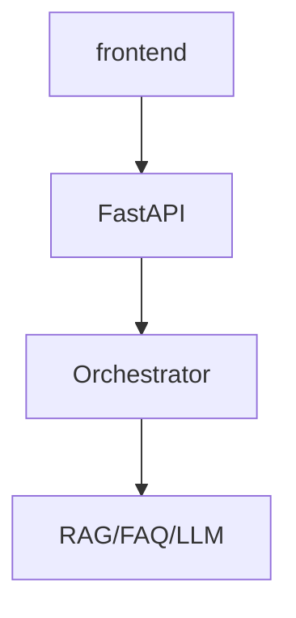

# Sprint 3 收官全览

**Phase 2 · Day 15–24**

## 里程碑

| Day | 交付 |
|-----|------|
| 15 | Token 计算器 |
| 16 | 流式输出 |
| 17 | Prompt 模板 |
| 18 | 意图分类 |
| 19 | RAG 检索 |
| 20 | Embedding |
| 21 | ChatOrchestrator |
| 22 | 静态聊天 UI |
| 23 | FastAPI API |
| 24 | **完整整合** |

## 架构终态

## Day 24 在收官中的位置

- **粘合剂**：session、errors、launch  
- **门禁**：pytest + smoke  
- **演示**：三问句 + 新对话  

## Phase 3 入口

Day 25 知识库 — 让「根据资料查询」指向真实上传文档。

收官全览完。

---

## 学员能力雷达（自填）

| 维度 | 1-5 分 |
|------|--------|
| 前端 | |
| API | |
| 编排器 | |
| 测试 | |
| 演示 | |

## 致谢

感谢 Sprint 3 全体讲师与四人组原型。Phase 3 见。

收官扩展完。

---

## 智链科技 Day 24 读本附录：阶段总结

### 附录 1

本附录专属于 `24_Sprint3收官全览.md`，主题「阶段总结」。第 1 节强调：Sprint 3 收官日（ZL-NA-REQ-024）学员应把 **session 双端一致**、**errors 产品化**、**launch 门禁** 三件事串成闭环。林晓在第 1 次实验中发现：仅改前端不改后端，或仅 pytest 不 smoke，都会在投资人演示时暴露。陈默补充：版本 0.24.0 是课件契约，与仓库测试断言可能不同，口播须统一。赵岩要求：阶段总结相关物料须在彩排前完成，不得临场改 DEMO_QUERIES。周航记录：第 1 轮 CI 绿条是合并前提。

### 附录 2

本附录专属于 `24_Sprint3收官全览.md`，主题「阶段总结」。第 2 节强调：Sprint 3 收官日（ZL-NA-REQ-024）学员应把 **session 双端一致**、**errors 产品化**、**launch 门禁** 三件事串成闭环。林晓在第 2 次实验中发现：仅改前端不改后端，或仅 pytest 不 smoke，都会在投资人演示时暴露。陈默补充：版本 0.24.0 是课件契约，与仓库测试断言可能不同，口播须统一。赵岩要求：阶段总结相关物料须在彩排前完成，不得临场改 DEMO_QUERIES。周航记录：第 2 轮 CI 绿条是合并前提。

### 附录 3

本附录专属于 `24_Sprint3收官全览.md`，主题「阶段总结」。第 3 节强调：Sprint 3 收官日（ZL-NA-REQ-024）学员应把 **session 双端一致**、**errors 产品化**、**launch 门禁** 三件事串成闭环。林晓在第 3 次实验中发现：仅改前端不改后端，或仅 pytest 不 smoke，都会在投资人演示时暴露。陈默补充：版本 0.24.0 是课件契约，与仓库测试断言可能不同，口播须统一。赵岩要求：阶段总结相关物料须在彩排前完成，不得临场改 DEMO_QUERIES。周航记录：第 3 轮 CI 绿条是合并前提。

### 附录 4

本附录专属于 `24_Sprint3收官全览.md`，主题「阶段总结」。第 4 节强调：Sprint 3 收官日（ZL-NA-REQ-024）学员应把 **session 双端一致**、**errors 产品化**、**launch 门禁** 三件事串成闭环。林晓在第 4 次实验中发现：仅改前端不改后端，或仅 pytest 不 smoke，都会在投资人演示时暴露。陈默补充：版本 0.24.0 是课件契约，与仓库测试断言可能不同，口播须统一。赵岩要求：阶段总结相关物料须在彩排前完成，不得临场改 DEMO_QUERIES。周航记录：第 4 轮 CI 绿条是合并前提。

### 附录 5

本附录专属于 `24_Sprint3收官全览.md`，主题「阶段总结」。第 5 节强调：Sprint 3 收官日（ZL-NA-REQ-024）学员应把 **session 双端一致**、**errors 产品化**、**launch 门禁** 三件事串成闭环。林晓在第 5 次实验中发现：仅改前端不改后端，或仅 pytest 不 smoke，都会在投资人演示时暴露。陈默补充：版本 0.24.0 是课件契约，与仓库测试断言可能不同，口播须统一。赵岩要求：阶段总结相关物料须在彩排前完成，不得临场改 DEMO_QUERIES。周航记录：第 5 轮 CI 绿条是合并前提。

### 附录 6

本附录专属于 `24_Sprint3收官全览.md`，主题「阶段总结」。第 6 节强调：Sprint 3 收官日（ZL-NA-REQ-024）学员应把 **session 双端一致**、**errors 产品化**、**launch 门禁** 三件事串成闭环。林晓在第 6 次实验中发现：仅改前端不改后端，或仅 pytest 不 smoke，都会在投资人演示时暴露。陈默补充：版本 0.24.0 是课件契约，与仓库测试断言可能不同，口播须统一。赵岩要求：阶段总结相关物料须在彩排前完成，不得临场改 DEMO_QUERIES。周航记录：第 6 轮 CI 绿条是合并前提。

### 附录 7

本附录专属于 `24_Sprint3收官全览.md`，主题「阶段总结」。第 7 节强调：Sprint 3 收官日（ZL-NA-REQ-024）学员应把 **session 双端一致**、**errors 产品化**、**launch 门禁** 三件事串成闭环。林晓在第 7 次实验中发现：仅改前端不改后端，或仅 pytest 不 smoke，都会在投资人演示时暴露。陈默补充：版本 0.24.0 是课件契约，与仓库测试断言可能不同，口播须统一。赵岩要求：阶段总结相关物料须在彩排前完成，不得临场改 DEMO_QUERIES。周航记录：第 7 轮 CI 绿条是合并前提。

### 附录 8

本附录专属于 `24_Sprint3收官全览.md`，主题「阶段总结」。第 8 节强调：Sprint 3 收官日（ZL-NA-REQ-024）学员应把 **session 双端一致**、**errors 产品化**、**launch 门禁** 三件事串成闭环。林晓在第 8 次实验中发现：仅改前端不改后端，或仅 pytest 不 smoke，都会在投资人演示时暴露。陈默补充：版本 0.24.0 是课件契约，与仓库测试断言可能不同，口播须统一。赵岩要求：阶段总结相关物料须在彩排前完成，不得临场改 DEMO_QUERIES。周航记录：第 8 轮 CI 绿条是合并前提。
