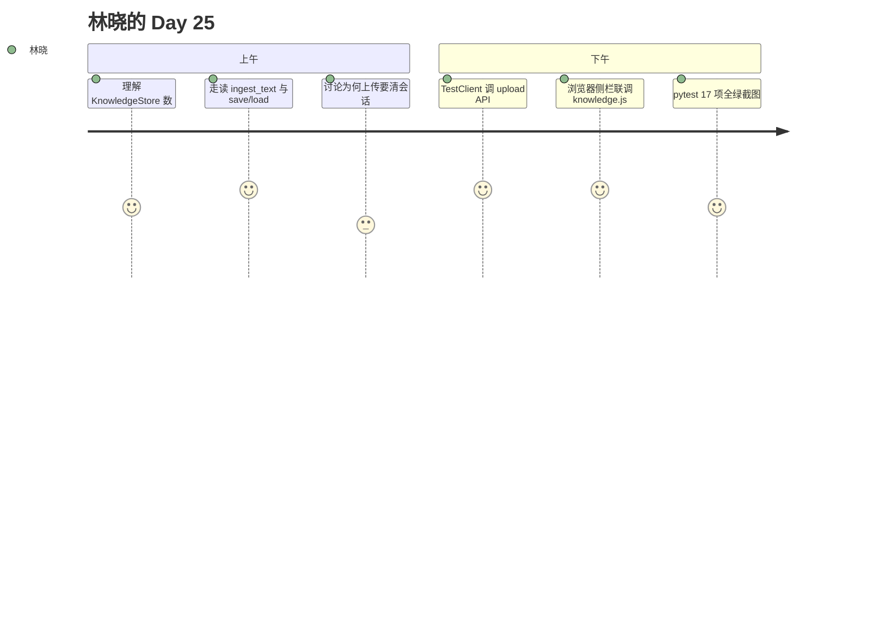

# Day 25 旁白解读

2026 年 7 月 30 日，星期四。Sprint 3 庆功宴的香槟还没散尽，赵岩已在白板写下 **Phase 3** 三个字母。

「投资人昨天问：『知识从哪来？』我们答不上来。」他转向林晓，「今天，你要让运营能上传一份 FAQ，刷新页面，问『最低起购金额』，答案来自刚上传的文档。」

陈默打开 `rag/knowledge_store.py`：「Day 19 的 `chunk_documents`、Day 20 的 `EmbeddingRetriever` 都不动。我们加一层 **可写、可存盘** 的壳。」

林晓盯着 JSON 文件路径 `data/knowledge/store.json`，忽然明白：RAG 终于从课堂 `sample_docs` 走向企业真实文档。

周航在白板补充数据流：「上传 → `ingest_upload` → `KnowledgeStore.ingest_bytes`（Day 25 等同 txt 直读）→ `_rebuild_index` → `save` → `session_manager.clear_all()`。任何一步漏了，用户仍会看到旧答案。」

## 旁白：persist 的意义

赵岩讲了一个故事：三年前某客服机器人把「退货政策」写死在代码里，运营改一个字要发版三天。今日 `store.json` 是第一步——知识外置、可版本化、可审计。林晓问：「为何不用数据库？」陈默答：「MVP 用 JSON 教学透明；Day 29 再换 Chroma 向量库，接口不变。」

## 旁白：单例与多会话

`get_knowledge_store()` 全局单例意味着全平台共享一份企业知识库，符合单租户教学模型。不同 `session_id` 的聊天共享同一索引，但各自 orchestrator 实例在上传前可能缓存旧 RAG——故 `clear_all()` 不是可选项。

旁白解读完。需求：ZL-NA-REQ-025。

---

## 附录：林晓日记节选（旁白专节）

今晚我把 `store.json` 打开给母亲看——她不懂 JSON，但看见「最低起购金额」出现在 chunks 里，说：「这才是你做的产品。」我想起 Day 19 只在终端里见过的 sample_docs，如今成了运营能摸得着的数据。陈默说 Phase 3 才刚开始，我反而踏实：知识终于有了一条路，从上传到检索，再到聊天回复。

赵岩在 Slack 留言：「明天开始能传 Markdown 了。」我点开 `product_notice.md` 预习，看见 `#` 标题和代码块，猜想解析器要比 txt 难一层。但 Day 25 的 txt 管线我已走通——这是地基。

旁白附录完。

---

## 声线设计说明（培训部）

旁白采用第三人称贴近林晓视角，帮助学员情感代入。教师朗读时可配乐轻柔 BGM，关键句「知识从哪来」提高音量。旁白与 01_ 背景互文：前者文学化，后者会议纪要体。不建议合并两文件，以免失去节奏层次。扮演赵岩的同学可在旁白段末即兴补充一句团队口号，强化记忆锚点。

旁白声线说明完。

---

## 镜头脚本第 2 场

特写：林晓手指划过 store.json 里「1000 元」字样。画外音：「知识第一次住在她亲手上传的文件里。」镜头脚本完。
