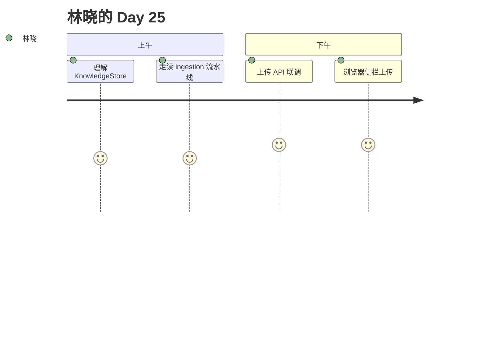

# Day 25 旁白解读

2026 年 7 月 30 日，星期四。Sprint 3 庆功宴的香槟还没散尽，赵岩已在白板写下 **Phase 3** 三个字母。

「投资人昨天问：『知识从哪来？』我们答不上来。」他转向林晓，「今天，你要让运营能上传一份 FAQ，刷新页面，问『最低起购金额』，答案来自刚上传的文档。」

陈默打开 `rag/knowledge_store.py`：「Day 19 的 `chunk_documents`、Day 20 的 `EmbeddingRetriever` 都不动。我们加一层 **可写、可存盘** 的壳。」

林晓盯着 JSON 文件路径 `data/knowledge/store.json`，忽然明白：RAG 终于从课堂 sample_docs 走向企业真实文档。

