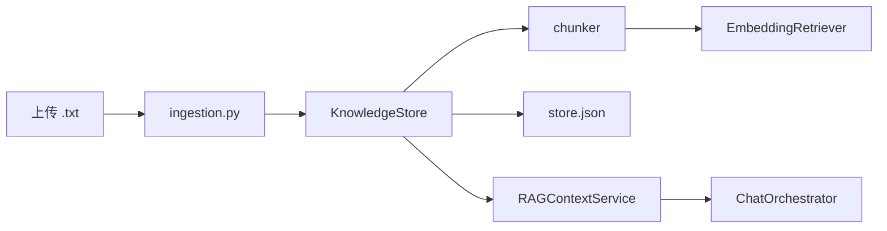

# Day 25 架构设计

```mermaid
flowchart LR
    UP[上传 .txt] --> ING[ingestion.py]
    ING --> KS[KnowledgeStore]
    KS --> CH[chunker]
    CH --> EM[EmbeddingRetriever]
    KS --> JSON[store.json]
    KS --> RAG[RAGContextService]
    RAG --> ORCH[ChatOrchestrator]
```

## 单例模式

`get_knowledge_store()` 全局共享，避免每会话重复建索引。

## 上传后会话清除

上传更新索引后调用 `session_manager.clear_all()`，确保新对话使用新 RAG。
