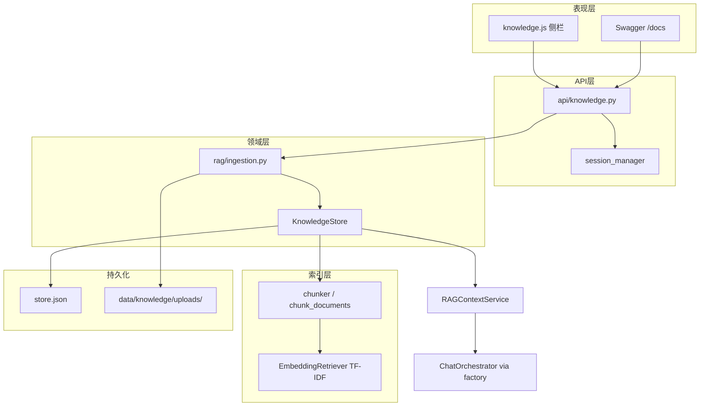

# Day 25 架构设计

**需求**：ZL-NA-REQ-025 | **版本**：0.25.0

## 分层架构



## 单例模式

`get_knowledge_store()` 在 `threading.Lock` 保护下懒加载。API 与 `factory.create_orchestrator` 共享同一 store，避免重复构建索引。

## 上传后会话清除

已创建的 `ChatOrchestrator` 在构造时持有 `RAGContextService` 引用。上传重建索引后，旧 orchestrator 仍指向旧 retriever。`session_manager.clear_all()` 强制下次 chat 新建 orchestrator。

## ingest_text 副作用链

1. `clean_text`（可选）  
2. `chunk_documents` 生成 `TextChunk` 列表  
3. `_append_chunks` 更新 documents 元数据  
4. `_rebuild_index` 重训 TF-IDF 并 export_state  
5. `invalidate_cache` 清空 `_rag_service` 缓存  

## Day 25 与后续演进

| 能力 | Day 25 | Day 26+ |
|------|--------|---------|
| 上传格式 | .txt | +.md/.pdf |
| 分块 | fixed window | +markdown sections |
| 向量 | JSON 内嵌 TF-IDF | Chroma（Day 29） |

架构设计完。


---

## 附录：factory 注入对比（架构专节）

Day 24:
```python
rag = RAGContextService.from_sample_docs(use_embedding=True)
```

Day 25:
```python
from rag.knowledge_store import get_knowledge_store
rag = get_knowledge_store().as_rag_service()
```

**影响面**：ChatOrchestrator、FAQ 检索、doc_summary 工具均读同一 store。上传后必须 clear_all，否则旧 orchestrator 缓存旧 rag 引用。

架构附录完。

---

## 附录：并发场景头脑风暴

问：两个运营同时 upload 不同文件？答：单进程下串行处理，均 append chunks，最后 save 覆盖整文件——教学环境可接受。问：同时 upload 同文件？答：产生重复 source 块，Day 28 rebuild 清理。问：upload 时用户 chat？答：可能读到旧索引或新索引取决于竞态，clear_all 在上传末尾降低风险。

架构 vol2 完。

---

## 反模式警示

禁止在 chat.py 直接调用 ingest_text——破坏 Single Writer 原则，审计链断裂。反模式警示完。
