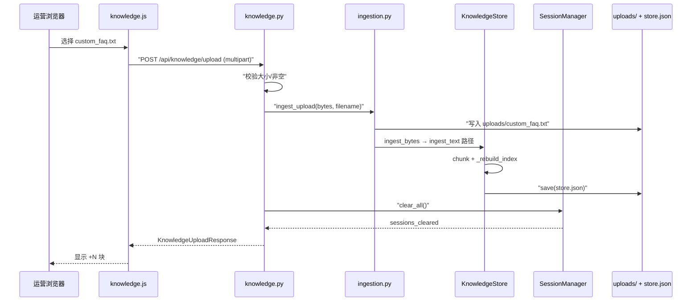
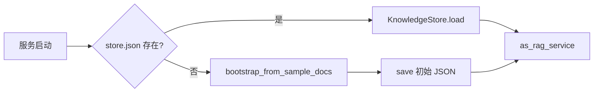
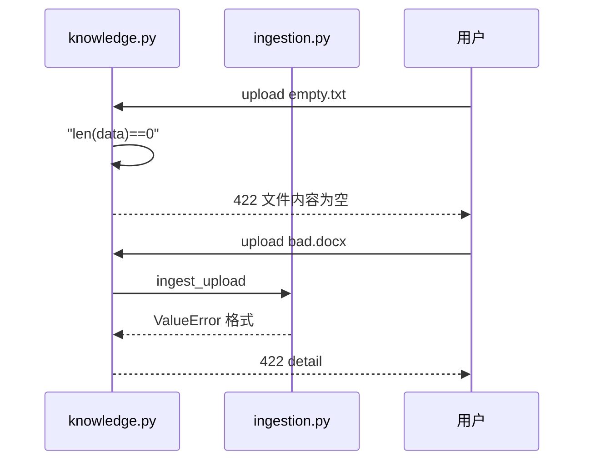

# Day 25 流程图与示意图

## 上传时序图



## 冷启动引导



## JSON 持久化结构（Day 25）

```
store.json
├── version: "1.0"
├── platform_version: "0.25.0"
├── documents[]: KnowledgeDocument
├── chunks[]: TextChunk 序列化
└── embedding: TfidfEmbeddingModel.export_state()
```

流程图完。


---

## 附录：失败路径时序（流程专节）



流程附录完。

---

## 附录：数据流层级图

```
[UTF-8 bytes] → DocumentRecord → TextChunk[] → TfidfEmbeddingModel
                      ↓                              ↓
              KnowledgeDocument              embedding_state in JSON
```

每层可独立单元测试：chunker 不测 API；API 不测 TF-IDF 数学。

流程 vol2 完。

---

## 打印版布局

A3 横向打印时序图贴墙；学员贴纸标注自己负责的模块。打印布局完。
