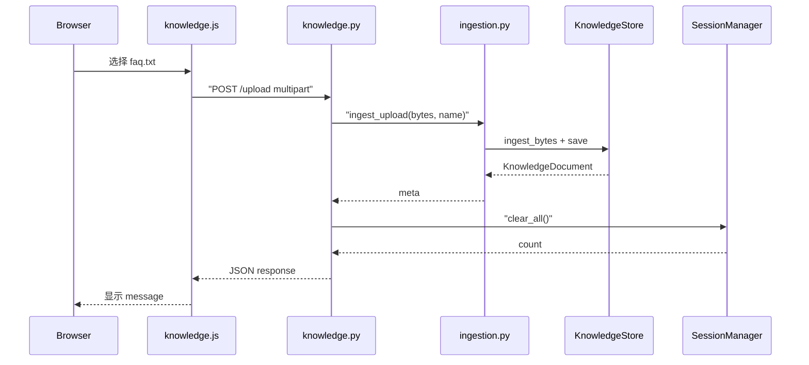

# Day 25 完整代码走查

**需求**：ZL-NA-REQ-025 | **版本**：0.25.0  
**方式**：按上传路径自顶向下

---

## 走查 1：服务启动与 store 引导

```
uvicorn / sprint3_launch --serve
  → create_app()
    → include_router(knowledge_router)
  → 首次 get_knowledge_store()
    → load_or_bootstrap()
      → bootstrap_from_sample_docs() [无 store.json]
      → save()
```

**检查点**：factory 在 create_orchestrator 时调用 `get_knowledge_store().as_rag_service()`。

---

## 走查 2：GET /api/knowledge/status

```
Request GET /api/knowledge/status
  → knowledge.py knowledge_status()
    → get_knowledge_store().status_dict()
    → KnowledgeStatusResponse(**data)
```

**检查点**：`document_count`、`chunk_count`、`documents[]` 与 store 内存一致。

---

## 走查 3：POST /api/knowledge/upload 全链

```
1. browser: knowledge.js uploadFile
     FormData.append("file", file)
     fetch('/api/knowledge/upload', {method:'POST', body: form})

2. FastAPI: UploadFile 解析 multipart

3. knowledge.py upload_document
     await file.read()
     校验非空、<= MAX_UPLOAD_BYTES
     ingest_upload(data, file.filename)

4. ingestion.py ingest_upload
     detect_format / Day25: .txt
     dest.write_bytes(data)
     kb.ingest_bytes(data, filename)
     kb.save()

5. KnowledgeStore.ingest_bytes [Day25 txt 路径]
     → ingest_text 或 parse plain

6. session_manager.clear_all()

7. KnowledgeUploadResponse 序列化
```



---

## 走查 4：chat 使用新索引

```
POST /api/chat [新 session 或 clear 后]
  → session_manager.get_or_create
    → factory.create_orchestrator
      → get_knowledge_store().as_rag_service()
  → orchestrator.handle_message
    → RAG retrieve_context 命中新 chunks
```


---

## 走查 5：持久化往返

```
ingest_text → _rebuild_index → save(path)
  → JSON {version, documents, chunks, embedding}
load(path)
  → documents/chunks 反序列化
  → embedding_state → EmbeddingClient.load_state
  → as_rag_service() 检索验证
```

---

## 走查 6：测试挂钩

```python
"""Day 25 知识库 API 测试。"""

from __future__ import annotations

import io
import os
import sys
from pathlib import Path

import pytest

SRC = Path(__file__).resolve().parents[2] / "src"
if str(SRC) not in sys.path:
    sys.path.insert(0, str(SRC))

os.environ.setdefault("NEXUS_LLM_MOCK", "1")

from fastapi.testclient import TestClient

from api.app import create_app
from day25.constants import SAMPLE_UPLOAD_NAME, SAMPLE_UPLOAD_TEXT
from rag.knowledge_store import KnowledgeStore, set_knowledge_store


@pytest.fixture
def client(tmp_path):
    store = KnowledgeStore.bootstrap_from_sample_docs(store_path=tmp_path / "store.json")
    set_knowledge_store(store)
    return TestClient(create_app())


def test_health_version_025(client):
    data = client.get("/api/health").json()
    assert data["version"] == "0.44.0"


def test_knowledge_status(client):
    resp = client.get("/api/knowledge/status")
    assert resp.status_code == 200
    data = resp.json()
    assert data["chunk_count"] > 0
    assert data["document_count"] >= 1
    assert data["platform_version"] == "0.44.0"


def test_knowledge_upload_txt(client):
    files = {
        "file": (SAMPLE_UPLOAD_NAME, io.BytesIO(SAMPLE_UPLOA
```


---

## 走查 7：前端 bindPanel

```javascript
/**
 * NexusAgent Day 25 — 知识库侧栏（上传与状态）
 *
 * 需求：ZL-NA-REQ-025
 */
(function (global) {
  "use strict";

  async function fetchStatus() {
    const base = (global.NexusConfig && global.NexusConfig.apiBase) || "";
    const res = await fetch(`${base}/api/knowledge/status`);
    if (!res.ok) {
      throw new Error(`status ${res.status}`);
    }
    return res.json();
  }

  async function uploadFile(file) {
    const base = (global.NexusConfig && global.NexusConfig.apiBase) || "";
    const form = new FormData();
    form.append("file", file, file.name);
    const res = await fetch(`${base}/api/knowledge/upload`, {
      method: "POST",
      body: form,
    });
    const payload = await (global.NexusErrors
      ? NexusErrors.parseErrorResponse(res)
      : res.json().catch(() => ({})));
    if (!res.ok) {
      const msg = global.NexusErrors
        ? NexusErrors.mapApiError(res.status,
```


走查完。详见 [22_knowledge_store精读.md](22_knowledge_store精读.md)。

---

## 走查 8：完整 API 测试文件

```python
"""Day 25 知识库 API 测试。"""

from __future__ import annotations

import io
import os
import sys
from pathlib import Path

import pytest

SRC = Path(__file__).resolve().parents[2] / "src"
if str(SRC) not in sys.path:
    sys.path.insert(0, str(SRC))

os.environ.setdefault("NEXUS_LLM_MOCK", "1")

from fastapi.testclient import TestClient

from api.app import create_app
from day25.constants import SAMPLE_UPLOAD_NAME, SAMPLE_UPLOAD_TEXT
from rag.knowledge_store import KnowledgeStore, set_knowledge_store


@pytest.fixture
def client(tmp_path):
    store = KnowledgeStore.bootstrap_from_sample_docs(store_path=tmp_path / "store.json")
    set_knowledge_store(store)
    return TestClient(create_app())


def test_health_version_025(client):
    data = client.get("/api/health").json()
    assert data["version"] == "0.44.0"


def test_knowledge_status(client):
    resp = client.get("/api/knowledge/status")
    assert resp.status_code == 200
    data = resp.json()
    assert data["chunk_count"] > 0
    assert data["document_count"] >= 1
    assert data["platform_version"] == "0.44.0"


def test_knowledge_upload_txt(client):
    files = {
        "file": (SAMPLE_UPLOAD_NAME, io.BytesIO(SAMPLE_UPLOAD_TEXT.encode("utf-8")), "text/plain"),
    }
    resp = client.post("/api/knowledge/upload", files=files)
    assert resp.status_code == 200
    data = resp.json()
    assert data["filename"] == SAMPLE_UPLOAD_NAME
    assert data["chunk_count"] > 0
    assert data["total_chunks"] > data["chunk_count"] or data["total_chunks"] >= data["chunk_count"]


def test_knowledge_upload_rejects_unsupported(client):
    files = {"file": ("bad.docx", io.BytesIO(b"PK"), "application/octet-stream")}
    resp = client.post("/api/knowledge/upload", files=files)
    assert resp.status_code == 422


def test_knowledge_upload_empty(client):
    files = {"file": ("empty.txt", io.BytesIO(b""), "text/plain")}
    resp = client.post("/api/knowledge/upload", files=files)
    assert resp.status_code == 422


def test_chat_after_upload_uses_kb(client):
    files = {
        "file": (SAMPLE_UPLOAD_NAME, io.BytesIO(SAMPLE_UPLOAD_TEXT.encode("utf-8")), "text/plain"),
    }
    client.post("/api/knowledge/upload", files=files)
    resp = client.post(
        "/api/chat",
        json={"message": "最低起购金额是多少", "session_id": "kb-test"},
    )
    assert resp.status_code == 200
    assert len(resp.json()["reply"]) > 0


def test_upload_clears_sessions(client):
    client.post("/api/chat", json={"message": "你好", "session_id": "to-clear"})
    files = {
        "file": (SAMPLE_UPLOAD_NAME, io.BytesIO(SAMPLE_UPLOAD_TEXT.encode("utf-8")), "text/plain"),
    }
    upload = client.post("/api/knowledge/upload", files=files)
    assert upload.json()["sessions_cleared"] >= 1


def test_frontend_knowledge_js(client):
    text = client.get("/knowledge.js").text
    assert "NexusKnowledge" in text
    assert "uploadFile" in text
```


| 测试 | 走查要点 |
|------|----------|
| test_knowledge_status | status 200 且 chunk_count>0 |
| test_knowledge_upload_txt | multipart 字段名 file |
| test_upload_clears_sessions | 先 chat 再 upload |
| test_chat_after_upload_uses_kb | 端到端 RAG 价值 |
| test_frontend_knowledge_js | 静态托管 knowledge.js |

---

## 走查 9：factory 注入（读 api/factory.py）

上传后 chat 链路依赖 factory 每次 `get_knowledge_store().as_rag_service()`。若开发者改回 `from_sample_docs`，upload 对 chat 不可见——`test_chat_after_upload_uses_kb` 会红。


---

## 附录：走查 8 — test_knowledge_store 矩阵（走查专节）

| 测试函数 | 验证点 |
|----------|--------|
| test_bootstrap_has_chunks | 引导后 chunk>=3 |
| test_ingest_text_appends_chunks | 追加块数 |
| test_rag_retrieve_after_ingest | 检索命中 1000/起购 |
| test_save_and_load_roundtrip | 持久化往返 |
| test_embedding_export_load_state | TF-IDF 状态 |
| test_ingest_upload_writes_file | uploads 落盘 |

走查附录完。

---

## 附录：走查 9 — 前端 uploadFile（走查 vol2）

```javascript
async function uploadFile(file) {
    const base = (global.NexusConfig && global.NexusConfig.apiBase) || "";
    const form = new FormData();
    form.append("file", file, file.name);
    const res = await fetch(`${base}/api/knowledge/upload`, {
      method: "POST",
      body: form,
    });
    const payload = await (global.NexusErrors
      ? NexusErrors.parseErrorResponse(res)
      : res.json().catch(() => ({})));
    if (!res.ok) {
      const msg = global.NexusErrors
        ? NexusErrors.mapApiError(res.status, payload)
        : `上传失败（${res.status}）`;
      throw new Error(msg);
    }
    return payload;
  }
```


不手动设置 `Content-Type`，浏览器自动带 `multipart/form-data; boundary=...`。`NexusErrors.parseErrorResponse` 统一错误 JSON 解析，与 Day 23 chat 错误处理同族。

## 走查 10 — get_or_create 与 store 关系

chat 路由不直接读 store；factory 在创建 orchestrator 时读一次。故 upload 后必须 clear orchestrator 实例，而非仅 invalidate store 缓存。

走查 vol2 完。

---

## 走查考核

期末抽考：白板默写 upload 时序 8 步，错 2 步即补考 26_ Lab。

---

## 白板时序考核

期末白板默写：Browser→knowledge.js→API→ingestion→store→clear_all，限时 4 分钟。考核完。

## 走查附录：api/knowledge upload 全文

```python
"""
知识库 REST API — 文档上传、分块调参与检索评估

需求：ZL-NA-REQ-025 / ZL-NA-REQ-026 / ZL-NA-REQ-027 / ZL-NA-REQ-028 / ZL-NA-REQ-029 / ZL-NA-REQ-030 / ZL-NA-REQ-031 / ZL-NA-REQ-032 / ZL-NA-REQ-033 / ZL-NA-REQ-034 / ZL-NA-REQ-035 / ZL-NA-REQ-036 / ZL-NA-REQ-037 / ZL-NA-REQ-038
"""

from __future__ import annotations

from pathlib import Path

from fastapi import APIRouter, File, HTTPException, UploadFile

from api.schemas import (
    ChunkConfigRequest,
    ChunkConfigResponse,
    CitationConfigRequest,
    CitationConfigResponse,
    CitationPreviewRequest,
    CitationPreviewResponse,
    ExpansionConfigRequest,
    ExpansionConfigResponse,
    ExpansionPreviewRequest,
    ExpansionPreviewResponse,
    EvaluateRequest,
    EvaluateResponse,
    KnowledgeStatusResponse,
    KnowledgeUploadResponse,
    RebuildRequest,
    RebuildResponse,
    RerankConfigRequest,
    RerankConfigResponse,
    RewriteConfigRequest,
    RewriteConfigResponse,
    RewritePreviewRequest,
    RewritePreviewResponse,
    RouteConfigRequest,
    RouteConfigResponse,
    RoutePreviewRequest,
    RoutePreviewResponse,
    ValidationConfigRequest,
    ValidationConfigResponse,
    ValidationPreviewRequest,
    ValidationPreviewResponse,
    ValidationRetryPreviewRequest,
    ValidationRetryPreviewResponse,
    RetrievalConfigRequest,
    RetrievalConfigResponse,
)
from api.sessions import session_manager
from core.exceptions import NexusError, StorageError
from rag.chunk_config import PRESET_CONFIGS, ChunkConfig
from rag.ingestion import ingest_upload
from rag.knowledge_rebuild import rebuild_store, rebuild_with_best_config
from rag.knowledge_store import get_knowledge_store
from rag.citation_config import CitationConfig
from rag.expansion_config import ExpansionConfig
from rag.query_expander import build_expander
from rag.query_rewriter import RuleBasedQueryRewriter
from rag.query_router import RuleBasedQueryRouter
from rag.route_config import RouteConfig
from rag.validation_config import ValidationConfig
from rag.rerank_config import RerankConfig
from rag.rewrite_config import RewriteConfig
from rag.retrieval_config import RetrievalConfig
from rag.retrieval_eval import EvalQuery, pick_best_config, run_ab_experiment
from tools.doc_parser import parse_bytes

router = APIRouter(prefix="/api/knowledge", tags=["knowledge"])

MAX_UPLOAD_BYTES = 512_000  # 500 KB 教学上限
_EVAL_SAMPLE = (
    Path(__file__).resolve().parent.parent / "day26" / "sample_docs" / "product_notice.md"
)


@router.get("/retrieval-config", response_model=RetrievalConfigResponse)
def get_retrieval_config() -> RetrievalConfigResponse:
    """返回当前检索模式（vector / keyword / hybrid）与融合参数"""
    cfg = get_knowledge_store().get_retrieval_config()
    return RetrievalConfigResponse(**cfg.to_dict())


@router.put("/retrieval-config", response_model=RetrievalConfigResponse)
def update_retrieval_config(body: RetrievalConfigRequest) -> RetrievalConfigResponse:
    """更新检索策略；变更后清除 RAG 缓存"""
    store = get_knowledge_store()
    try:
        cfg = RetrievalConfig.from_dict(body.model_dump())
        cfg.validate()
        store.set_retrieval_config(cfg)
        store.save()
    except ValueError as exc:
        raise HTTPException(status_code=422, detail=str(exc)) from exc
    return RetrievalConfigResponse(**cfg.to_dict())


@router.get("/rerank-config", response_model=RerankConfigResponse)
def get_rerank_config() -> RerankConfigResponse:
    """返回 rerank 开关、候选池大小与模型标识"""
    cfg = get_knowledge_store().get_rerank_config()
    return RerankConfigResponse(**cfg.to_dict())


@router.put("/rerank-config", response_model=RerankConfigResponse)
def update_rerank_config(body: RerankConfigRequest) -> RerankConfigResponse:
    """更新 rerank 策略；变更后清除 RAG 缓存"""
    store = get_knowledge_store()
    try:
        cfg = RerankConfig.from_dict(body.model_dump())
        cfg.validate()
        store.set_rerank_config(cfg)
        store.save()
    except ValueError as exc:
        raise HTTPException(status_code=422, detail=str(exc)) from exc
    return RerankConfigResponse(**cfg.to_dict())


@router.get("/rewrite-config", response_model=RewriteConfigResponse)
def get_rewrite_config() -> RewriteConfigResponse:
    """返回查询改写开关与规则模式"""
    cfg = get_knowledge_store().get_rewrite_config()
    return RewriteConfigResponse(**cfg.to_dict())


@router.put("/rewrite-config", response_model=RewriteConfigResponse)
def update_rewrite_config(body: RewriteConfigRequest) -> RewriteConfigResponse:
    """更新查询改写策略；变更后清除 RAG 缓存"""
    store = get_knowledge_store()
    try:
        cfg = RewriteConfig.from_dict(body.model_dump())
        cfg.validate()
        store.set_rewrite_config(cfg)
        store.save()
    except ValueError as exc:
        raise HTTPException(status_code=422, detail=str(exc)) from exc
    return RewriteConfigResponse(**cfg.to_dict())


@router.post("/rewrite-preview", response_model=RewritePreviewResponse)
def rewrite_preview(body: RewritePreviewRequest) -> RewritePreviewResponse:
    """预览单条 query 的规则改写结果（不触发检索）"""
    store = get_knowledge_store()
    cfg = store.get_rewrite_config()
    rewriter = RuleBasedQueryRewriter(config=cfg)
    result = rewriter.rewrite(body.query)
    return RewritePreviewResponse(**result.to_dict())


@router.get("/citation-config", response_model=CitationConfigResponse)
def get_citation_config() -> CitationConfigResponse:
    """返回引用溯源开关与展示参数"""
    cfg = get_knowledge_store().get_citation_config()
    return CitationConfigResponse(**cfg.to_dict())


@router.put("/citation-config", response_model=CitationConfigResponse)
def update_citation_config(body: CitationConfigRequest) -> CitationConfigResponse:
    """更新引用溯源策略并持久化"""
    store = get_knowledge_store()
    try:
        cfg = CitationConfig.from_dict(body.model_dump())
        cfg.validate()
        store.set_citation_config(cfg)
        store.save()
    except ValueError as exc:
        raise HTTPException(status_code=422, detail=str(exc)) from exc
    return CitationConfigResponse(**cfg.to_dict())


@router.post("/citation-preview", response_model=CitationPreviewResponse)
def citation_preview(body: CitationPreviewRequest) -> CitationPreviewResponse:
    """预览单条 query 的检索引用（含 rewrite / expansion 审计）"""
    store = get_knowledge_store()
    data = store.fetch_citations(body.query)
    return CitationPreviewResponse(**data)
```


## 走查附录：ingest_upload

```python
"""
文档 ingestion 流水线 — 读取、解析、清洗、分块、入库

需求：ZL-NA-REQ-025 / ZL-NA-REQ-026
"""

from __future__ import annotations

from pathlib import Path

from core.exceptions import NexusError, StorageError
from rag.knowledge_store import KnowledgeDocument, KnowledgeStore, get_knowledge_store
from tools.doc_parser import detect_format, parse_bytes, supported_formats
from tools.doc_reader import read_documents


def ingest_directory(
    directory: Path,
    *,
    pattern: str = "*.txt",
    clean: bool = True,
    store: KnowledgeStore | None = None,
) -> list[KnowledgeDocument]:
    """批量将目录下文本文件写入知识库"""
    kb = store or get_knowledge_store()
    docs = read_documents(directory, pattern=pattern, clean=clean)
    results: list[KnowledgeDocument] = []
    for doc in docs:
        content = doc.cleaned if clean and doc.cleaned else doc.content
        meta = kb.ingest_text(content, filename=doc.name, clean=False)
        results.append(meta)
    kb.save()
    return results


def ingest_upload(
    data: bytes,
    filename: str,
    *,
    store: KnowledgeStore | None = None,
    uploads_dir: Path | None = None,
    chunk_strategy: str = "auto",
) -> KnowledgeDocument:
    """处理 API 上传：解析 → 落盘 → 入库"""
    from core.paths import get_path

    kb = store or get_knowledge_store()
    target_dir = uploads_dir or get_path("knowledge_uploads")
    target_dir.mkdir(parents=True, exist_ok=True)

    safe_name = Path(filename).name
    try:
        detect_format(safe_name)
    except NexusError as exc:
        raise ValueError(exc.message) from exc

    dest = target_dir / safe_name
    dest.write_bytes(data)
    meta = kb.ingest_bytes(
        data,
        filename=safe_name,
        chunk_strategy=chunk_strategy,
    )
    kb.save()
    return meta


__all__ = ["ingest_directory", "ingest_upload", "supported_formats"]
```
