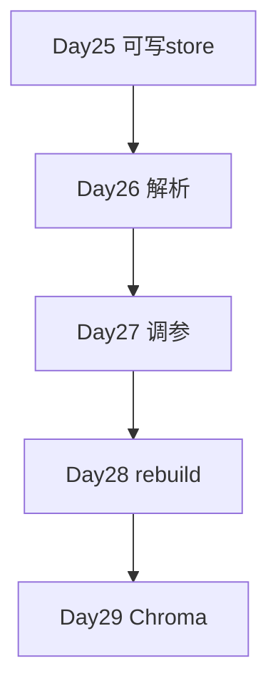

# Phase 3 启动全览（Day 25–31）

| Day | 主题 | 需求 |
|-----|------|------|
| 25 | 知识库 ingestion + upload API | ZL-NA-REQ-025 |
| 26 | Markdown/PDF 解析 + 分块策略 | ZL-NA-REQ-026 |
| 27 | 分块调参 + 检索评估 | ZL-NA-REQ-027 |
| 28 | 全量 rebuild | ZL-NA-REQ-028 |
| 29 | Chroma 向量库 | ZL-NA-REQ-029 |
| 30 | 知识库 Sprint 总结 | ZL-NA-REQ-030 |
| 31 | Phase 3 答辩 | — |

## Day 25 在路线图的位置

**数据面第一步**：让知识「可写入」。没有 Day 25，后续解析与向量库无挂载点。

## 投资人叙事

赵岩：「Day 24 是脸，Day 25 是脑的记忆皮层。」

全览完。

---

## Phase 3 每日_dependencies

Day 25 不依赖 Day 26；Day 26 依赖 Day 25 store；Day 27 依赖 Day 26 解析；Day 28 rebuild 依赖 Day 27 评估；Day 29 Chroma 依赖稳定 chunk 管线。

## 投资人时间线

| 日期 | 演示能力 |
|------|----------|
| 7/30 | 运营上传 txt |
| 7/31 | 上传 md/pdf |
| 8/01 | 调参命中提升 |
| 8/04 | 一键 rebuild |
| 8/05 | 向量库 |

## 团队产能假设

陈默架构 40%、林晓全栈 30%、周航 CI 20%、赵岩产品 10%。每日 standup 15 分钟。

---

## 附录：依赖关系图（全览专节）

全览附录完。

---

## 附录：每周口号（全览 vol2）

- Day 25：「知识能上传」  
- Day 26：「格式能解析」  
- Day 27：「参数能调优」  
- Day 28：「库能重建」  
- Day 29：「向量能生产」  

全览 vol2 完。

---

## 周会预告

周五 Phase 3 周会展示 Day25–26 联调：txt+md 双格式上传。周会预告完。
