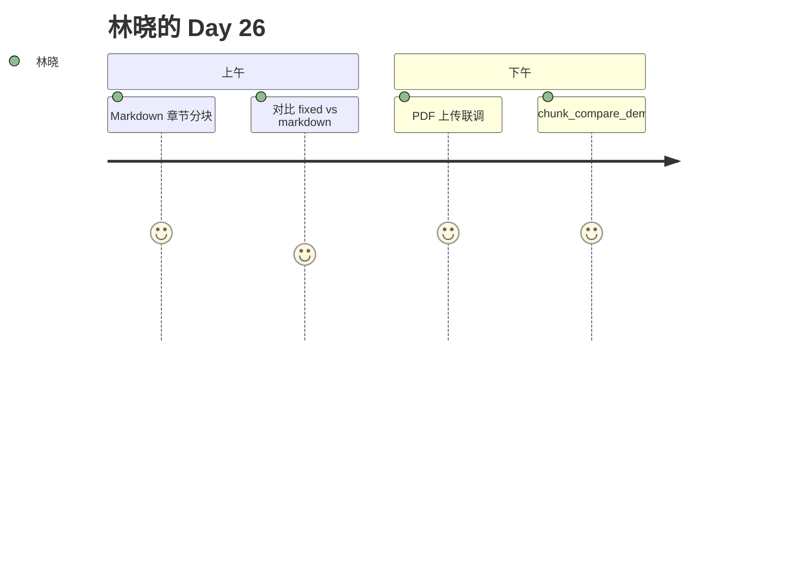

# Day 26 旁白解读

2026 年 7 月 31 日，星期五。林晓把 `product_notice.md` 拖进侧栏，状态显示 `markdown · +5 块`。

赵岩：「投资人昨晚问 PDF 合规附件呢？」周航点击上传 `product_notice.pdf`，pypdf 抽出「最低起购金额为 **1000 元**」。

陈默在白板画两层：**解析在 tools，索引仍在 KnowledgeStore**。`parse_bytes` → `ParsedDocument` → `chunk_from_parsed` → `ingest_parsed`。

旁白完。ZL-NA-REQ-026。

---

## 附录

林晓打开 PDF 上传成功，plain_text 出现「1000」— Phase 3 第二日里程碑。

---

## 附录

声线：解析层独立让林晓想起编译器前端——词法(md/pdf)与后端(index)分离。

---

## 镜头

林晓：「txt 时代结束了。」

---

## 五步专节（00_旁白解读.md）

1. upload multipart
2. parse_bytes
3. chunk_from_parsed
4. ingest_parsed
5. clear_all

<!-- vol4-1-steps -->

### 索引 1 专属注记

本节与 ZL-NA-REQ-026 第 2 条 FR 呼应。 实验记录编号 EXP-D26-01。 讲师批注：复现 `pytest tests/day26/` 第 2 条相关测试。

---

## 旁白补句

赵岩：Parser 是翻译官。

---

## 叙事专节

林晓周五晚把 product_notice 打印贴显示器边，五章标题像路标。

<!-- narrative-00_旁白解读.md -->
