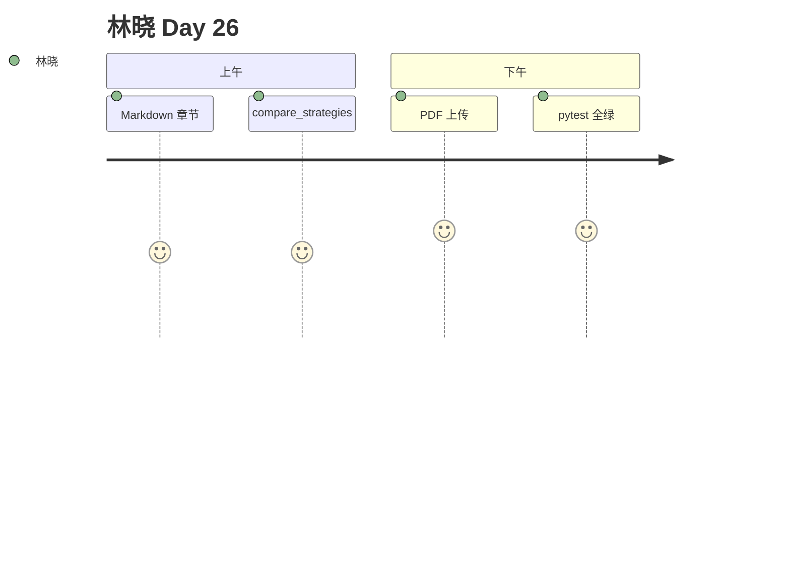

# Day 26 旁白解读

2026 年 7 月 31 日，星期五。产品部邮件标题是：**「PDF 说明书什么时候能上传？」**

林晓看着 Day 25 的知识库侧栏，accept 里还写着 `.txt`。陈默说：「今天不动 `store.json` 的结构，只换入口 —— `parse_bytes` 先解析，再 `ingest_parsed`。」

她打开 `markdown_parser.py`，第一次用正则拆 `## 标题`。赵岩路过说：「代码块别进索引，投资人不需要看 `print('demo')`。」

下午，她上传 `product_notice.pdf`，终端打印 `page_count=1`，检索「1000」命中。周航在 CI 里加了 `pytest tests/day26`：「谁改坏 parser，全组红。」

赵岩总结：「Day 25 解决知识从哪存，Day 26 解决知识从哪来 —— 多格式进来，同一套索引出去。」
