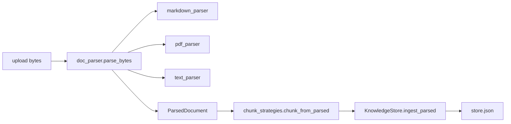

# Day 26 架构设计



## 分层原则

赵岩：「解析在 `tools/`，索引仍在 `KnowledgeStore`。」

## 策略选择

| 策略 | 适用 | 特点 |
|------|------|------|
| fixed | txt/pdf | 滑动窗口 overlap |
| markdown | .md | 章节语义完整 |
| auto | 上传默认 | md 用章节，其余 fixed |

架构完。


---

## 附录

反模式：在 markdown_parser 内调用 KnowledgeStore——破坏分层。

---

## ADR

parser 不写 store。

---

## 问答专节（03_架构设计.md）

问：parse_bytes 作用？
答：扩展名分发 txt/md/pdf。

问：为何剥离代码块？
答：避免源码噪声进检索。

<!-- vol4-5-qa -->

### 索引 5 专属注记

本节与 ZL-NA-REQ-026 第 6 条 FR 呼应。 实验记录编号 EXP-D26-05。 讲师批注：复现 `pytest tests/day26/` 第 6 条相关测试。


---

## 口诀

tools 解析 → rag 分块 → store 索引


---

## 叙事专节

陈默三支彩笔在玻璃墙画 tools/rag/store，实习生拍照发群当壁纸。

<!-- narrative-03_架构设计.md -->

## 架构嵌入：parsers/base 模型

```python
"""
解析结果模型与格式注册

需求：ZL-NA-REQ-026
"""

from __future__ import annotations

from dataclasses import dataclass, field
from typing import Any

SUPPORTED_EXTENSIONS: frozenset[str] = frozenset({".txt", ".md", ".markdown", ".pdf"})

FORMAT_LABELS: dict[str, str] = {
    ".txt": "纯文本",
    ".md": "Markdown",
    ".markdown": "Markdown",
    ".pdf": "PDF",
}


@dataclass
class DocumentSection:
    """结构化章节（Markdown / PDF 页）"""

    title: str
    body: str
    level: int = 0
    index: int = 0

    def to_dict(self) -> dict[str, Any]:
        return {
            "title": self.title,
            "body": self.body,
            "level": self.level,
            "index": self.index,
        }


@dataclass
class ParsedDocument:
    """统一解析输出 — 供 ingestion 与分块策略使用"""

    filename: str
    format: str
    plain_text: str
    title: str = ""
    sections: list[DocumentSection] = field(default_factory=list)
    page_count: int = 0
    metadata: dict[str, Any] = field(default_factory=dict)

    @property
    def section_count(self) -> int:
        return len(self.sections)

    def to_dict(self) -> dict[str, Any]:
        return {
            "filename": self.filename,
            "format": self.format,
            "title": self.title,
            "plain_text_len": len(self.plain_text),
            "section_count": self.section_count,
            "page_count": self.page_count,
            "metadata": self.metadata,
        }
```


## 架构嵌入：ingest_parsed 衔接

```python
clean: bool = True,
        chunk_size: int | None = None,
        overlap: int | None = None,
    ) -> KnowledgeDocument:
        """将文本写入知识库并重建索引"""
        cfg = self.get_chunk_config()
        cs = chunk_size if chunk_size is not None else cfg.chunk_size
        ov = overlap if overlap is not None else cfg.overlap
        text = (content or "").strip()
        if not text:
            raise ValueError("文档内容不能为空")
        if not filename.strip():
            raise ValueError("filename 不能为空")

        cleaned = text
        if clean:
            cleaned, _ = clean_text(text)
        doc = DocumentRecord(
            path=Path(filename),
            content=text,
            encoding="utf-8",
            size_bytes=len(text.encode("utf-8")),
            cleaned=cleaned,
        )
        new_chunks = chunk_documents(
            [doc],
            chunk_size=cs,
            overlap=ov,
            use_cleaned=clean,
        )
        self._append_chunks(filename, new_chunks, size_bytes=doc.size_bytes)
        self._rebuild_index()
        return self.documents[-1]

    def ingest_file(
        self,
        path: Path,
        *,
        clean: bool = True,
        chunk_size: int = 200,
        overlap: int = 40,
    ) -> KnowledgeDocument:
        """从磁盘文件 ingestion"""
        content, encoding = read_text_file(path)
        cleaned = content
        if clean:
            cleaned, _ = clean_text(content)
        doc = DocumentRecord(
            path=path,
            content=content,
            encoding=encoding,
```


架构嵌入完。
