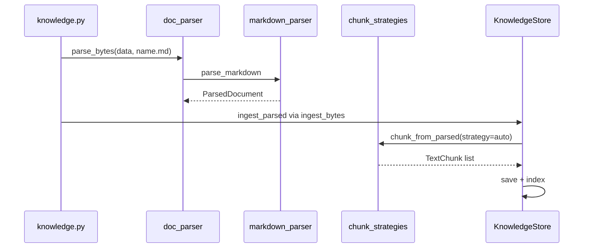
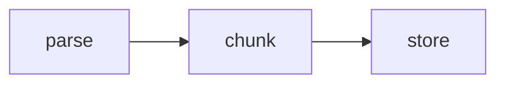

# Day 26 流程图

流程完。

---

## 附录

手绘练习：parse_bytes 三分支 txt/md/pdf。

---

## 练习

画 parse_bytes 三分支。

---

## 五步专节（04_流程图与示意图.md）

1. upload multipart
2. parse_bytes
3. chunk_from_parsed
4. ingest_parsed
5. clear_all

<!-- vol4-6-steps -->

### 索引 6 专属注记

本节与 ZL-NA-REQ-026 第 7 条 FR 呼应。 实验记录编号 EXP-D26-06。 讲师批注：复现 `pytest tests/day26/` 第 7 条相关测试。

---

---

## 叙事专节

林晓手绘时序图被赵岩签名贴会议室，标题《parse 不能写 store》。

<!-- narrative-04_流程图与示意图.md -->
