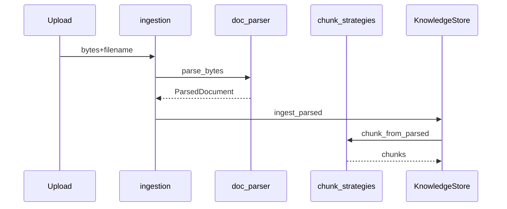
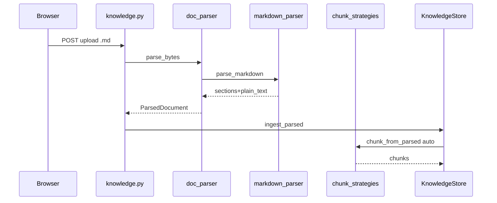

# Day 26 完整代码走查

## 1. parse_bytes 分发

```python
"""
统一文档解析入口 — 按扩展名分发

需求：ZL-NA-REQ-026
"""

from __future__ import annotations

from pathlib import Path

from core.exceptions import NexusError, StorageError
from tools.parsers.base import FORMAT_LABELS, SUPPORTED_EXTENSIONS, ParsedDocument
from tools.parsers.markdown_parser import parse_markdown
from tools.parsers.pdf_parser import parse_pdf
from tools.parsers.text_parser import parse_plain_text


def detect_format(filename: str) -> str:
    ext = Path(filename).suffix.lower()
    if ext not in SUPPORTED_EXTENSIONS:
        raise NexusError(
            f"不支持的文件格式: {ext}，支持: {sorted(SUPPORTED_EXTENSIONS)}",
            code="UNSUPPORTED_FORMAT",
        )
    return ext


def parse_bytes(data: bytes, filename: str) -> ParsedDocument:
    """
    将上传字节解析为统一 ParsedDocument。

    Raises:
        StorageError: 格式不支持或解析失败
        UnicodeDecodeError: 文本文件非 UTF-8
    """
    if not data:
        raise NexusError("文件内容为空", code="EMPTY_FILE")

    ext = detect_format(filename)
    safe_name = Path(filename).name

    if ext == ".txt":
        doc = parse_plain_text(data, safe_name)
    elif ext in (".md", ".markdown"):
        doc = parse_markdown(data, safe_name)
    elif ext == ".pdf":
        doc = parse_pdf(data, safe_name)
    else:
        raise NexusError(f"未实现的格式: {ext}", code="UNSUPPORTED_FORMAT")

    doc.metadata.setdefault("format_label", FORMAT_LABELS.get(ext, ext))
    return doc


def supported_formats() -> list[dict[str, str]]:
    """API 返回的支持格式列表"""
    seen: set[str] = set()
    items: list[dict[str, str]] = []
    for ext in sorted(SUPPORTED_EXTENSIONS):
        if ext in seen:
            continue
        items.append({"extension": ext, "label": FORMAT_LABELS.get(ext, ext)})
        seen.add(ext)
    return items
```


## 2. ingest 链

```
upload → ingest_upload → ingest_bytes → parse_bytes → ingest_parsed → chunk_from_parsed
```



## 3. 测试

```python
"""Day 26 知识库 API 多格式上传测试。"""

from __future__ import annotations

import io
import os
import sys
from pathlib import Path

import pytest

SRC = Path(__file__).resolve().parents[2] / "src"
SAMPLES = SRC / "day26" / "sample_docs"

if str(SRC) not in sys.path:
    sys.path.insert(0, str(SRC))

os.environ.setdefault("NEXUS_LLM_MOCK", "1")

from fastapi.testclient import TestClient

from api.app import create_app
from rag.knowledge_store import KnowledgeStore, set_knowledge_store


@pytest.fixture
def client(tmp_path):
    store = KnowledgeStore.bootstrap_from_sample_docs(store_path=tmp_path / "store.json")
    set_knowledge_store(store)
    return TestClient(create_app())


def test_health_version_026(client):
    assert client.get("/api/health").json()["version"] == "0.30.0"


def test_status_supported_formats(client):
    data = client.get("/api/knowledge/status").json()
    assert data["platform_version"] == "0.30.0"
    exts = {f["extension"] for f in data["supported_formats"]}
    assert ".pdf" in exts


def test_upload_markdown(client):
    md = (SAMPLES / "product_notice.md").read_bytes()
    resp = client.post(
        "/api/knowledge/upload",
        files={"file": ("product_notice.md", io.BytesIO(md), "text/markdown")},
    )
    assert resp.status_code == 200
    body = resp.json()
    assert body["format"] == "markdown"
    assert body["chunk_count"] >= 3


def test_upload_pdf(client):
    pdf_path = SAMPLES / "product_notice.pdf"
    if not pdf_path.is_file():
```


走查完。


---

## 附录：test_doc_parser 全文

```python
"""Day 26 文档解析器测试。"""

from __future__ import annotations

import sys
from pathlib import Path

import pytest

SRC = Path(__file__).resolve().parents[2] / "src"
SAMPLES = SRC / "day26" / "sample_docs"

if str(SRC) not in sys.path:
    sys.path.insert(0, str(SRC))

from core.exceptions import NexusError
from rag.chunk_strategies import chunk_from_parsed, compare_strategies
from tools.doc_parser import parse_bytes, supported_formats
from tools.parsers.markdown_parser import parse_markdown


def test_supported_formats_includes_md_pdf():
    exts = {f["extension"] for f in supported_formats()}
    assert ".md" in exts
    assert ".pdf" in exts


def test_parse_markdown_sections():
    data = (SAMPLES / "product_notice.md").read_bytes()
    doc = parse_markdown(data, "product_notice.md")
    assert doc.format == "markdown"
    assert doc.section_count >= 4
    assert "收益率" in doc.plain_text or "8%" in doc.plain_text
    titles = [s.title for s in doc.sections]
    assert any("风险" in t for t in titles)


def test_markdown_strips_code_fence():
    raw = b"# T\n\n```py\nsecret()\n```\n\n## Body\nvisible text"
    doc = parse_markdown(raw, "t.md")
    assert "secret()" not in doc.plain_text
    assert "visible text" in doc.plain_text


def test_parse_pdf_sample():
    pdf_path = SAMPLES / "product_notice.pdf"
    if not pdf_path.is_file():
        pytest.skip("sample pdf missing")
    doc = parse_bytes(pdf_path.read_bytes(), "product_notice.pdf")
    assert doc.format == "pdf"
    assert doc.page_count >= 1
    assert "1000" in doc.plain_text


def test_parse_bytes_rejects_unknown_ext():
    with pytest.raises(NexusError):
        parse_bytes(b"data", "file.docx")


def test_chunk_markdown_auto_strategy():
    doc = parse_bytes((SAMPLES / "product_notice.md").read_bytes(), "product_notice.md")
    chunks = chunk_from_parsed(doc, strategy="markdown")
    assert len(chunks) >= 3
    assert any("起购" in c.text or "1000" in c.text for c in chunks)


def test_compare_strategies_differs():
    doc = parse_bytes((SAMPLES / "product_notice.md").read_bytes(), "product_notice.md")
    results = compare_strategies(doc)
    assert len(results) == 2
    assert results[0].strategy == "fixed"
    assert results[1].strategy == "markdown"


def test_parse_empty_raises():
    with pytest.raises(NexusError):
        parse_bytes(b"", "empty.txt")


def test_invalid_pdf_raises():
    with pytest.raises(NexusError):
        parse_bytes(b"%PDF-1.4\nbroken", "bad.pdf")


def test_plain_text_utf8():
    doc = parse_bytes("你好世界".encode("utf-8"), "hello.txt")
    assert doc.plain_text == "你好世界"
    assert doc.format == "txt"
```


---

## 走查 4：markdown 上传全链



## 走查 5：完整 test_doc_parser

```python
"""Day 26 文档解析器测试。"""

from __future__ import annotations

import sys
from pathlib import Path

import pytest

SRC = Path(__file__).resolve().parents[2] / "src"
SAMPLES = SRC / "day26" / "sample_docs"

if str(SRC) not in sys.path:
    sys.path.insert(0, str(SRC))

from core.exceptions import NexusError
from rag.chunk_strategies import chunk_from_parsed, compare_strategies
from tools.doc_parser import parse_bytes, supported_formats
from tools.parsers.markdown_parser import parse_markdown


def test_supported_formats_includes_md_pdf():
    exts = {f["extension"] for f in supported_formats()}
    assert ".md" in exts
    assert ".pdf" in exts


def test_parse_markdown_sections():
    data = (SAMPLES / "product_notice.md").read_bytes()
    doc = parse_markdown(data, "product_notice.md")
    assert doc.format == "markdown"
    assert doc.section_count >= 4
    assert "收益率" in doc.plain_text or "8%" in doc.plain_text
    titles = [s.title for s in doc.sections]
    assert any("风险" in t for t in titles)


def test_markdown_strips_code_fence():
    raw = b"# T\n\n```py\nsecret()\n```\n\n## Body\nvisible text"
    doc = parse_markdown(raw, "t.md")
    assert "secret()" not in doc.plain_text
    assert "visible text" in doc.plain_text


def test_parse_pdf_sample():
    pdf_path = SAMPLES / "product_notice.pdf"
    if not pdf_path.is_file():
        pytest.skip("sample pdf missing")
    doc = parse_bytes(pdf_path.read_bytes(), "product_notice.pdf")
    assert doc.format == "pdf"
    assert doc.page_count >= 1
    assert "1000" in doc.plain_text


def test_parse_bytes_rejects_unknown_ext():
    with pytest.raises(NexusError):
        parse_bytes(b"data", "file.docx")


def test_chunk_markdown_auto_strategy():
    doc = parse_bytes((SAMPLES / "product_notice.md").read_bytes(), "product_notice.md")
    chunks = chunk_from_parsed(doc, strategy="markdown")
    assert len(chunks) >= 3
    assert any("起购" in c.text or "1000" in c.text for c in chunks)


def test_compare_strategies_differs():
    doc = parse_bytes((SAMPLES / "product_notice.md").read_bytes(), "product_notice.md")
    results = compare_strategies(doc)
    assert len(results) == 2
    assert results[0].strategy == "fixed"
    assert results[1].strategy == "markdown"


def test_parse_empty_raises():
    with pytest.raises(NexusError):
        parse_bytes(b"", "empty.txt")


def test_invalid_pdf_raises():
    with pytest.raises(NexusError):
        parse_bytes(b"%PDF-1.4\nbroken", "bad.pdf")


def test_plain_text_utf8():
    doc = parse_bytes("你好世界".encode("utf-8"), "hello.txt")
    assert doc.plain_text == "你好世界"
    assert doc.format == "txt"
```


## 走查 6：完整 test_parse_api

```python
"""Day 26 知识库 API 多格式上传测试。"""

from __future__ import annotations

import io
import os
import sys
from pathlib import Path

import pytest

SRC = Path(__file__).resolve().parents[2] / "src"
SAMPLES = SRC / "day26" / "sample_docs"

if str(SRC) not in sys.path:
    sys.path.insert(0, str(SRC))

os.environ.setdefault("NEXUS_LLM_MOCK", "1")

from fastapi.testclient import TestClient

from api.app import create_app
from rag.knowledge_store import KnowledgeStore, set_knowledge_store


@pytest.fixture
def client(tmp_path):
    store = KnowledgeStore.bootstrap_from_sample_docs(store_path=tmp_path / "store.json")
    set_knowledge_store(store)
    return TestClient(create_app())


def test_health_version_026(client):
    assert client.get("/api/health").json()["version"] == "0.30.0"


def test_status_supported_formats(client):
    data = client.get("/api/knowledge/status").json()
    assert data["platform_version"] == "0.30.0"
    exts = {f["extension"] for f in data["supported_formats"]}
    assert ".pdf" in exts


def test_upload_markdown(client):
    md = (SAMPLES / "product_notice.md").read_bytes()
    resp = client.post(
        "/api/knowledge/upload",
        files={"file": ("product_notice.md", io.BytesIO(md), "text/markdown")},
    )
    assert resp.status_code == 200
    body = resp.json()
    assert body["format"] == "markdown"
    assert body["chunk_count"] >= 3


def test_upload_pdf(client):
    pdf_path = SAMPLES / "product_notice.pdf"
    if not pdf_path.is_file():
        pytest.skip("sample pdf missing")
    resp = client.post(
        "/api/knowledge/upload",
        files={"file": ("product_notice.pdf", io.BytesIO(pdf_path.read_bytes()), "application/pdf")},
    )
    assert resp.status_code == 200
    assert resp.json()["format"] == "pdf"


def test_upload_rejects_docx(client):
    resp = client.post(
        "/api/knowledge/upload",
        files={"file": ("x.docx", io.BytesIO(b"PK"), "application/octet-stream")},
    )
    assert resp.status_code == 422


def test_chat_after_md_upload(client):
    md = (SAMPLES / "product_notice.md").read_bytes()
    client.post(
        "/api/knowledge/upload",
        files={"file": ("notice.md", io.BytesIO(md), "text/markdown")},
    )
    chat = client.post(
        "/api/chat",
        json={"message": "最低起购金额", "session_id": "md-chat"},
    )
    assert chat.status_code == 200
    assert len(chat.json()["reply"]) > 0


def test_knowledge_store_ingest_parsed_format(tmp_path):
    store = KnowledgeStore.bootstrap_from_sample_docs(store_path=tmp_path / "s.json")
    doc = __import__("tools.doc_parser", fromlist=["parse_bytes"]).parse_bytes(
        (SAMPLES / "product_notice.md").read_bytes(),
        "p.md",
    )
    meta = store.ingest_parsed(doc)
    assert meta.format == "markdown"
    assert meta.chunk_count >= 3
```


## 走查 7：三解析器源码并列

```python
"""
统一文档解析入口 — 按扩展名分发

需求：ZL-NA-REQ-026
"""

from __future__ import annotations

from pathlib import Path

from core.exceptions import NexusError, StorageError
from tools.parsers.base import FORMAT_LABELS, SUPPORTED_EXTENSIONS, ParsedDocument
from tools.parsers.markdown_parser import parse_markdown
from tools.parsers.pdf_parser import parse_pdf
from tools.parsers.text_parser import parse_plain_text


def detect_format(filename: str) -> str:
    ext = Path(filename).suffix.lower()
    if ext not in SUPPORTED_EXTENSIONS:
        raise NexusError(
            f"不支持的文件格式: {ext}，支持: {sorted(SUPPORTED_EXTENSIONS)}",
            code="UNSUPPORTED_FORMAT",
        )
    return ext


def parse_bytes(data: bytes, filename: str) -> ParsedDocument:
    """
    将上传字节解析为统一 ParsedDocument。

    Raises:
        StorageError: 格式不支持或解析失败
        UnicodeDecodeError: 文本文件非 UTF-8
    """
    if not data:
        raise NexusError("文件内容为空", code="EMPTY_FILE")

    ext = detect_format(filename)
    safe_name = Path(filename).name

    if ext == ".txt":
        doc = parse_plain_text(data, safe_name)
    elif ext in (".md", ".markdown"):
        doc = parse_markdown(data, safe_name)
    elif ext == ".pdf":
        doc = parse_pdf(data, safe_name)
    else:
        raise NexusError(f"未实现的格式: {ext}", code="UNSUPPORTED_FORMAT")

    doc.metadata.setdefault("format_label", FORMAT_LABELS.get(ext, ext))
    return doc


def supported_formats() -> list[dict[str, str]]:
    """API 返回的支持格式列表"""
    seen: set[str] = set()
    items: list[dict[str, str]] = []
    for ext in sorted(SUPPORTED_EXTENSIONS):
        if ext in seen:
            continue
        items.append({"extension": ext, "label": FORMAT_LABELS.get(ext, ext)})
        seen.add(ext)
    return items
```


```python
"""
Markdown 结构解析 — 标题分段、去代码块

需求：ZL-NA-REQ-026
"""

from __future__ import annotations

import re

from tools.parsers.base import DocumentSection, ParsedDocument

_HEADING = re.compile(r"^(#{1,6})\s+(.+)$", re.MULTILINE)
_FENCE = re.compile(r"```[\s\S]*?```", re.MULTILINE)
_INLINE_CODE = re.compile(r"`([^`]+)`")
_LINK = re.compile(r"\[([^\]]+)\]\([^)]+\)")
_BOLD = re.compile(r"\*\*([^*]+)\*\*")


def parse_markdown(data: bytes, filename: str) -> ParsedDocument:
    raw = data.decode("utf-8")
    stripped = _FENCE.sub("", raw)
    stripped = _INLINE_CODE.sub(r"\1", stripped)
    stripped = _LINK.sub(r"\1", stripped)
    stripped = _BOLD.sub(r"\1", stripped)

    sections: list[DocumentSection] = []
    title = filename.rsplit(".", 1)[0]
    current_title = title
    current_level = 0
    current_lines: list[str] = []
    idx = 0

    for line in stripped.splitlines():
        match = _HEADING.match(line)
        if match:
            if current_lines:
                body = "\n".join(current_lines).strip()
                if body:
                    sections.append(
                        DocumentSection(
                            title=current_title,
                            body=body,
                            level=current_level,
                            index=idx,
                        )
                    )
                    idx += 1
            level = len(match.group(1))
            current_title = match.group(2).strip()
            current_level = level
            if level == 1 and not sections:
                title = current_title
            current_lines = []
        else:
            current_lines.append(line)

    if current_lines:
        body = "\n".join(current_lines).strip()
        if body:
            sections.append(
                DocumentSection(
                    title=current_title,
                    body=body,
                    level=current_level,
                    index=idx,
                )
            )

    plain_parts = [f"## {s.title}\n{s.body}" for s in sections if s.body]
    plain_text = "\n\n".join(plain_parts) if plain_parts else stripped.strip()

    return ParsedDocument(
        filename=filename,
        format="markdown",
        plain_text=plain_text,
        title=title,
        sections=sections,
        metadata={"heading_count": len(sections)},
    )
```


```python
"""
PDF 文本抽取 — 基于 pypdf

需求：ZL-NA-REQ-026
"""

from __future__ import annotations

import io

from core.exceptions import NexusError, StorageError
from tools.parsers.base import DocumentSection, ParsedDocument


def parse_pdf(data: bytes, filename: str) -> ParsedDocument:
    try:
        from pypdf import PdfReader
    except ImportError as exc:
        raise NexusError(
            "PDF 解析需要安装 pypdf：pip install pypdf",
            code="PDF_DEPS_MISSING",
        ) from exc

    try:
        reader = PdfReader(io.BytesIO(data))
    except Exception as exc:
        raise NexusError(f"无法解析 PDF: {filename}", code="PDF_PARSE_ERROR") from exc

    pages: list[str] = []
    sections: list[DocumentSection] = []
    for i, page in enumerate(reader.pages):
        text = (page.extract_text() or "").strip()
        pages.append(text)
        if text:
            sections.append(
                DocumentSection(
                    title=f"第{i + 1}页",
                    body=text,
                    level=0,
                    index=i,
                )
            )

    plain_text = "\n\n".join(p for p in pages if p).strip()
    if not plain_text:
        raise NexusError(f"PDF 未提取到文本: {filename}", code="PDF_EMPTY")

    title = filename.rsplit(".", 1)[0]
    return ParsedDocument(
        filename=filename,
        format="pdf",
        plain_text=plain_text,
        title=title,
        sections=sections,
        page_count=len(reader.pages),
        metadata={"extractor": "pypdf"},
    )
```


走查专节完。

---

## 走查 7：错误路径

bad.docx → UNSUPPORTED_FORMAT → 422。Day 26 不改 ingest_upload 外壳。走查长文完。

---

## 案例专节（20_完整代码走查.md）

运营传 product_notice.md，问「年化收益率」，应命中含 8% 的章节块。
若命中 fixed 碎块，Day27 evaluate 调参。

<!-- vol4-22-case -->

### 索引 22 专属注记

本节与 ZL-NA-REQ-026 第 5 条 FR 呼应。 实验记录编号 EXP-D26-22。 讲师批注：复现 `pytest tests/day26/` 第 6 条相关测试。


## 走查嵌入：ingestion.py 全文

```python
"""
文档 ingestion 流水线 — 读取、解析、清洗、分块、入库

需求：ZL-NA-REQ-025 / ZL-NA-REQ-026
"""

from __future__ import annotations

from pathlib import Path

from core.exceptions import NexusError, StorageError
from rag.knowledge_store import KnowledgeDocument, KnowledgeStore, get_knowledge_store
from tools.doc_parser import detect_format, parse_bytes, supported_formats
from tools.doc_reader import read_documents


def ingest_directory(
    directory: Path,
    *,
    pattern: str = "*.txt",
    clean: bool = True,
    store: KnowledgeStore | None = None,
) -> list[KnowledgeDocument]:
    """批量将目录下文本文件写入知识库"""
    kb = store or get_knowledge_store()
    docs = read_documents(directory, pattern=pattern, clean=clean)
    results: list[KnowledgeDocument] = []
    for doc in docs:
        content = doc.cleaned if clean and doc.cleaned else doc.content
        meta = kb.ingest_text(content, filename=doc.name, clean=False)
        results.append(meta)
    kb.save()
    return results


def ingest_upload(
    data: bytes,
    filename: str,
    *,
    store: KnowledgeStore | None = None,
    uploads_dir: Path | None = None,
    chunk_strategy: str = "auto",
) -> KnowledgeDocument:
    """处理 API 上传：解析 → 落盘 → 入库"""
    from core.paths import get_path

    kb = store or get_knowledge_store()
    target_dir = uploads_dir or get_path("knowledge_uploads")
    target_dir.mkdir(parents=True, exist_ok=True)

    safe_name = Path(filename).name
    try:
        detect_format(safe_name)
    except NexusError as exc:
        raise ValueError(exc.message) from exc

    dest = target_dir / safe_name
    dest.write_bytes(data)
    meta = kb.ingest_bytes(
        data,
        filename=safe_name,
        chunk_strategy=chunk_strategy,
    )
    kb.save()
    return meta


__all__ = ["ingest_directory", "ingest_upload", "supported_formats"]
```


## 走查嵌入：knowledge upload 路由

```python
"""
知识库 REST API — 文档上传、分块调参与检索评估

需求：ZL-NA-REQ-025 / ZL-NA-REQ-026 / ZL-NA-REQ-027 / ZL-NA-REQ-028 / ZL-NA-REQ-029 / ZL-NA-REQ-030
"""

from __future__ import annotations

from pathlib import Path

from fastapi import APIRouter, File, HTTPException, UploadFile

from api.schemas import (
    ChunkConfigRequest,
    ChunkConfigResponse,
    EvaluateRequest,
    EvaluateResponse,
    KnowledgeStatusResponse,
    KnowledgeUploadResponse,
    RebuildRequest,
    RebuildResponse,
)
from api.sessions import session_manager
from core.exceptions import NexusError, StorageError
from rag.chunk_config import PRESET_CONFIGS, ChunkConfig
from rag.ingestion import ingest_upload
from rag.knowledge_rebuild import rebuild_store, rebuild_with_best_config
from rag.knowledge_store import get_knowledge_store
from rag.retrieval_eval import EvalQuery, pick_best_config, run_ab_experiment
from tools.doc_parser import parse_bytes

router = APIRouter(prefix="/api/knowledge", tags=["knowledge"])

MAX_UPLOAD_BYTES = 512_000  # 500 KB 教学上限
_EVAL_SAMPLE = (
    Path(__file__).resolve().parent.parent / "day26" / "sample_docs" / "product_notice.md"
)


@router.get("/chunk-config", response_model=ChunkConfigResponse)
def get_chunk_config() -> ChunkConfigResponse:
    """返回当前知识库默认分块参数"""
    cfg = get_knowledge_store().get_chunk_config()
    return ChunkConfigResponse(**cfg.to_dict())


@router.put("/chunk-config", response_model=ChunkConfigResponse)
def update_chunk_config(body: ChunkConfigRequest) -> ChunkConfigResponse:
    """更新默认分块参数（影响后续上传）"""
    store = get_knowledge_store()
    try:
        cfg = ChunkConfig.from_dict(body.model_dump())
        cfg.validate()
        store.set_chunk_config(cfg)
        store.save()
    except ValueError as exc:
        raise HTTPException(status_code=422, detail=str(exc)) from exc
    return ChunkConfigResponse(**cfg.to_dict())


@router.post("/evaluate", response_model=EvaluateResponse)
def evaluate_chunk_configs(body: EvaluateRequest | None = None) -> EvaluateResponse:
    """
    对内置样例文档运行 A/B 分块评估，返回 hit@1 与推荐配置。

    默认使用 PRESET_CONFIGS 四套预设与 day27 评估问句集。
    """
    body = body or EvaluateRequest()
    if not _EVAL_SAMPLE.is_file():
        raise HTTPException(status_code=500, detail="评估样例文档缺失")

    doc = parse_bytes(_EVAL_SAMPLE.read_bytes(), _EVAL_SAMPLE.name)
    from day27.constants import EVAL_QUERIES

    queries = [EvalQuery.from_dict(q) for q in EVAL_QUERIES]

    if body.use_presets and not body.configs:
        configs = list(PRESET_CONFIGS)
    else:
        configs = [ChunkConfig.from_dict(c.model_dump()) for c in body.configs]
        for c in configs:
            c.validate()

    results = run_ab_experiment(doc, configs, queries)
    best = pick_best_config(results)
    if not best:
        raise HTTPException(status_code=500, detail="评估未产生结果")

    return EvaluateResponse(
        best_config=best.to_dict()["config"],
        results=[r.to_dict() for r in results],
        eval_query_count=len(queries),
    )


@router.post("/rebuild", response_model=RebuildResponse)
def rebuild_knowledge_base(body: RebuildRequest | None = None) -> RebuildResponse:
    """
    按当前 chunk_config（或 evaluate 最优配置）全量重建知识库。

    重扫 sample_docs + knowledge_uploads，清空后重新分块与索引。
    """
    body = body or RebuildRequest()
    store = get_knowledge_store()

    if body.apply_best_config:
        if not _EVAL_SAMPLE.is_file():
            raise HTTPException(status_code=500, detail="评估样例文档缺失")
        report = rebuild_with_best_config(
            store,
            eval_sample_path=_EVAL_SAMPLE,
            include_sample_docs=body.include_sample_docs,
        )
    else:
        report = rebuild_store(store, include_sample_docs=body.include_sample_docs)

    cleared = session_manager.clear_all()
    data = report.to_dict()
    data["sessions_cleared"] = cleared
    return RebuildResponse(**data)


@router.get("/status", response_model=KnowledgeStatusResponse)
def knowledge_status() -> KnowledgeStatusResponse:
    """返回知识库文档数、分块数、支持格式与文档列表"""
    store = get_knowledge_store()
    data = store.status_dict()
    return KnowledgeStatusResponse(**data)


@router.post("/upload", response_model=KnowledgeUploadResponse)
async def upload_document(
    file: UploadFile = File(..., description="企业文档 (.txt / .md / .pdf)"),
) -> KnowledgeUploadResponse:
    """
    上传企业文档到知识库：解析 → 落盘 → 分块 → Chroma 向量索引 → 持久化。

    Day 26 起支持 Markdown 与 PDF。上传成功后清除服务端会话。
    """
    if not file.filename:
        raise HTTPException(status_code=422, detail="缺少文件名")

    data = await file.read()
    if not data:
        raise HTTPException(status_code=422, detail="文件内容为空")
    if len(data) > MAX_UPLOAD_BYTES:
        raise HTTPException(status_code=413, detail="文件超过 500KB 上限")

    try:
        meta = ingest_upload(data, file.filename)
    except ValueError as exc:
        raise HTTPException(status_code=422, detail=str(exc)) from exc
    except NexusError as exc:
        status = 400 if exc.code in (
            "PDF_PARSE_ERROR", "PDF_EMPTY", "UNSUPPORTED_FORMAT", "EMPTY_FILE"
        ) else 500
        raise HTTPException(status_code=status, detail=exc.message) from exc
    except StorageError as exc:
        raise HTTPException(status_code=500, detail=exc.message) from exc
    except UnicodeDecodeError as exc:
        raise HTTPException(status_code=400, detail="文本文件须为 UTF-8 编码") from exc

    cleared = session_manager.clear_all()
    store = get_knowledge_store()

    return KnowledgeUploadResponse(
        filename=meta.name,
        format=meta.format,
        chunk_count=meta.chunk_count,
        document_count=store.document_count,
        total_chunks=store.chunk_count,
        sessions_cleared=cleared,
        index_mode=store.index_mode,
        message=f"文档已入库（{meta.format}），增量索引已更新",
    )
```


---

## test_parse_api

```python
"""Day 26 知识库 API 多格式上传测试。"""

from __future__ import annotations

import io
import os
import sys
from pathlib import Path

import pytest

SRC = Path(__file__).resolve().parents[2] / "src"
SAMPLES = SRC / "day26" / "sample_docs"

if str(SRC) not in sys.path:
    sys.path.insert(0, str(SRC))

os.environ.setdefault("NEXUS_LLM_MOCK", "1")

from fastapi.testclient import TestClient

from api.app import create_app
from rag.knowledge_store import KnowledgeStore, set_knowledge_store


@pytest.fixture
def client(tmp_path):
    store = KnowledgeStore.bootstrap_from_sample_docs(store_path=tmp_path / "store.json")
    set_knowledge_store(store)
    return TestClient(create_app())


def test_health_version_026(client):
    assert client.get("/api/health").json()["version"] == "0.30.0"


def test_status_supported_formats(client):
    data = client.get("/api/knowledge/status").json()
    assert data["platform_version"] == "0.30.0"
    exts = {f["extension"] for f in data["supported_formats"]}
    assert ".pdf" in exts


def test_upload_markdown(client):
    md = (SAMPLES / "product_notice.md").read_bytes()
    resp = client.post(
        "/api/knowledge/upload",
        files={"file": ("product_notice.md", io.BytesIO(md), "text/markdown")},
    )
    assert resp.status_code == 200
    body = resp.json()
    assert body["format"] == "markdown"
    assert body["chunk_count"] >= 3


def test_upload_pdf(client):
    pdf_path = SAMPLES / "product_notice.pdf"
    if not pdf_path.is_file():
        pytest.skip("sample pdf missing")
    resp = client.post(
        "/api/knowledge/upload",
        files={"file": ("product_notice.pdf", io.BytesIO(pdf_path.read_bytes()), "application/pdf")},
    )
    assert resp.status_code == 200
    assert resp.json()["format"] == "pdf"


def test_upload_rejects_docx(client):
    resp = client.post(
        "/api/knowledge/upload",
        files={"file": ("x.docx", io.BytesIO(b"PK"), "application/octet-stream")},
    )
    assert resp.status_code == 422


def test_chat_after_md_upload(client):
    md = (SAMPLES / "product_notice.md").read_bytes()
    client.post(
        "/api/knowledge/upload",
        files={"file": ("notice.md", io.BytesIO(md), "text/markdown")},
    )
    chat = client.post(
        "/api/chat",
        json={"message": "最低起购金额", "session_id": "md-chat"},
    )
    assert chat.status_code == 200
    assert len(chat.json()["reply"]) > 0


def test_knowledge_store_ingest_parsed_format(tmp_path):
    store = KnowledgeStore.bootstrap_from_sample_docs(store_path=tmp_path / "s.json")
    doc = __import__("tools.doc_parser", fromlist=["parse_bytes"]).parse_bytes(
        (SAMPLES / "product_notice.md").read_bytes(),
        "p.md",
    )
    meta = store.ingest_parsed(doc)
    assert meta.format == "markdown"
    assert meta.chunk_count >= 3
```


---

## 叙事专节

走查考核有人漏写 clear_all，赵岩罚唱 Phase3 主题歌。

<!-- narrative-20_完整代码走查.md -->
