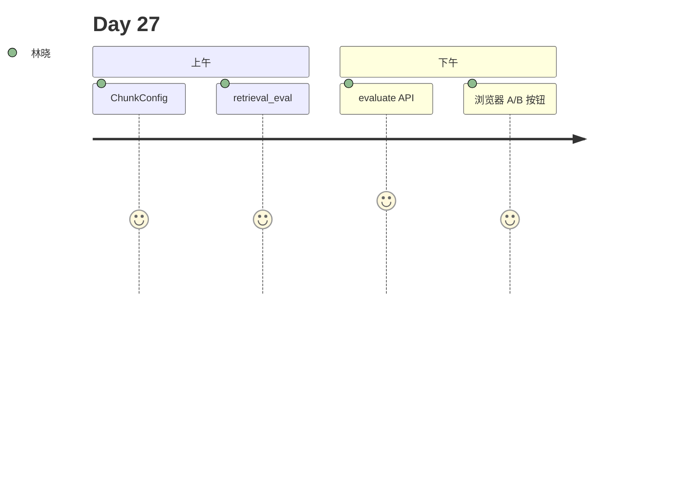

# Day 27 旁白解读

2026 年 8 月 3 日。陈默在白板写下：**chunk_size=200 谁定的？** 全场安静。

「Day 19 的默认值不是圣经，」他说，「今天用数据说话 —— hit@1、块数、平均分，A/B 四套预设跑一遍。」

林晓运行 `ab_experiment_demo.py`，看着 `wide` 配置 hit_rate 从 75% 升到 100%。赵岩说：「调参不是玄学，是可复现的实验。」

