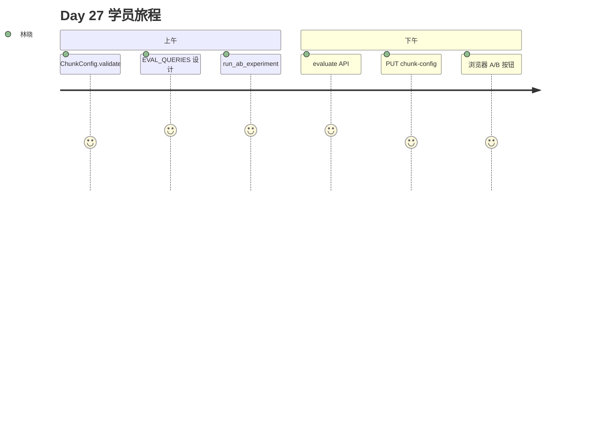

# Day 27 旁白解读

2026 年 8 月 3 日，星期一。智链科技产品部会议室，白板最上方写着一行字：**「chunk_size=200 谁定的？」**

陈默把马克笔扔回托盘：「Day 19 的默认值不是圣经。上周客服反馈『赎回规则』总检索到收益率段落——这不是模型笨，是**块切错了**。」

林晓打开 `product_notice.md`：五个 `##` 章节，起购、收益、风险、赎回各一段。她用 compact（120 字符）跑了一遍 evaluate，hit_rate 只有 50%。换成 wide（400 字符），四条评估问句全部命中。

赵岩在白板画了两条泳道：

```
[实验泳道]  parse → chunk(配置A) → 内存 EmbeddingRetriever → EVAL_QUERIES → hit@1
[生产泳道]  upload → store.chunks → TF-IDF/Chroma → /api/chat
```

「实验泳道不碰 store，」赵岩强调，「调参是科学，发布是工程——明天 Day 28 才 rebuild。」

下午周航把 `#kb-eval-btn` 接到 `POST /api/knowledge/evaluate`。投资人演示前，产品只需点一次按钮，看 `best_config.name` 是否为 `wide`。



**旁白**：今日故事线 —— 用数据回答「块要多大」，而不是凭感觉。
