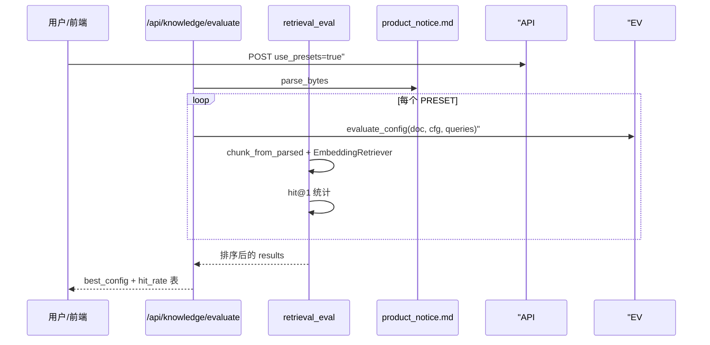
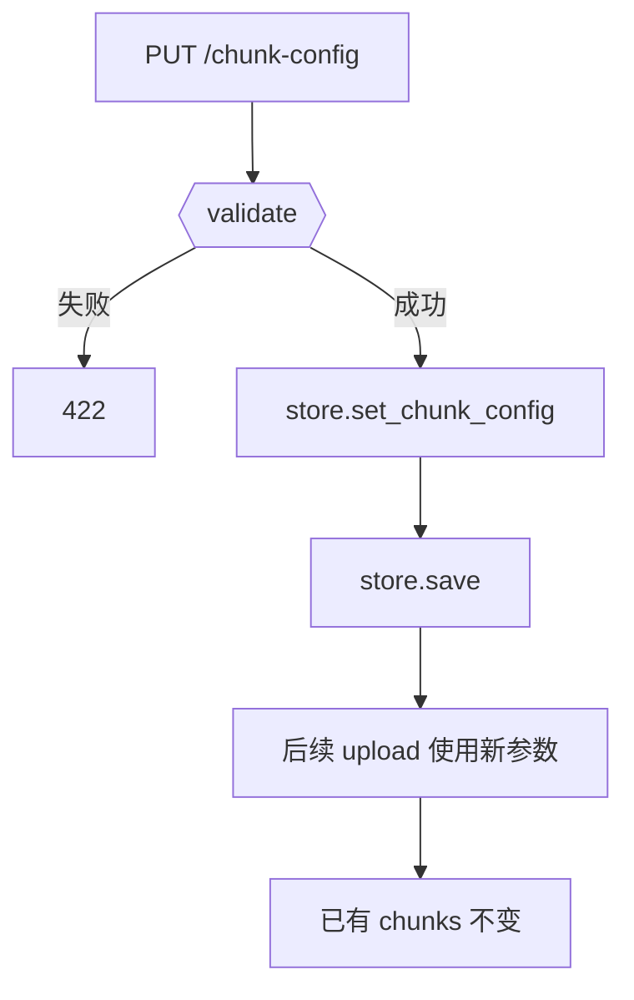

# Day 27 流程图与示意图

## A/B 评估时序



## chunk-config 更新流程



## hit@1 判定

```
query: "赎回多久到账"
expect_any: ["T+1", "到账", "赎回"]

retriever.search(query, top_k=1)
  → top.chunk.text = "...T+1 工作日到账..."
  → any(kw in text for kw in expect_any) → hit=true
```

## PRESET 对比示意（教学典型结果）

| name | chunk_size | hit_rate | chunk_count |
|------|------------|----------|-------------|
| compact | 120 | ~50-75% | 较多 |
| default | 200 | ~75% | 中等 |
| wide | 400 | ~100% | 较少 |
| markdown_wide | 500 | 视策略而定 | 章节块 |

*实际数值以本地 `ab_experiment_demo.py` 输出为准。*

## 与 Day 28 衔接

```
Day 27: evaluate → 选出 best_config → PUT chunk-config（可选）
Day 28: rebuild → 全库按 chunk_config 重扫源文件
```
