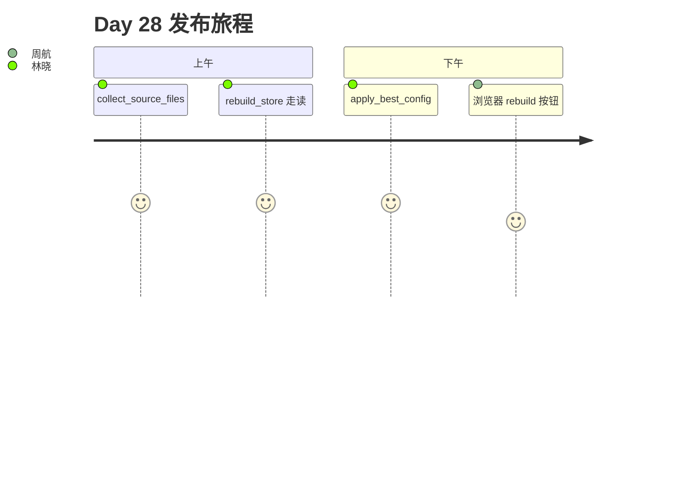

# Day 28 旁白解读

2026 年 8 月 4 日，星期二。林晓把 Day 27 的评估报告贴在显示器边：**wide, hit_rate=100%**。她点开知识库状态页，`chunk_count` 仍是 12。

陈默路过：「调参是实验，重建是发布。你改了默认配置，旧块还在仓库里睡觉。」

上午十点，`rebuild_demo.py` 跑通。终端打印：

```
重建前: 3 篇 / 12 块
配置: size=400 overlap=60
重建后: 3 篇 / 8 块
```

赵岩：「块数下降，说明全库按 wide 重新切了。看 `last_rebuilt_at`，这就是运维要的审计点。」

下午投资人演示彩排。周航点击「全量重建」，勾选 `apply_best_config`。API 先 evaluate 四套 PRESET，自动 `set_chunk_config(wide)`，再 `rebuild_store`。聊天接口立刻引用新块。



**旁白**：Day 27 回答「块要多大」，Day 28 让整个库**统一到答案上**。

---

## 场景还原：投资人演示前 30 分钟

周航检查清单口述版：

1. `GET /api/knowledge/status` — `chunk_config.name` 是否目标 PRESET  
2. `POST /api/knowledge/evaluate` — 截图 `best_config` 与 `hit_rate`  
3. `POST /api/knowledge/rebuild` — `apply_best_config=true` 或手动 PUT 后 rebuild  
4. 确认 `last_rebuilt_at` 为今日 UTC  
5. 浏览器无痕窗口新开 chat，问「赎回多久到账」  

林晓补充：「第 5 步必须用新 session，否则陈默会当场抓旧上下文 bug。」

赵岩记录：发布决策不只技术，还有**审计时间戳**——`last_rebuilt_at` 是合规部第一周就会问的字段。

## 技术名词对照（中英）

| 中文 | English | Day 28 对应 |
|------|---------|-------------|
| 全量重建 | full rebuild | rebuild_store |
| 源文件扫描 | source collection | collect_source_files |
| 双源覆盖 | upload override | uploads 优先 |
| 评估驱动发布 | eval-driven release | apply_best_config |
| 审计时间 | audit timestamp | last_rebuilt_at |

## 课后一分钟

陈默：「记住三个词——**清、扫、建**。清了旧块，扫了源文件，建了新的索引。明天 Chroma 换引擎，这三个词不变。」

林晓在笔记本写下：`evaluate = 实验`，`rebuild = 发布`，`last_rebuilt_at = 审计`。周航补上第四行：`sessions_cleared = 用户重新对话`。

赵岩最后补充：「投资人问『你们知识库什么时候更新的』，别答『昨天调了参数』——答 `last_rebuilt_at` 里的 UTC 时间，并说明已与评估实验一致。」

旁白收束：Day 28 结束，知识库从「能调参」走向「能发布」。下一课，向量引擎换壳，流程不换。
