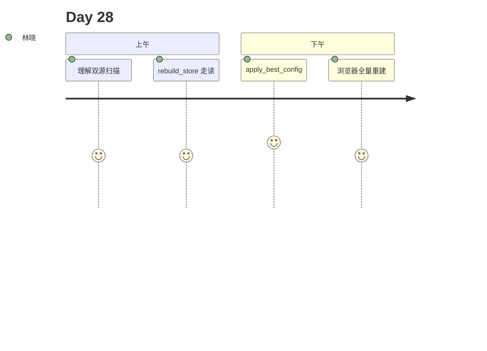

# Day 28 旁白解读

2026 年 8 月 4 日，星期二。林晓盯着 Day 27 的评估结果：wide 配置 hit_rate 100%。她问陈默：「现在全库还是旧块，怎么办？」

陈默在白板写下 **rebuild** 三个字母：「调参是实验，重建是发布。`POST /api/knowledge/rebuild` 会清空 chunks，重扫 sample_docs 和 uploads，用当前 chunk_config 重新分块。」

赵岩补充：「投资人演示前先 evaluate 再 rebuild，保证线上索引与实验结论一致。」

下午 Lab，林晓执行 `rebuild_demo.py`，终端打印 `chunks 12 → 8`。她打开 store.json，看到 `last_rebuilt_at` 时间戳。周航提醒：「uploads 与 sample 同名时，uploads 优先 —— 运营文档覆盖内置样例。」

