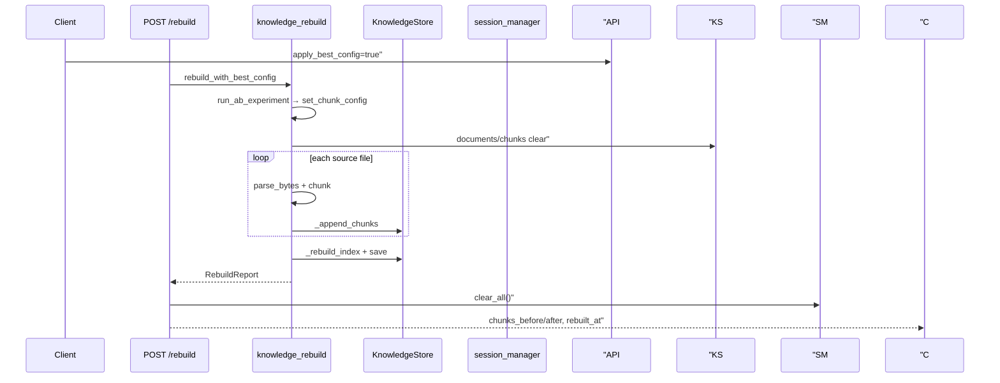
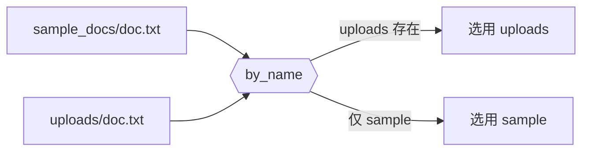

# Day 28 流程图与示意图

## rebuild 时序



## 双源覆盖决策



## Day 27 → Day 28 发布流水线

```
evaluate → 人工确认 best_config
    ↓
方案 A: PUT chunk-config → POST rebuild (apply_best_config=false)
方案 B: POST rebuild (apply_best_config=true)
    ↓
spot-check EVAL_QUERIES + /api/chat
```

## 块数变化示意

| 阶段 | chunk_size | 典型 chunk_count |
|------|------------|------------------|
| 重建前 default | 200 | 12 |
| 重建后 wide | 400 | 8 |

*以 `rebuild_demo.py` 本地输出为准。*
