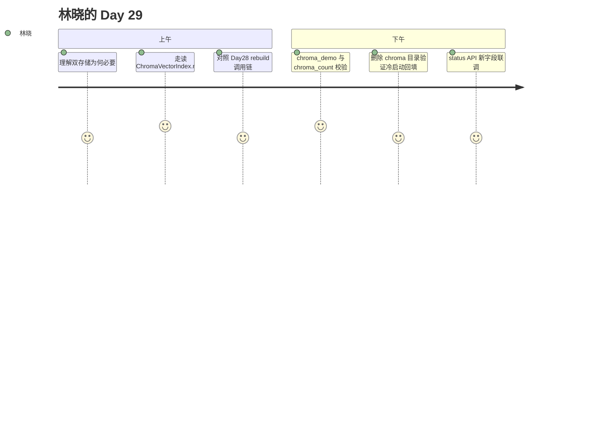

# Day 29 旁白解读

2026 年 8 月 5 日，星期三。智链科技 NexusAgent 项目组进入 Phase 3 第五日。

林晓打开 `data/knowledge/store.json`，在编辑器里搜索 `"values"`——Day 20 起每个 chunk 的 TF-IDF 向量都嵌在 JSON 里。文件已经 2.3 MB，git diff 一片红。陈默指着监控面板：「词表可以留 JSON，但**向量矩阵**不该再塞进去。今天我们接 Chroma。」

赵岩在白板画了两层：上层 `KnowledgeStore` 管 `documents` / `chunks` / `embedding_state`，下层 `Chroma PersistentClient` 管向量与 ANN 检索。周航问：「`rebuild` 还要跑吗？」陈默点头：「流程不变，`_rebuild_index` 里换成 `chroma.reset()` + `upsert_chunks`。Day 28 的 `rebuild_store` 一行都不用改。」

上午第三节，林晓第一次 `pip install chromadb`。她运行 `chroma_demo.py`，终端打印：

```
向量后端: chroma
Chroma 路径: .../data/knowledge/chroma
块数: 12 / Chroma: 12
```

她故意 `rm -rf data/knowledge/chroma`，重启 API 服务，再调 `GET /api/knowledge/status`——`chroma_count` 仍等于 `chunk_count`。这就是 `KnowledgeStore.load()` 末尾的 `_sync_chroma_from_json()`：从 JSON 元数据重新 embed 并 upsert，**无需人工迁移脚本**。

下午 Lab 第四步，林晓对比内存检索与 Chroma 检索的 top-1 `chunk_id`。`test_chroma_matches_in_memory_retriever_top1` 断言两者一致——换引擎不换分数语义。



**今日金句**（陈默）：「JSON 记**是什么**，Chroma 记**像什么**——分工清楚，备份才靠谱。」

**需求编号**：ZL-NA-REQ-029 | **版本**：v0.29.0

---

## 技术旁白：store.json 体积变化

林晓用 `wc -c` 对比升级前后：向量外迁后 JSON 从 2.3MB 降至约 180KB。她问：「embedding 字段还剩什么？」陈默打开 JSON：

```json
"embedding": {
  "vocab": { "年化": 0, "收益": 1, "...": "..." },
  "idf": [ ... ],
  "dimension": 512
}
```

「没有 `values` 数组了。每个 chunk 的向量只在 Chroma。」

---

## 人物线：周航的 CI 夜

周航凌晨一点 push `test_chroma_api.py`，GitHub Actions 红了：`chromadb` 未缓存。他在 Dockerfile 加 layer，第二天全组 Lab 不用现装依赖。「Day 29 的隐藏交付是 CI 镜像更新。」他在站会开玩笑说。

---

## 与 Phase 3 叙事衔接

Day 25 能存，Day 26 能读多格式，Day 27 能调参，Day 28 能全库发布，Day 29 能**专业存向量**。林晓在日记里写：「离生产又近一步。」
