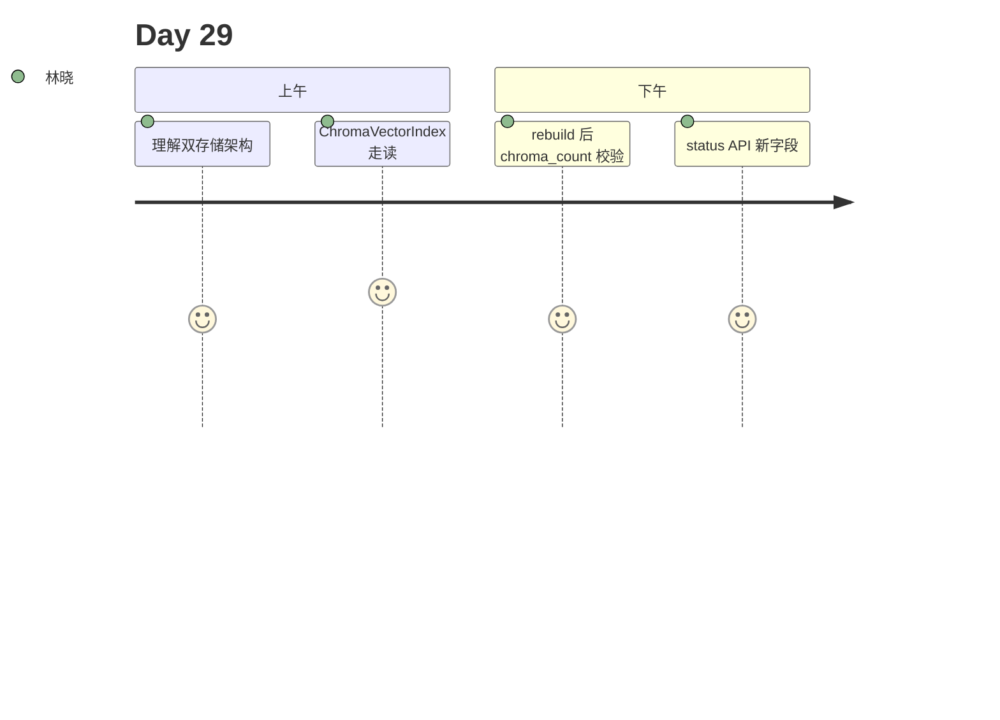

# Day 29 旁白解读

2026 年 8 月 5 日，星期三。林晓打开 `store.json`，embedding 字段里密密麻麻的 vocab 让她头疼。陈默指着文件大小：「词表可以留 JSON，但**向量矩阵**不该再塞进去。今天我们接 Chroma。」

赵岩在白板画了两层：上层 KnowledgeStore 管 documents/chunks，下层 Chroma PersistentClient 管向量。周航问：「rebuild 还要跑吗？」陈默点头：「流程不变，`_rebuild_index` 里换成 `chroma.reset()` + `upsert_chunks`。」

下午 Lab，林晓执行 `chroma_demo.py`，终端打印 `vector_backend: chroma` 与 `chroma_count: 12`。她删除 chroma 目录后重启服务，发现 load 会自动从 JSON 回填向量 —— 这就是 `_sync_chroma_from_json`。

