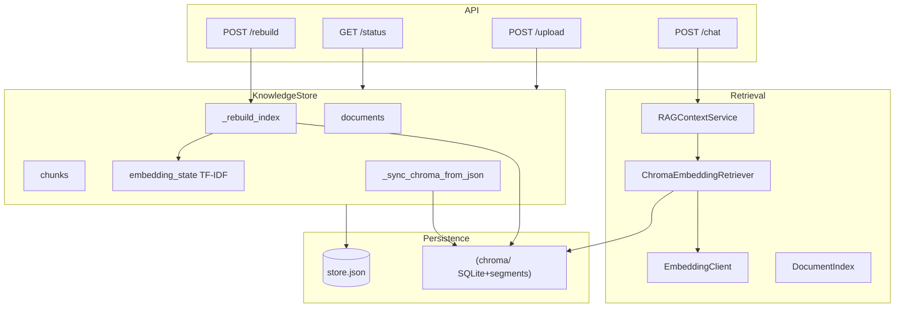
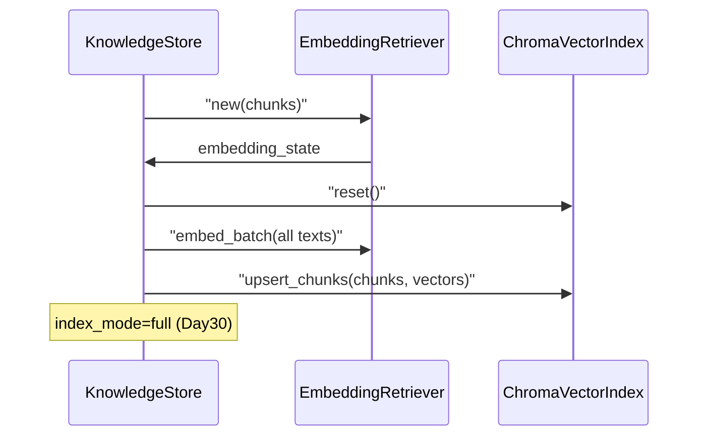
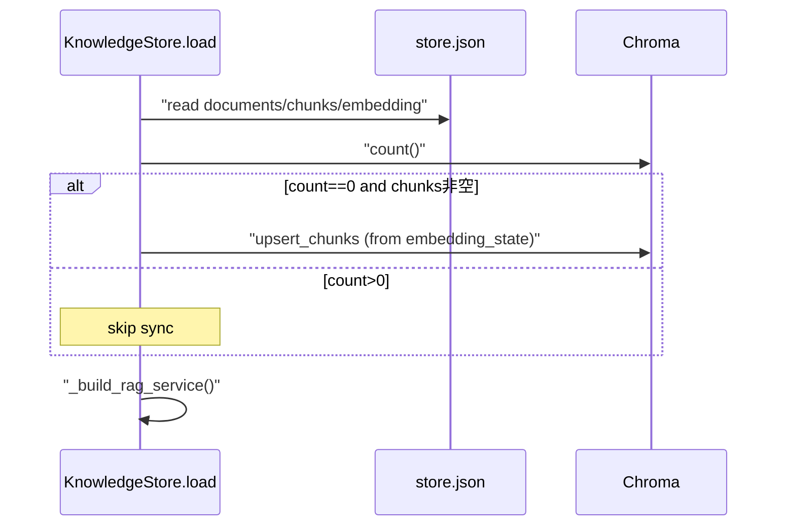
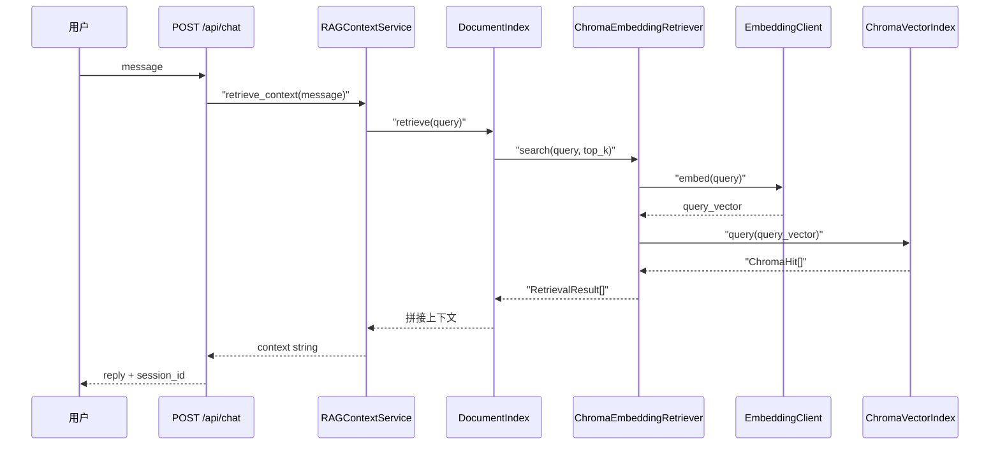
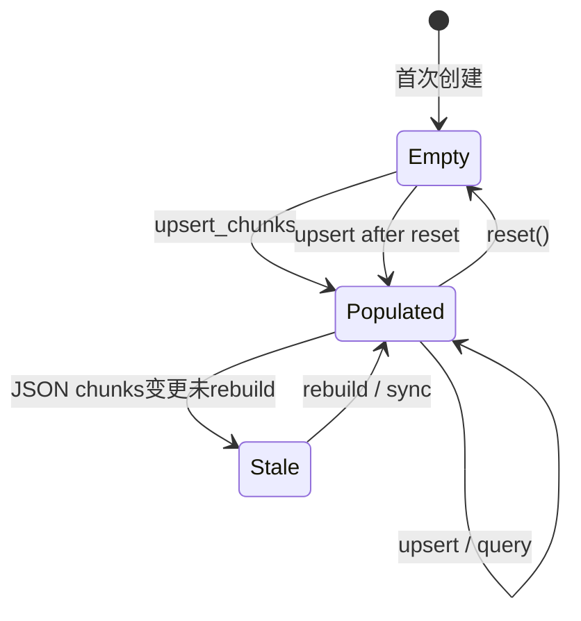

# Day 29 架构设计 — 双存储与检索链路

**需求**：ZL-NA-REQ-029 | **版本**：v0.29.0

## 1. 逻辑架构



## 2. 数据所有权

| 数据 | 权威源 | 副本/索引 |
|------|--------|-----------|
| 文档列表 | JSON `documents` | — |
| 分块文本 | JSON `chunks` | Chroma `documents` 字段（调试） |
| TF-IDF 词表 | JSON `embedding` | EmbeddingClient 内存 |
| 向量 | Chroma `embeddings` | 由 chunks+词表派生，可重建 |

**不变量**：`len(chunks) == chroma.count()`（空库除外）。

## 3. _rebuild_index 时序



## 4. 冷启动 load 时序



## 5. 模块依赖

```
knowledge_store.py
  ├── chroma_store.ChromaVectorIndex
  ├── chroma_retriever.ChromaEmbeddingRetriever
  └── embedding_retriever.EmbeddingRetriever  # 仅 rebuild / sync

chroma_retriever.py
  ├── chroma_store.ChromaVectorIndex
  └── embedding.EmbeddingClient

chroma_store.py
  └── chromadb.PersistentClient  # 延迟 import
```

## 6. 配置与路径

`core/paths.py` 中 `knowledge_chroma` 键指向 `data/knowledge/chroma`。测试通过 `store.chroma_path` 注入临时目录，避免污染开发库。

## 7. 与 Day 28 rebuild_store 关系

`rag/knowledge_rebuild.py` 的 `rebuild_store()` 在重扫源文件后调用 `store._rebuild_index()`——**无代码修改**。Day 29 只替换 `_rebuild_index` 内部实现：由「写 JSON 向量」改为「写 Chroma」。

## 8. 安全与运维

- Chroma 目录含 SQLite，热备份建议停写或文件级快照  
- 不在 Chroma metadata 存 PII；正文已在 chunks 中，权限与 JSON 同级  
- 遥测关闭，符合企业内网部署习惯  

---

## 9. 序列图：chat 请求完整路径



## 10. 状态机：Chroma collection 生命周期



## 11. 部署拓扑（教学单机）

```
┌──────────────┐
│  uvicorn     │
│  api.app     │
└──────┬───────┘
       │ in-process
       ▼
┌──────────────┐     ┌─────────────┐
│ KnowledgeStore│────▶│ chroma/     │
│ store.json   │     │ (local disk)│
└──────────────┘     └─────────────┘
```

生产多副本时**不能**每副本各写各的 Embedded Chroma；应切 Chroma Server 或共享存储——超出本课范围，记入讲师 FAQ。

## 12. 性能数量级（经验值，非基准承诺）

| chunk 数 | JSON 仅词表 | Chroma query P50 |
|----------|-------------|------------------|
| 50 | load <0.5s | <10ms |
| 500 | load <1s | <20ms |
| 5000 | load ~2s | <50ms |

向量外迁主要收益在 **JSON load 与 git 体积**，非 query 延迟。

## 13. 失败模式与恢复

| 失败模式 | 检测 | 恢复 |
|----------|------|------|
| chroma 目录损坏 | count 异常 / sqlite 错误 | 删 chroma + load sync |
| 词表手改 | top-1 测试失败 | rebuild |
| 仅恢复旧 JSON | vector_backend 缺失 | 自动 bootstrap 逻辑 |
| 磁盘满 | upsert 抛错 | 扩容 + rebuild |

## 14. 架构决策记录 ADR-029

**标题**：采用 Chroma Embedded 作为向量持久化  
**状态**：已接受  
**上下文**：JSON 向量膨胀  
**决策**：双存储，Chroma cosine collection  
**后果**：多 worker 需后续评估；运维双备份
