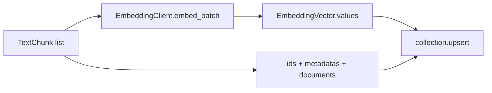
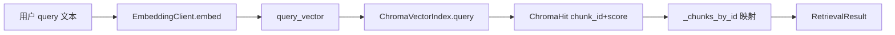
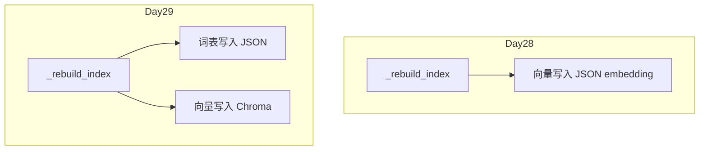
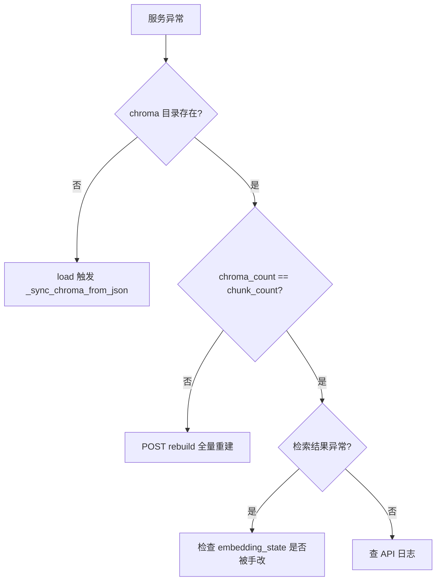
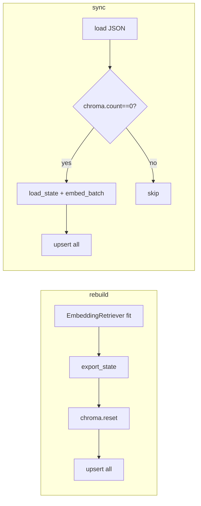

# Day 29 流程图与示意图

## 1. 双存储物理视图

```
data/knowledge/
├── store.json          # documents, chunks, embedding(vocab/idf), vector_backend
├── uploads/            # 运营上传源文件
└── chroma/             # Chroma PersistentClient 数据目录
    ├── chroma.sqlite3
    └── ...             # HNSW 段文件
```

## 2. upsert_chunks 数据流



## 3. query 检索数据流



## 4. Day 28 → Day 29 变更点（单点）



## 5. 故障恢复决策树



## 6. 课堂白板图（ASCII）

```
┌─────────────────────────────────────────┐
│           KnowledgeStore                 │
│  documents[]  chunks[]  embedding_state │
└───────────────┬─────────────────────────┘
                │ _rebuild_index / sync
                ▼
┌─────────────────────────────────────────┐
│        ChromaVectorIndex                 │
│  collection: nexus_knowledge             │
│  space: cosine                           │
└─────────────────────────────────────────┘
```

---

## 7. rebuild 与 sync 路径对比图



rebuild **总是** reset；sync **从不** reset（除非 count 为 0 的等价于空库）。

---

## 8. metadata 在检索后的使用

检索命中 `ChromaHit` 后，`ChromaEmbeddingRetriever` 用 `chunk_id` 回查 `TextChunk`，`_overlap_terms` 生成高亮 token。metadata 中的 `source` 不直接展示给用户，但可用于日志：

```
matched chunk_id=abc source=product_notice.txt index=2 score=0.42
```

---

## 9. 课堂绘图作业

学员手绘「upload Day29 全量 rebuild」时序图，必须包含：parse → append chunks → _rebuild_index → reset → upsert。教师抽查 3 人投影讲解。
