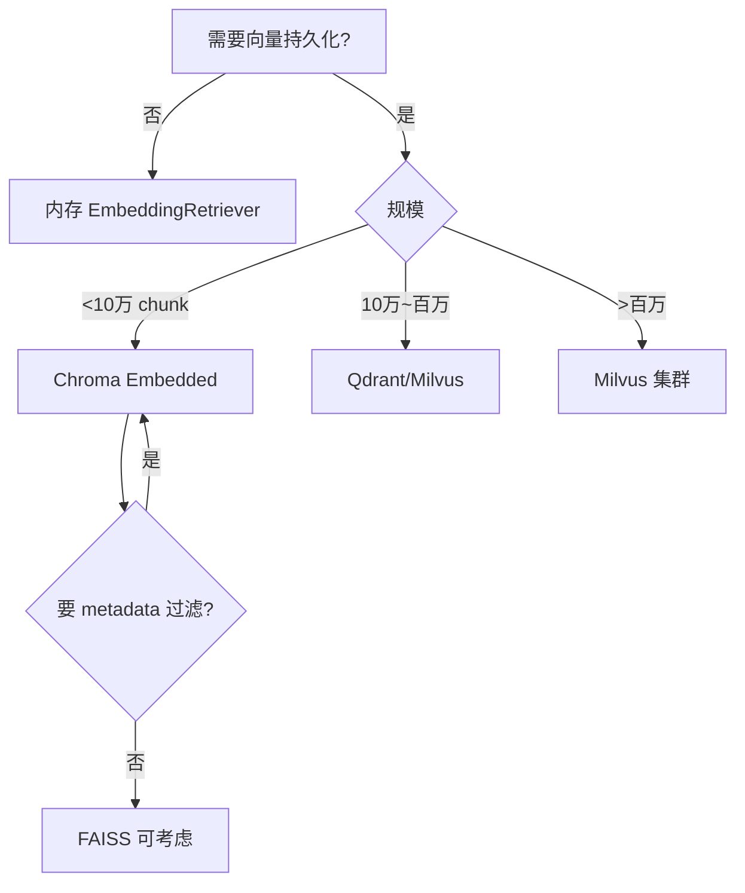

# 深度扩展：向量库选型（Day 29）

## 1. 选型维度矩阵

| 维度 | Chroma | Qdrant | Milvus | pgvector |
|------|--------|--------|--------|----------|
| 嵌入式部署 | ✅ | Docker | K8s 集群 | PostgreSQL 扩展 |
| 元数据过滤 | ✅ | ✅强 | ✅ | SQL |
| 多租户 | 弱 | ✅ | ✅ | ✅ |
| 运维成熟度 | 中 | 高 | 很高 | 依赖 PG |
| 学习曲线 | 低 | 中 | 高 | 中 |

## 2. 为何教学选 Chroma

NexusAgent 课程强调**最小可运行路径**：`pip install chromadb` 即可，无需 Docker Compose。接口简洁，与 Python dataclass 教学风格一致。

## 3. 迁移到 Qdrant 的适配层思路

保留 `ChromaVectorIndex` 同名方法：`reset/upsert_chunks/query/count/delete_*`。内部换 Qdrant Client。`KnowledgeStore` 零修改——这就是**端口适配器模式**。

## 4. 云向量库（Pinecone / Zilliz Cloud）

优点：免运维、自动扩缩。缺点：数据出境、成本、内网合规。智链 B 轮客户多为金融，倾向私有化 Chroma/Qdrant。

## 5. BM25 + 向量混合

Day 31 将讲混合检索。向量库选型需支持**同一 query 多次检索**或融合层独立。Chroma 单路向量足够教学。

## 6. 案例：某券商知识库 POC

- 10 万 chunk → Qdrant 集群  
- 元数据 `department/regulation_version` 过滤  
- NexusAgent 课程架构与之同构，仅规模不同  

## 7. 阅读清单

- Chroma 官方 docs：Persistent Client  
- Qdrant：Filtering  
- MTEB 排行榜：理解 Embedding 质量差异  

---

## 8. 详细对比：Chroma vs FAISS

| 维度 | Chroma | FAISS |
|------|--------|-------|
| 持久化 | 内置 | 需手动 save index |
| 元数据过滤 | ✅ | 需自研 |
| Python API 友好度 | 高 | 中 |
| 大规模 ANN | 中 | 很高 |
| 教学曲线 | 低 | 中 |

NexusAgent 曾考虑 FAISS Day 24，但 metadata 与持久化样板代码多，最终 Day 29 选 Chroma。

## 9. 云厂商托管向量服务

**Pinecone / Zilliz Cloud / AWS OpenSearch k-NN**

优点：免运维、弹性。缺点：成本随维度与 QPS 上升；金融客户数据出境审批。智链国内客户 POC 用嵌入式 Chroma，合同交付可换 Qdrant on-prem。

## 10. 选型决策树

## 11. 成本粗算（示意）

假设 1 万 chunk，512 维，Chroma 磁盘约 20–40MB；云向量托管月费可能数十美元起。教学项目忽略云成本，企业标书须写清 TCO。

## 12. 学员调研作业（关联本扩展）

任选 Chroma / Qdrant / Milvus 官网，写 200 字「若替换 ChromaVectorIndex 需要改哪些方法」。不提交代码，仅接口列表。
