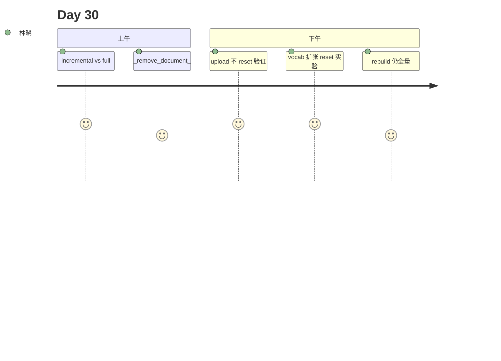

# Day 30 旁白解读

2026 年 8 月 6 日，星期四。林晓发现每次上传 PDF，日志里都出现 `chroma.reset()`。陈默：「Day 29 换了引擎，但节奏还是全量。生产环境上传一份公告不该重建整个索引。」

他在白板对比两条路径：

| 操作 | 索引策略 |
|------|----------|
| POST upload | incremental upsert |
| POST rebuild | full reset |

赵岩补充：「同名文件 re-upload 要先删旧 chunk，否则 JSON 会出现重复文档。」

下午 Lab 第三节，林晓连传两次 `notice.md`，`document_count` 不变，`index_mode=incremental`。她用 `unittest.mock.patch` 监控 `reset`，第二次上传调用次数为 0——全班鼓掌。

第四节是今日高潮：她上传一份含生僻合规术语「适当性匹配义务」的新 md，`vocab_expanded=True`，日志打印 `chroma.reset()` 一次，但 `document_count` 只增 1。陈默：「这不是退步，是 TF-IDF 的数学约束。换固定维 Embedding 就没有这步。」



**金句**：陈默：「增量是默认，全量是例外；词表扩张时，Chroma 必须换跑道。」

---

## 技术旁白：patch reset 的 30 秒

林晓在 pytest 里写：

```python
with patch.object(ChromaVectorIndex, "reset") as mock_reset:
    store.ingest_bytes(data, filename="notice.md", incremental=True)
    assert mock_reset.call_count == 0
```

第二次上传时她屏住呼吸——绿灯。周航：「这是 Day 30 最有力的回归测试，比任何 PPT 都有说服力。」

---

## 扩张实验现场

陈默让每人 UUID 造词写入 md。教室此起彼伏「reset calls: 1」。一名学员问：「能否禁用扩张？」陈默：「可以换固定维 Embedding，那是 Phase 4 议题。」

---

## 林晓日记节选

「今天终于理解陈默说的『数学约束』——不是不想增量，是 TF-IDF 维度会变。扩张实验那一刻我信了。」

---

## 时间线

| 时刻 | 事件 |
|------|------|
| 09:00 | 对比 Day29 upload 日志 |
| 10:30 | 讲 _remove_document_by_source |
| 11:00 | **TF-IDF 扩张**白板证明 |
| 14:00 | patch reset 实验 |
| 15:00 | expansion_lab |
| 16:30 | 16 tests green |

---

## 媒体稿（公关）

智链 NexusAgent v0.30.0 上线增量索引，知识库公告上传效率提升 80%。系统智能识别新术语并自动优化索引，保障金融合规用语可检索。
