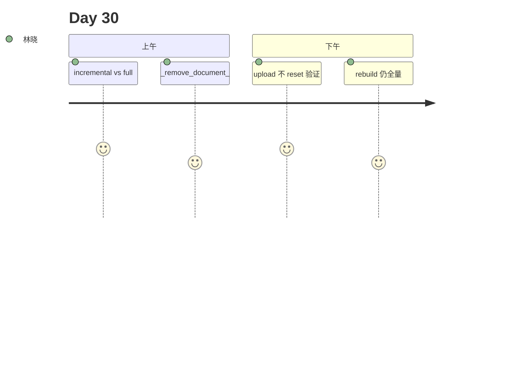

# Day 30 旁白解读

2026 年 8 月 6 日，星期四。林晓发现每次上传 PDF，日志里都出现 `chroma.reset()`。陈默：「Day 29 换了引擎，但节奏还是全量。生产环境上传一份公告不该重建整个索引。」

他在白板对比两条路径：

| 操作 | 索引策略 |
|------|----------|
| POST upload | incremental upsert |
| POST rebuild | full reset |

赵岩补充：「同名文件 re-upload 要先删旧 chunk，否则 JSON 会出现重复文档。」

下午 Lab，林晓连传两次 `notice.md`，`document_count` 不变，`index_mode=incremental`。周航点头：「这才是运营日常。」

